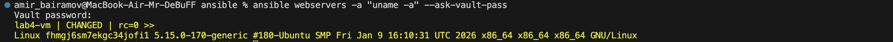
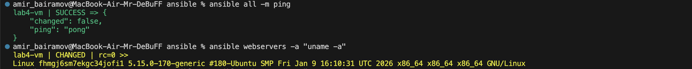
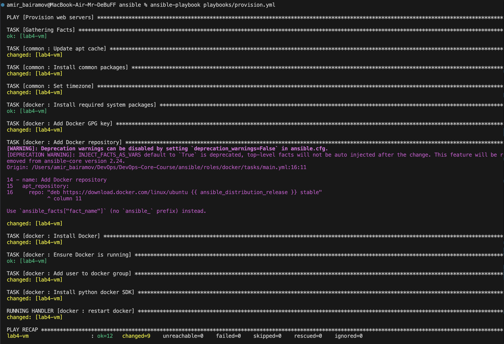
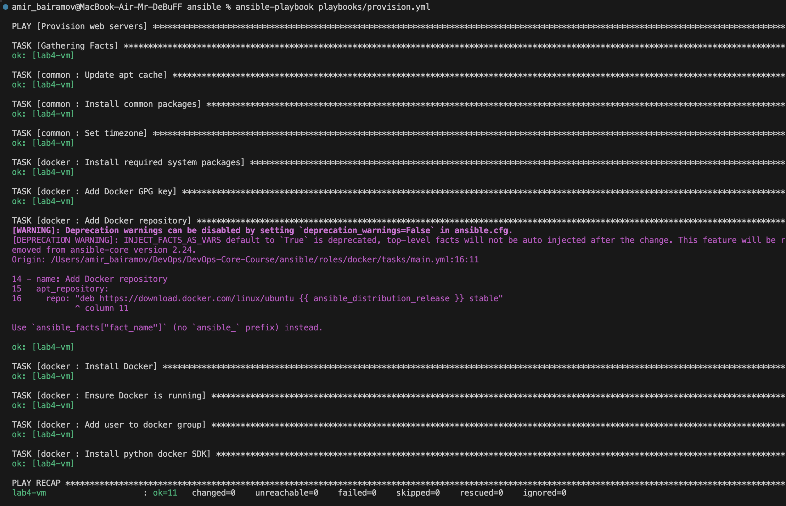
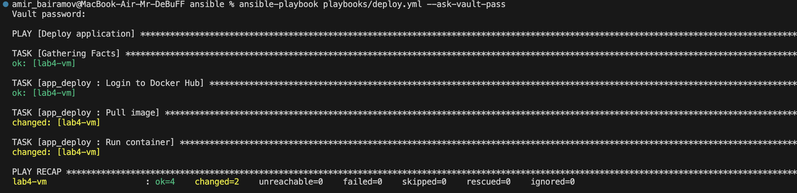
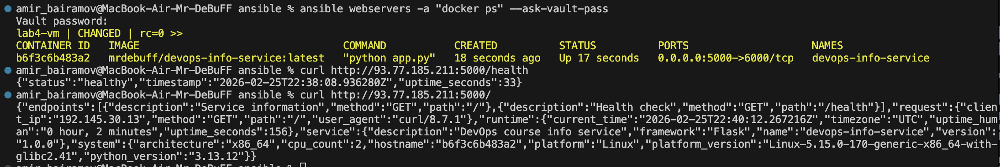

# LAB05 — Ansible Fundamentals

## 1. Architecture Overview

### Ansible Version


### Target VM

- Cloud provider: `Yandex Cloud`
- Provisioning tool: `Pulumi`
- OS: 



- Public IP: `93.77.185.211`

### Role Structure Diagram

```
ansible/
├── ansible.cfg
├── docs
│   ├── LAB05.md
│   └── screenshots_l5/...
├── inventory
│   ├── group_vars
│   │   └── all.yml
│   └── hosts.ini
├── playbooks
│   ├── deploy.yml
│   └── provision.yml
└── roles
    ├── app_deploy
    │   ├── defaults
    │   │   └── main.yml
    │   ├── handlers
    │   │   └── main.yml
    │   └── tasks
    │       └── main.yml
    ├── common
    │   ├── defaults
    │   │   └── main.yml
    │   └── tasks
    │       └── main.yml
    └── docker
        ├── defaults
        │   └── main.yml
        ├── handlers
        │   └── main.yml
        └── tasks
            └── main.yml
```

### Why Roles Instead of Monolithic Playbooks

Roles:
- provide modularity
- separate responsibilities
- allow reuse across projects
- follow Ansible best practices
- improve readability and maintainability

A monolithic playbook becomes hard to maintain, test, and reuse.

## 2. Roles Documentation

### Role: `common`

### Purpose

Performs basic system provisioning:
- updates apt cache
- installs essential packages
- configures timezone

This role prepares any Ubuntu server for further automation.

### Variables (defaults/main.yml)

```yaml
common_packages:
  - python3-pip
  - curl
  - git
  - vim
  - htop
```

### Handlers

None required in this role.

### Dependencies

No explicit dependencies, but typically executed before other roles.

### Role: `docker`

### Purpose

Installs and configures Docker Engine:
- adds Docker GPG key
- adds official Docker repository
- installs docker-ce packages
- enables and starts Docker service
- adds user to docker group
- installs Python Docker SDK

### Variables (defaults/main.yml)

```yaml
docker_user: ubuntu
```

### Handlers (handlers/main.yml)

```yaml
- name: restart docker
  service:
    name: docker
    state: restarted
```

Triggered when repository configuration changes.

### Dependencies

Executed after common role (system packages must exist).

### Role: `app_deploy`

### Purpose

Deploys containerized Python application:
- logs into Docker Hub
- pulls image
- runs container
- configures port mapping
- sets restart policy

### Variables

From Vault (inventory/group_vars/all.yml):

```yaml
dockerhub_username: <encrypted>
dockerhub_password: <encrypted>

app_name: devops-info-service
docker_image: "{{ dockerhub_username }}/{{ app_name }}"
docker_image_tag: latest
app_port: 5000
app_container_name: "{{ app_name }}"
```

Defaults:

```yaml
restart_policy: unless-stopped

app_port_2: 6000 # My port in the container is 6000 instead of 5000 because I use macOS and 5000 is already in use by system services

app_environment_vars: {}
```

### Handlers (handlers/main.yml):

```yaml
- name: restart app container
  docker_container:
    name: "{{ app_container_name }}"
    state: started
    restart: yes
    image: "{{ docker_image }}:{{ docker_image_tag }}"
    restart_policy: "{{ docker_restart_policy }}"
    ports:
      - "{{ app_port }}:{{ app_port }}"
    env: "{{ app_environment_vars }}"
  become: yes
```

Container restart handler.

### Dependencies

Requires:
- Docker role executed first
- Docker daemon running

## 3. Idempotency Demonstration



### First Run



### Second Run



### Analysis

First run:
- system state was not configured
- packages and services were installed

Second run:
- desired state already achieved
- Ansible detected no drift

### What Makes It Idempotent?
- `apt: state=present`
- `service: state=started`
- `user: append=yes`
- declarative configuration instead of shell commands

Ansible modules compare current state vs desired state before applying changes.

## 4. Ansible Vault Usage

### How you store credentials securely

Sensitive data stored in:

```
inventory/group_vars/all.yml
```

Created with:

```bash
ansible-vault create inventory/group_vars/all.yml
```

### Vault password management strategy

- Password stored locally in `.vault_pass`
- `.vault_pass` added to `.gitignore`
- Not committed to repository
- Used via:

```bash
ansible-playbook playbooks/deploy.yml --ask-vault-pass
```

### Example of encrypted file

```
$ANSIBLE_VAULT;1.1;AES256
3839326463386438306632346632663166...
```

### Why Ansible Vault is important

- prevents credential leaks
- safe for version control
- protects Docker Hub access tokens
- aligns with security best practices

## 5. Deployment Verification

### Terminal output from deploy.yml run



### Container status and Health check verification

```bash
ansible webservers -a "docker ps" --ask-vault-pass  

curl http://93.77.185.211:5000/health

curl http://93.77.185.211:5000/
```



## 6. Key Decisions

### Why use roles instead of plain playbooks?

Roles provide modular architecture and separation of concerns. This improves maintainability and follows industry best practices.

### How do roles improve reusability?

Roles encapsulate logic and variables. They can be reused across different environments and projects without modification.

### What makes a task idempotent?
A task is idempotent when running it multiple times results in the same final state. Ansible achieves this using state-based modules like `apt`, `service`, and `docker_container`.

### How do handlers improve efficiency?
Handlers execute only when notified. This prevents unnecessary service restarts and reduces downtime.

### Why is Ansible Vault necessary?
It securely stores sensitive credentials such as Docker Hub tokens. Without Vault, secrets could be exposed in version control.
