# Lab 6: Advanced Ansible & CI/CD - Submission

**Name:** Amir Bairamov  
**Date:** 2026-03-05  
**Lab Points:** 10

---

# Overview

In this lab I implemented an advanced **Ansible automation workflow** and integrated it with **CI/CD using GitHub Actions**.

The main goal was to improve the existing infrastructure by introducing:

- Ansible **Blocks**
- **Tag-based execution**
- Migration from **single container deployment to Docker Compose**
- **Safe wipe logic** for removing deployed applications
- **CI/CD pipeline** for automatic deployment
- **Automated linting and verification**

### Technologies Used

- Ansible
- Docker
- Docker Compose
- GitHub Actions
- Ansible Vault
- SSH
- Linux (Ubuntu 22.04)

The final result is a fully automated deployment pipeline where:

```
Code Push → GitHub Actions → ansible-lint → ansible-playbook → Docker Compose → Running Application
```


---

# Task 1: Blocks & Tags (2 pts)

## Blocks Implementation

Blocks were used to group logically related tasks and provide better error handling.

Example from **web_app role**:

```yaml
- name: Deploy application with Docker Compose
  block:

    - name: Create app directory
      file:
        path: "/opt/{{ app_name }}"
        state: directory
        mode: '0755'

    - name: Template docker-compose
      template:
        src: docker-compose.yml.j2
        dest: "/opt/{{ app_name }}/docker-compose.yml"

    - name: Deploy container
      community.docker.docker_compose_v2:
        project_src: "/opt/{{ app_name }}"
        state: present
        pull: always

  rescue:

    - name: Deployment failed
      debug:
        msg: "Deployment failed"

  tags:
    - app_deploy
    - compose
```

Benefits of using blocks:
- Logical grouping of tasks
- Easier error handling
- Cleaner role structure
- Better debugging

### Tag Strategy

Tags allow executing only specific parts of the playbook.

Implemented tags:

| Tag        | Purpose                      |
| ---------- | ---------------------------- |
| docker     | Install and configure Docker |
| app_deploy | Deploy application           |
| compose    | Docker Compose related tasks |
| wipe       | Remove application           |

Example: List all tags

```
ansible-playbook playbooks/deploy.yml --list-tags
```

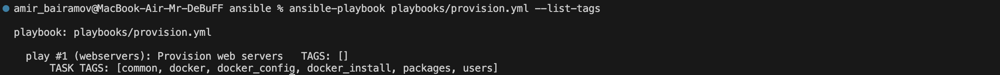

Example: Run different tags

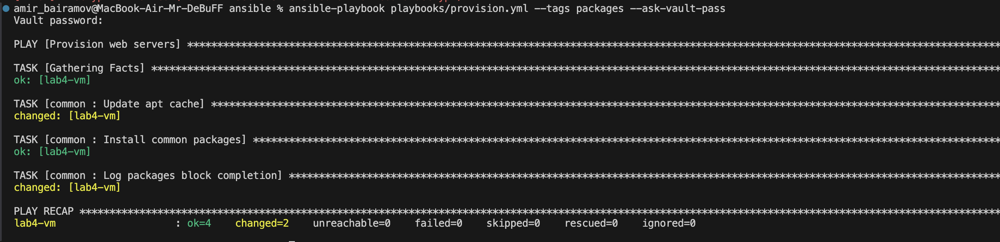

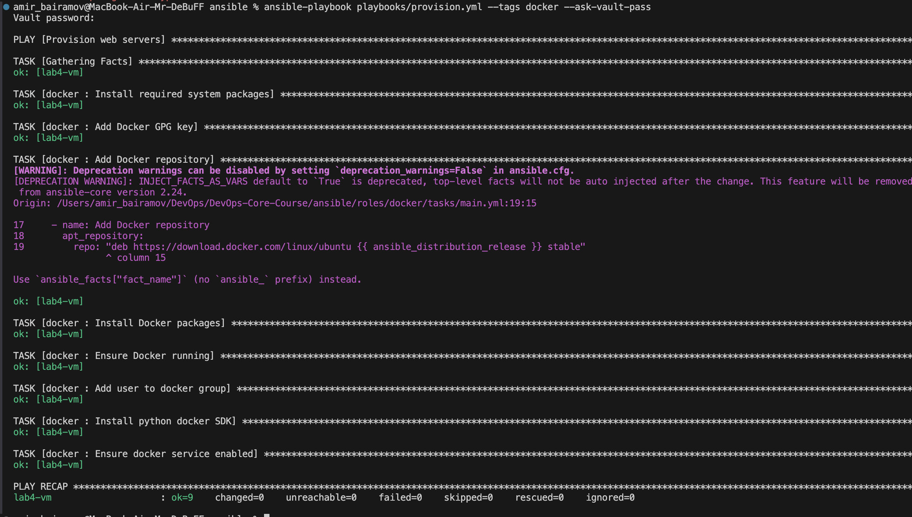

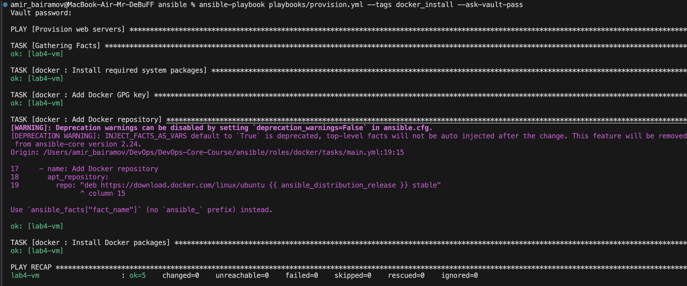

## Task 2: Docker Compose Migration (3 pts)

Originally the application was deployed using direct docker_container module.

### Before (Single Container Deployment)

Example:

```
community.docker.docker_container:
  name: "{{ app_container_name }}"
  image: "{{ docker_image }}:{{ docker_image_tag }}"
  ports:
    - "{{ app_port }}:{{ app_port_2 }}"
```

Limitations:
- Hard to scale
- Difficult multi-container support
- Harder configuration management

### After (Docker Compose Deployment)

The deployment was migrated to Docker Compose.

Template File

```
roles/web_app/templates/docker-compose.yml.j2
```

Example template:

```
version: "3.8"

services:
  {{ app_name }}:
    image: {{ docker_image }}:{{ docker_tag }}
    container_name: {{ app_name }}

    ports:
      - "{{ app_port }}:{{ app_internal_port }}"


    environment:

      {{ key }}: "{{ value }}"



    restart: unless-stopped
```

Advantages
- Easier multi-container architecture
- Better environment management
- Standard Docker deployment method
- Easier scaling

### Deployment Evidence and Verification

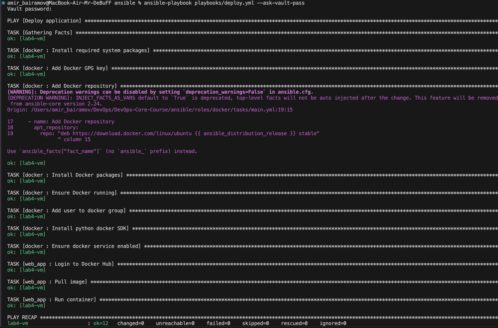

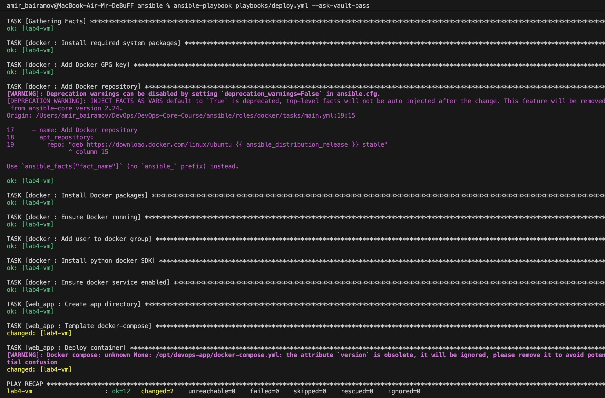

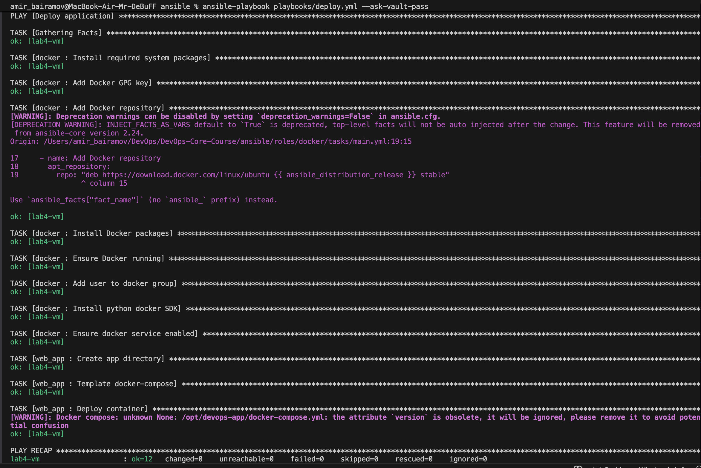

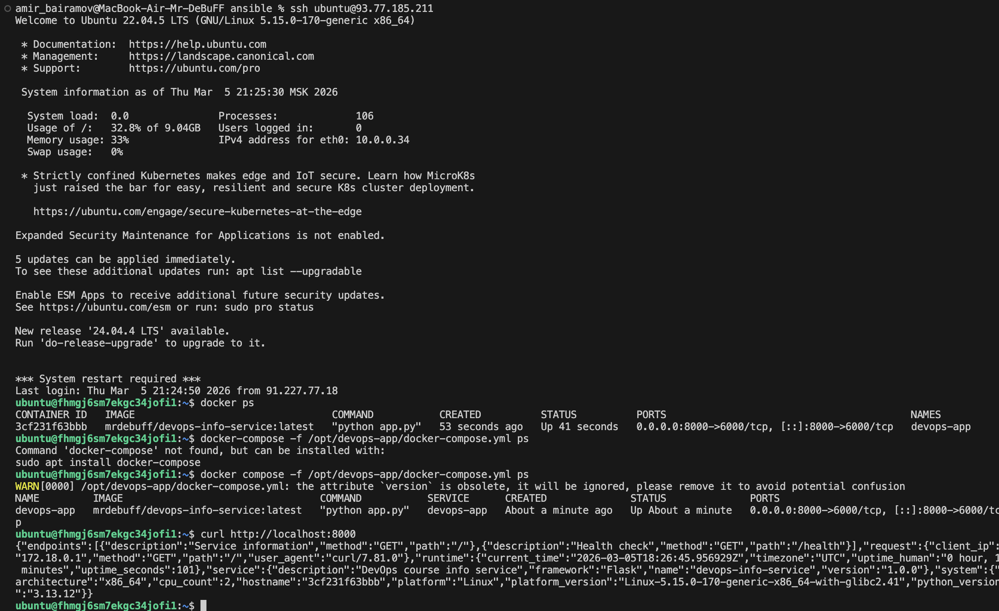

### Task 3: Wipe Logic (1 pt)

A wipe mechanism was implemented to safely remove the deployed application.

Purpose:
- Remove containers
- Remove application directory
- Clean deployment state

### Implementation

```
---

- name: Wipe web application
  block:

    - name: Stop containers
      community.docker.docker_compose_v2:
        project_src: "/opt/{{ app_name }}"
        state: absent
      ignore_errors: yes

    - name: Remove application directory
      file:
        path: "/opt/{{ app_name }}"
        state: absent

    - name: Log wipe completion
      debug:
        msg: "Application {{ app_name }} wiped"

  when: web_app_wipe | bool

  tags:
    - web_app_wipe
```

### Test Scenarios

Scenario 1:

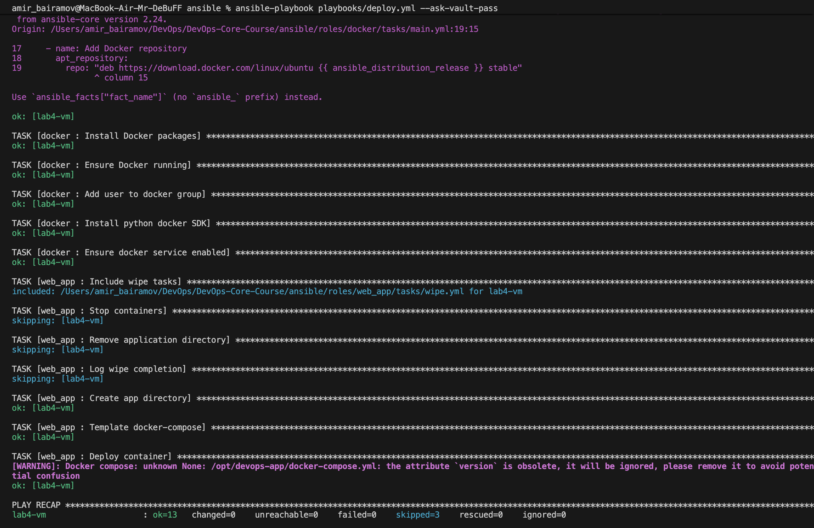
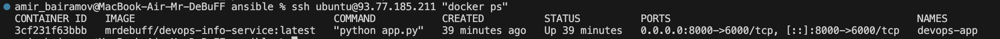

Scenario 2:

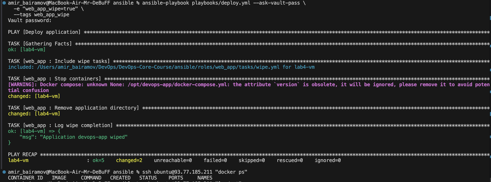

Scenario 3:

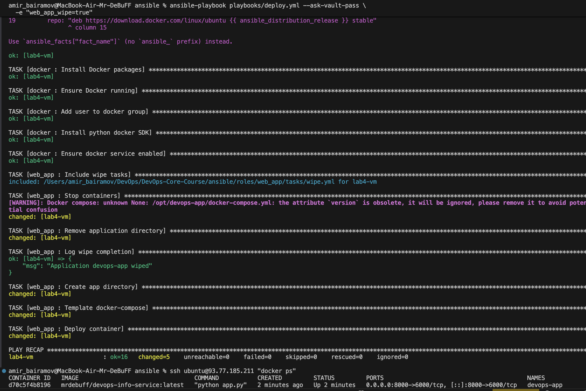

Scenario 4:

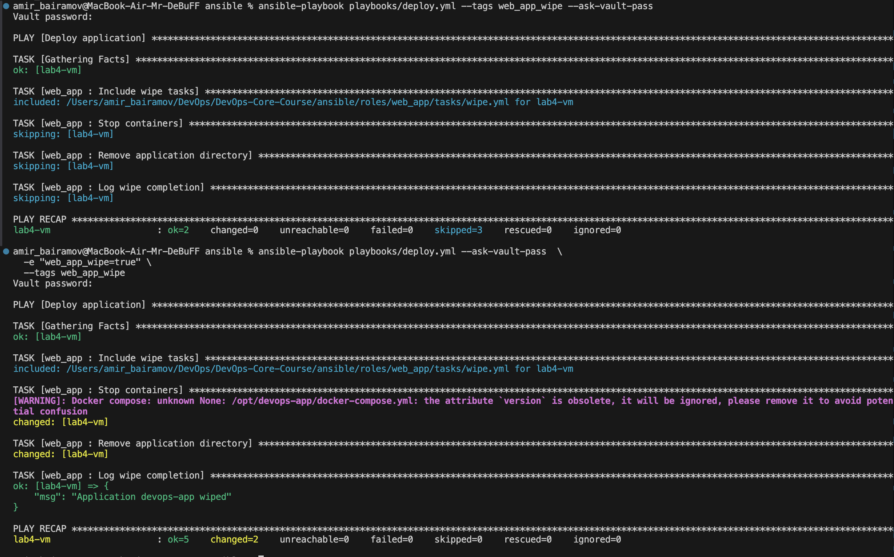

## Task 4: CI/CD Integration (3 pts)

CI/CD pipeline was implemented using GitHub Actions.

Workflow file:

```
.github/workflows/ansible-deploy.yml
```

Workflow Steps
- Checkout repository
- Setup Python
- Install Ansible
- Run ansible-lint
- Setup SSH connection
- Run ansible-playbook
- Verify deployment with curl

### GitHub Secrets Configuration

Secrets used:

| Secret                 | Purpose       |
| ---------------------- | ------------- |
| ANSIBLE_VAULT_PASSWORD | decrypt vault |
| SSH_PRIVATE_KEY        | connect to VM |
| VM_HOST                | server IP     |
| VM_USER                | SSH username  |

### Successful Workflow Run

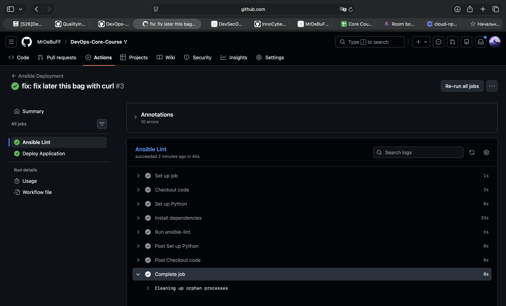

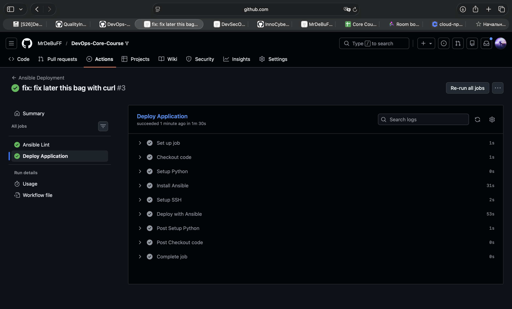

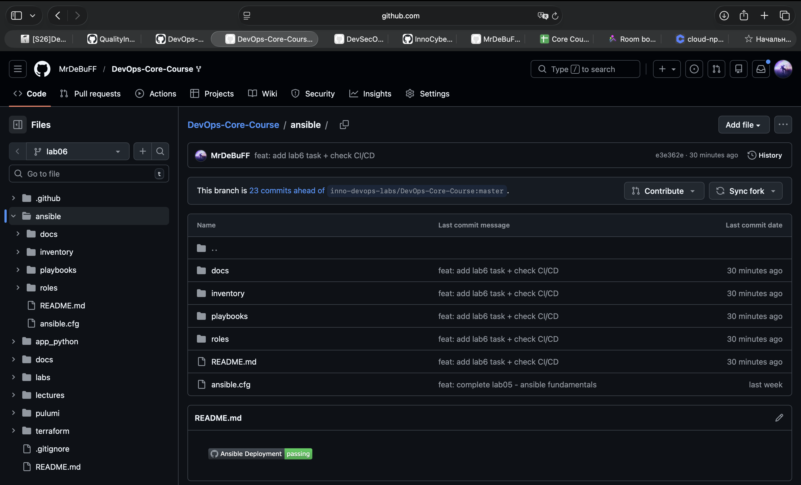

## Challenges & Solutions

### Challenge 1 — Docker Compose environment mapping error
Error:
```
services.devops-app.environment must be a mapping
```

Solution: Corrected the Jinja template loop to generate proper YAML mapping.


### Challenge 2 — Port mismatch

The application internally listens on port 6000, while external access was configured for 8000.

Solution: Corrected the Docker Compose port mapping.

## Research Answers
1. Security implications of storing SSH keys in GitHub Secrets

GitHub Secrets are encrypted and hidden from logs, but risks remain:
- Compromised workflows could leak credentials
- Repository write access could allow malicious workflow changes
- Secrets are exposed to runner environment

Best practices:
- Use deploy keys
- Limit repository permissions
- Rotate keys regularly
- Prefer short-lived tokens where possible

3. Implementing Rollbacks

Rollbacks can be implemented using Docker image versioning.

Example:

```
app:v1
app:v2
app:v3
```

If deployment fails, the playbook can redeploy the previous version.
Ansible can store the previous version tag and redeploy it.

4. Self-hosted runner security benefits

Self-hosted runners improve security because:
- Deployment happens inside the organization infrastructure
- Secrets never leave the internal network
- Firewall restrictions can be applied
- Infrastructure access can be tightly controlled

However they require more maintenance.