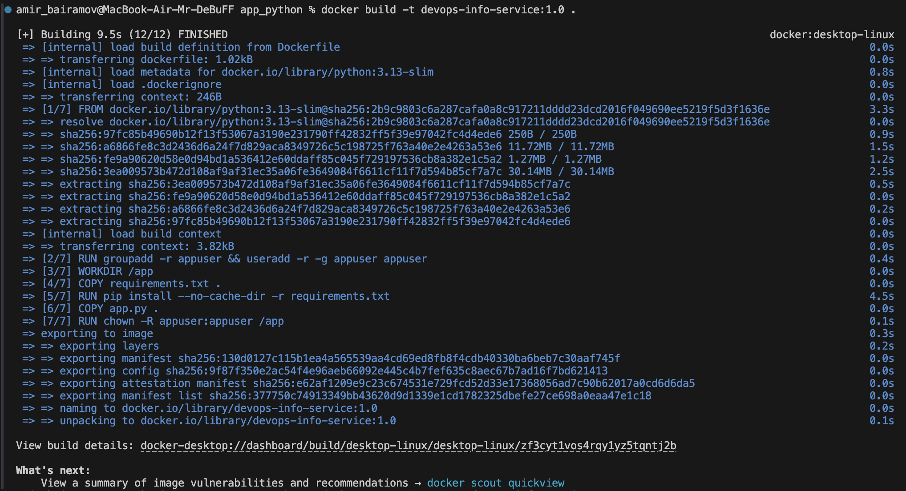
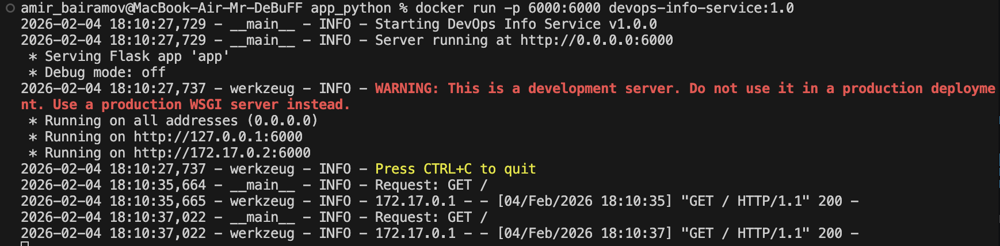
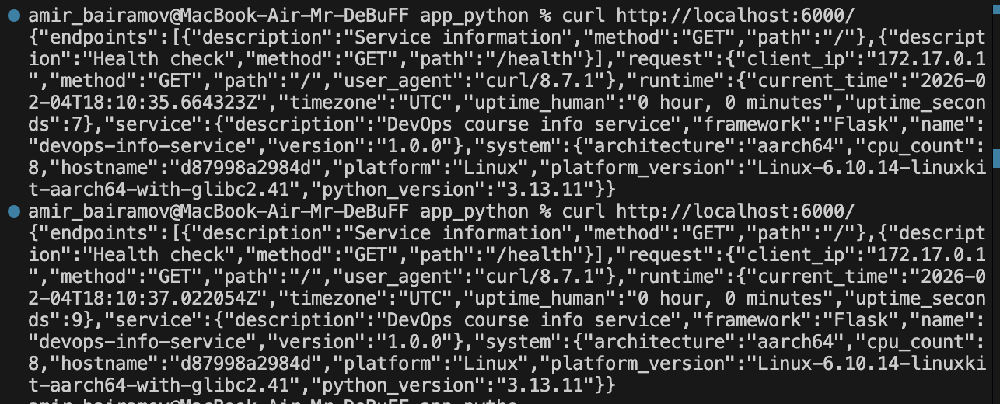

# Lab 2: Docker Containerization - Report

## 1. Docker Best Practices Applied

### Non-root user

The container is started by the unprivileged user `appuser`. This reduces the security risks in case the container is compromised.

```dockerfile
RUN groupadd -r appuser && useradd -r -g appuser appuser

USER appuser
```

### Layer caching

The file `requirements.txt` it is copied and installed before the application code. This allows Docker to use the cache if the dependencies have not changed.

```dockerfile
COPY requirements.txt .

RUN pip install --no-cache-dir -r requirements.txt
```

### .dockerignore

File `.dockerignore` eliminates the virtual environment, `git` files, and `IDE` configurations, reducing the size of the build context and speeding up image assembly.

## 2. Image Information & Decisions

**Base image**: `python:3.13-slim` — official image, minimum size, current Python version

**Final image size**: `42,6 MB` — I think it's really cool result

**Layer structure explanation**: Dependencies are installed before code is copied, which optimizes for build caching.

**Optimization choices**:
- slim image
- no-cache pip install
- excluding unnecessary files via `.dockerignore`

## 3. Build & Run Process

### Build process

```bash
docker build -t devops-info-service:1.0 .
```



### Container running

```bash
docker run -p 6000:6000 devops-info-service:1.0
```



### Testing endpoints

```bash
curl http://localhost:6000/

curl http://localhost:6000/health
```



### Docker Hub repository 

**URL** — https://hub.docker.com/r/mrdebuff/devops-info-service

## 4. Technical Analysis

- *Why does your Dockerfile work the way it does?*

The Dockerfile is designed for efficiency and security.
Dependencies are installed before copying application code to take advantage of Docker layer caching. A specific `slim` Python image ensures a consistent and lightweight runtime. The application runs as a `non-root` user, following container security best practices.

- *What would happen if you changed the layer order?*

If application code were copied before installing dependencies, Docker cache would be invalidated on every code change, causing slower rebuilds. Changing the order of user creation could also lead to permission issues during build or runtime.

- *What security considerations did you implement?*

The container runs as a `non-root` user to reduce security risks. A minimal base image is used to decrease the attack surface, and only necessary files are included in the final image. Dependency cache is disabled to avoid unnecessary artifacts.

- *How does .dockerignore improve your build?*

The `.dockerignore` file reduces the build context by excluding unnecessary files like virtual environments and `git` metadata. This speeds up builds, reduces image size, and prevents accidental inclusion of development artifacts.

## 5. Challenges & Solutions

**Issues**: Error with the port — Flask was listening to localhost

**Solution**: Using HOST=0.0.0.0 allowed accepting connections from the container.

### What I Learned
- Dockerfile basics

- РHow to work with Docker Hub

- The importance of layer order 

- Container security