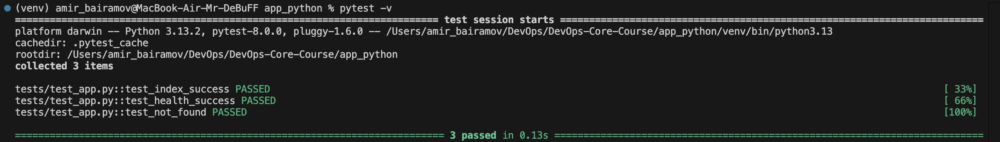

# Lab 3: Continuous Integration (CI/CD)

## 1. Overview

### Testing Framework

I chose **pytest** as the testing framework because:

- It provides clean and minimal syntax
- Supports fixtures and modular test design
- Is widely adopted in modern Python projects
- Integrates easily with CI pipelines

### Test Coverage

The following endpoints are covered:

- `GET /`  
  - Verifies status code (200)
  - Checks required JSON fields
  - Validates response structure

- `GET /health`
  - Verifies status code (200)
  - Validates health status and uptime fields

- `404` error handling
  - Verifies correct error response
  - Checks available endpoints list

Tests focus on API contract validation rather than environment-specific values.

### CI Workflow Trigger Configuration

The workflow runs on:

- `push` to `master`
- `push` to `lab03`
- `pull_request` targeting `master`

Docker image build and push occur only when:

- Event is `push`

This ensures:
- All changes are tested
- Only stable code is published

### Versioning Strategy

I selected **Calendar Versioning (CalVer)**: `YYYY.MM`

Example: `2026.02`

Reasoning:
- This project is a service, not a library
- Releases are continuous
- No need for strict semantic versioning
- Date-based tagging reflects deployment timeline

Docker tags created:

- `mrdebuff/devops-info-service:YYYY.MM`
- `mrdebuff/devops-info-service:latest`\

## 2. Workflow Evidence

### ✅ Successful Workflow Run

GitHub Actions:
https://github.com/MrDeBuFF/DevOps-Core-Course/actions/runs/21914946597

### ✅ Tests Passing Locally



### ✅ Docker Image Published

Docker Hub:
https://hub.docker.com/r/mrdebuff/devops-info-service/tags

### ✅ Status Badge

Status badge is visible in README.md and reflects current workflow state.


## 3. Best Practices Implemented

### Fail Fast
Docker build depends on successful completion of test job (`needs: test`).

Prevents publishing broken images.

### Dependency Caching
Enabled pip caching via:

```
actions/setup-python cache: pip
```

Result:
- First run: 1.5 minutes
- Cached run: ~50 seconds

Significant performance improvement.

### Conditional Docker Push
Docker image is built and pushed only on:

```
push to master
```

Prevents publishing development builds.

### Security Scanning (Snyk)
Integrated Snyk CLI into CI pipeline.

- Scans dependencies from `requirements.txt`
- Fails build on high or critical vulnerabilities

No high severity vulnerabilities found in Flask 3.1.0.

### Secrets Management

Secrets are stored in GitHub secrets and are not committed to the repository.

## 4. Key Decisions

### Versioning Strategy
CalVer was chosen because this is a continuously deployed service. Date-based tagging simplifies release tracking and avoids manual version bumping.

### Docker Tags
CI creates:
- `YYYY.MM`
- `latest`

Ensures both fixed and rolling version references.

### Workflow Triggers
- All branches are tested.
- Only pushes publishes Docker images.
- Pull requests are validated before merge.

### Test Coverage
Tests cover:
- All public endpoints
- Status codes
- JSON structure
- Error handling (404)

Not covered:
- Internal helper functions
- Platform-specific values (hostname, CPU count)

Focus is on API contract validation.

## 5. Challenges

- Snyk Docker-based action failed due to isolated container environment.
- Resolved by switching to Snyk CLI installation inside workflow.
- Required specifying correct working directory for dependency scanning.
