 # Lab 17 — Cloudflare Workers Edge Deployment

---

# Deployment Summary

## Worker URL

https://edge-api.amir-bayramov05.workers.dev

## Main Routes

| Route | Description |
|---|---|
| `/` | General application information |
| `/health` | Health check endpoint |
| `/edge` | Returns Cloudflare edge metadata |
| `/deployment` | Deployment information |
| `/secret-check` | Verifies configured secrets |
| `/counter` | KV-backed persistent counter |

---

# Configuration Used

## Environment Variables

Configured in `wrangler.jsonc`:

```json
"vars": {
  "APP_NAME": "edge-api",
  "COURSE_NAME": "devops-core"
}
```

These variables are plaintext configuration values and are safe to commit to Git.

---

## Secrets

Configured with Wrangler:

```bash
npx wrangler secret put API_TOKEN
npx wrangler secret put ADMIN_EMAIL
```

Secrets are not stored in Git or `wrangler.jsonc`.

The Worker accesses them through the `env` object.

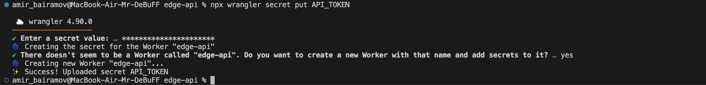

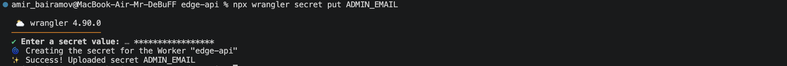

Verification:

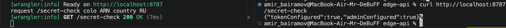

---

## Workers KV

KV namespace created with:

```bash
npx wrangler kv namespace create SETTINGS
```

Bound in `wrangler.jsonc`:

```json
"kv_namespaces": [
  {
    "binding": "SETTINGS",
    "id": "debc9457e0e74cf585942ebc4ecb26b8"
  }
]
```

The KV namespace is used for persistent state storage.

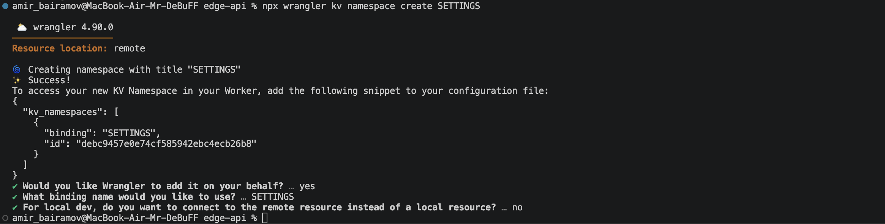

---

# API Implementation

## Example Endpoints

### `/health`

Returns service health status.

Example response:

```json
{
  "status": "ok",
  "version": "v2",
  "uptime": "running"
}
```

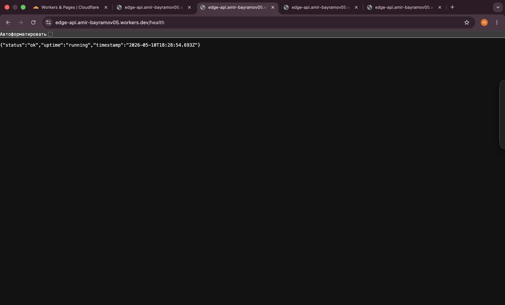

---

### `/edge`

Returns Cloudflare edge metadata from `request.cf`.

Example response:

```json
{
  "colo": "ARN",
  "country": "RU",
  "city": "Moscow",
  "asn": 12389,
  "httpProtocol": "HTTP/3",
  "tlsVersion": "TLSv1.3"
}
```

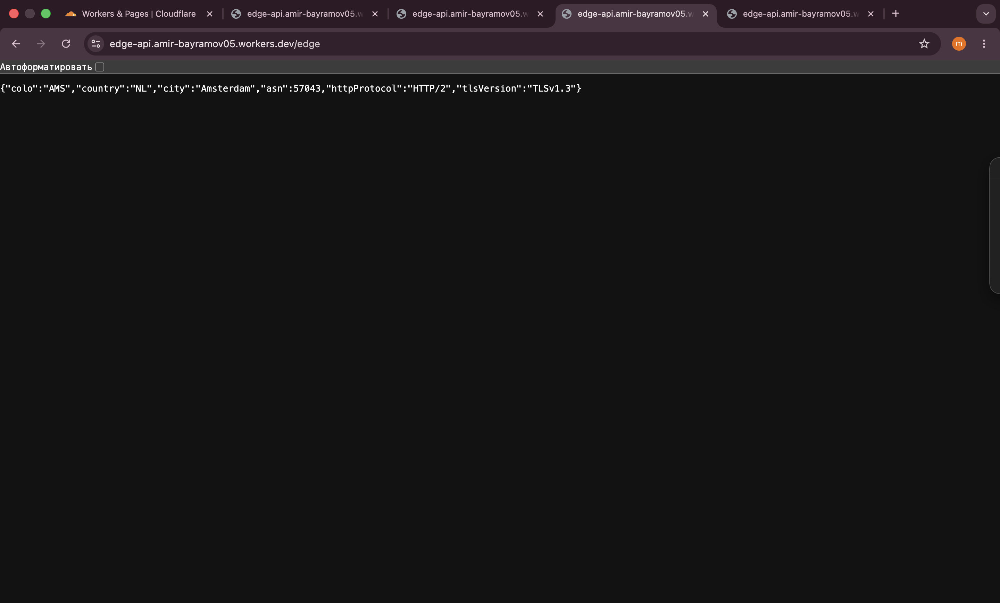

---

### `/counter`

Persistent KV-backed counter.

Example response:

```json
{
  "visits": 5,
  "persisted": true
}
```

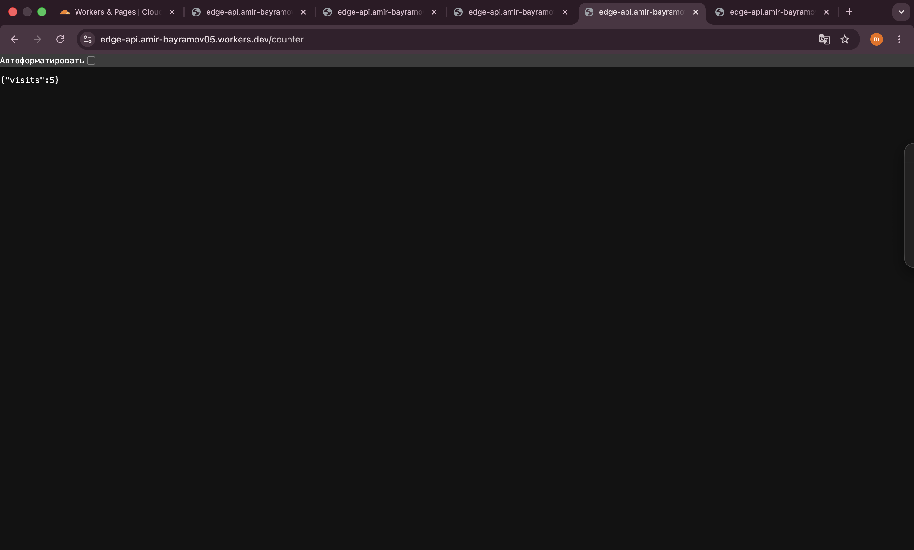

The counter value persisted after redeployment, proving KV persistence works independently from Worker deployments.

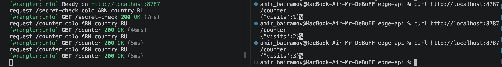

---

# Global Edge Behavior

Cloudflare Workers runs code on Cloudflare’s global edge network.

Unlike Kubernetes or VM-based deployments, the developer does not manually select deployment regions.

Instead:
- Cloudflare automatically distributes the Worker globally
- Requests execute near the user
- Routing is handled automatically by Cloudflare’s network

There is no need for:
- regional clusters
- load balancers
- ingress controllers
- multi-region deployment orchestration

This differs from Kubernetes where developers often:
- choose regions manually
- manage scaling infrastructure
- configure networking
- deploy replicas across zones or clusters

---

# Routing Concepts

## workers.dev

`workers.dev` provides an automatically generated public URL for a Worker.

Example:

```text
https://edge-api.amir-bayramov05.workers.dev
```

This was used for the required deployment.

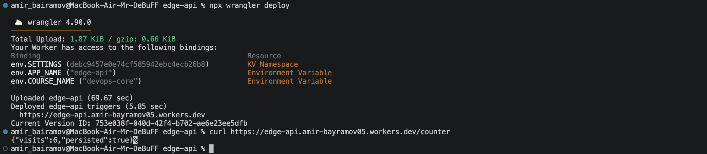

---

## Routes

Routes attach a Worker to traffic for an existing Cloudflare-managed domain or zone.

Example:

```text
api.example.com/*
```

---

## Custom Domains

Custom Domains allow a Worker to directly serve a domain or subdomain as the application origin.

This lab did not require a custom domain.

---

# Persistence Verification

The KV-backed `/counter` endpoint was tested before and after redeployment.

Observed behavior:
- Counter values continued increasing after redeployment
- Stored KV values were preserved
- Worker code deployments did not reset KV state

This demonstrates separation between:
- compute/runtime
- persistent storage

Before deploy:


After deploy:


---

# Observability & Operations

## Logs

Live logs were viewed using:

```bash
npx wrangler tail
```

Example logged fields:
- request path
- Cloudflare colo
- country

Example log output:

```text
request /edge colo ARN country RU
```

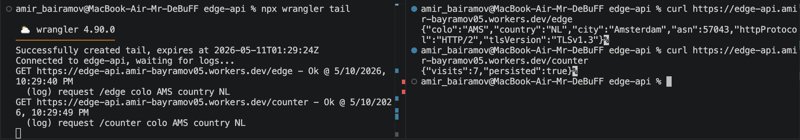

---

## Metrics

Metrics were reviewed in the Cloudflare dashboard.

Observed metrics included:
- request count
- invocation count
- errors
- CPU time

The dashboard provided near real-time operational visibility.

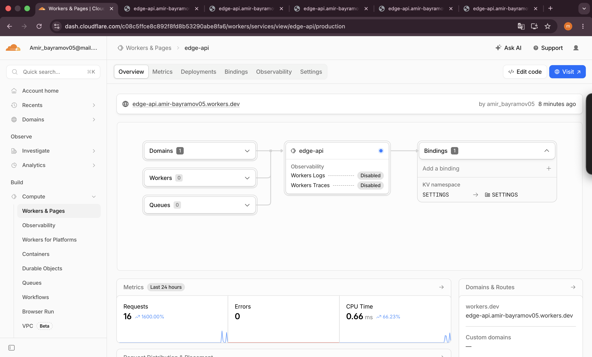

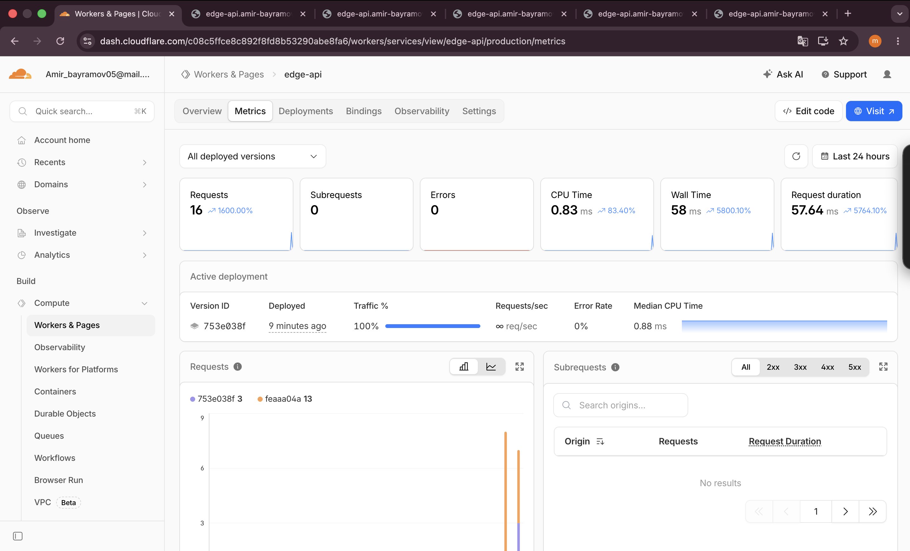

---

## Deployment Management

Deployment history was viewed using:

```bash
npx wrangler deployments list
```

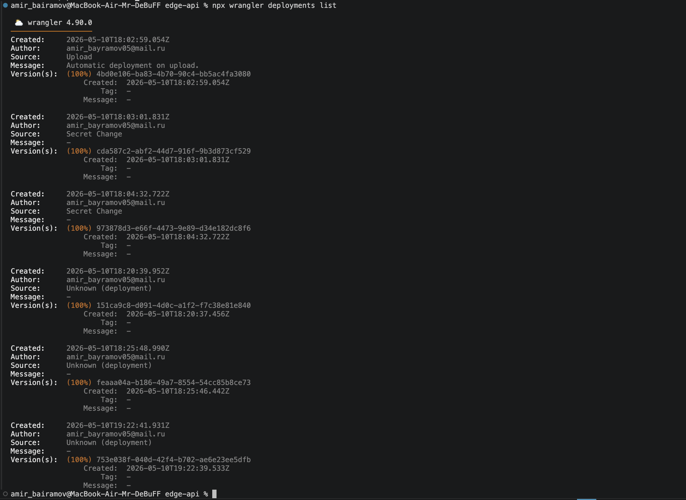

Multiple Worker versions were deployed.

Rollback was tested using:

```bash
npx wrangler rollback
```

The rollback successfully restored a previous Worker version.

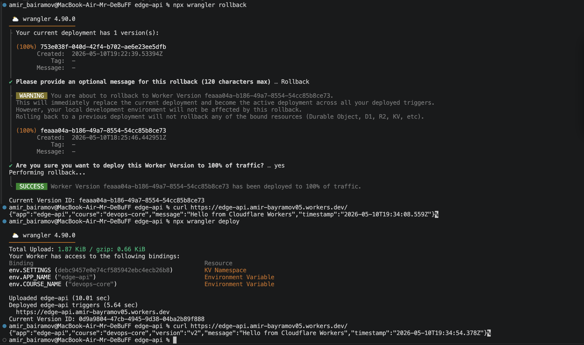

---

# Kubernetes vs Cloudflare Workers Comparison

| Aspect | Kubernetes | Cloudflare Workers |
|---|---|---|
| Setup complexity | High | Low |
| Deployment speed | Moderate | Very fast |
| Global distribution | Manual configuration | Automatic |
| Cost (small apps) | Higher | Very low / free tier |
| State model | External databases/volumes | KV/Durable Objects |
| Infrastructure management | Required | Fully managed |
| Runtime flexibility | Very high | Limited runtime |
| Long-running workloads | Excellent | Not suitable |
| Cold starts | Possible | Minimal |
| Best use case | Complex containerized systems | Lightweight edge APIs |

---

# When to Use Each

## Kubernetes is better for

- Complex microservice architectures
- Stateful systems
- Long-running workloads
- Custom networking
- GPU/ML workloads
- Container portability
- Advanced orchestration requirements

---

## Cloudflare Workers is better for

- Lightweight APIs
- Edge request processing
- CDN-adjacent logic
- Fast global deployments
- Low operational overhead
- Serverless applications
- Authentication middleware
- Request filtering and transformation

---

# Recommendation

For lightweight globally distributed APIs, Cloudflare Workers provides a significantly simpler deployment and operational model.

For large-scale distributed systems requiring extensive runtime control and orchestration, Kubernetes remains more flexible and powerful.

---

# Reflection

## What felt easier than Kubernetes?

Cloudflare Workers was significantly easier to:
- deploy
- expose publicly
- scale globally
- configure networking

There was no need to:
- build Docker images
- manage clusters
- configure ingress
- manage load balancers

Deployment required only:

```bash
npx wrangler deploy
```

---

## What felt more constrained?

Workers has runtime limitations:
- no Docker containers
- limited execution model
- limited filesystem access
- no traditional background processes

The platform is optimized for lightweight edge workloads rather than full infrastructure control.

---

## What changed because Workers is not a Docker host?

The application had to be written specifically for the Workers runtime.

There was:
- no container image
- no operating system access
- no package installation on a VM
- no persistent local filesystem

State persistence had to use platform services such as Workers KV instead of local storage.

---

# Evidence

## Screenshots

Screenshots were saved in the `screenshots_l17` directory.

These screenshots demonstrate:
- full lab workflow
- successful deployment
- edge metadata
- persistence
- observability
- deployment history
- production metrics

---

# Commands Used

```bash
npx wrangler whoami
```

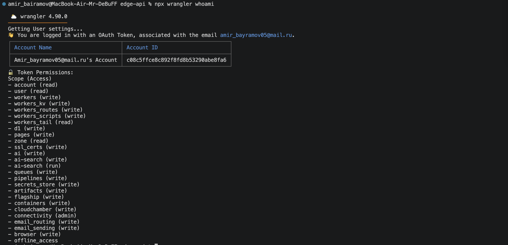

## Local Development

```bash
npx wrangler dev
```

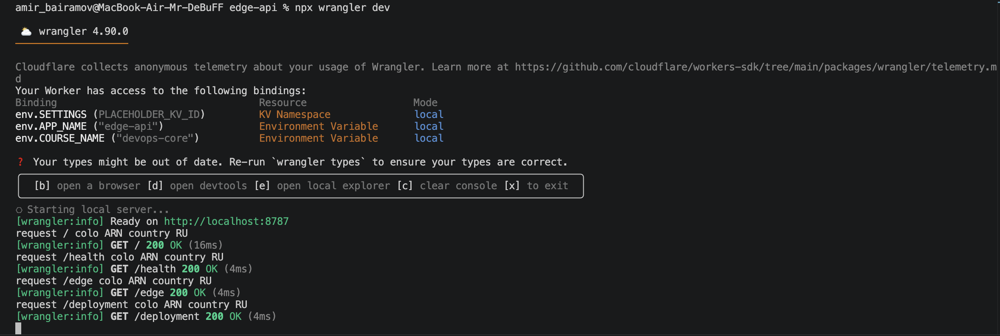

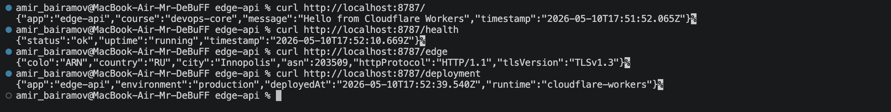

## Deploy

```bash
npx wrangler deploy
```

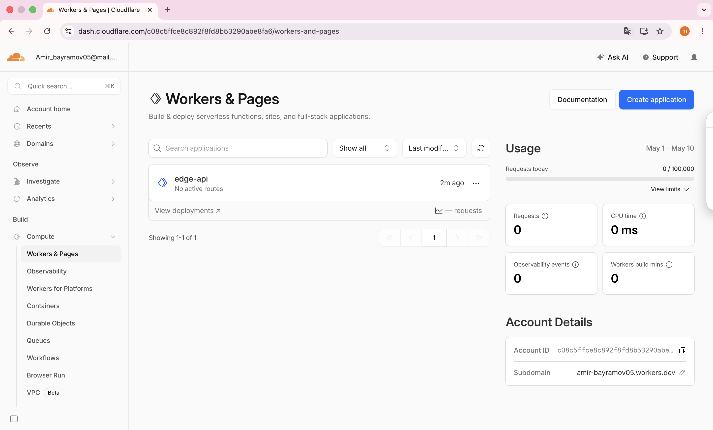

---

# Conclusion

This lab demonstrated deployment of a globally distributed serverless API using Cloudflare Workers.
