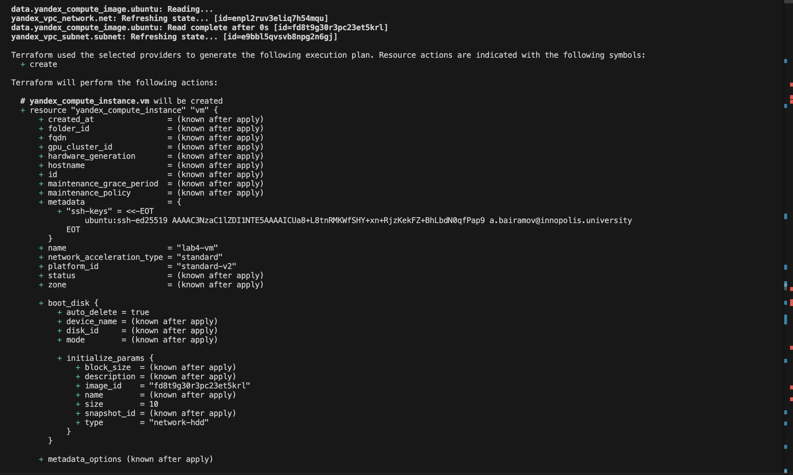
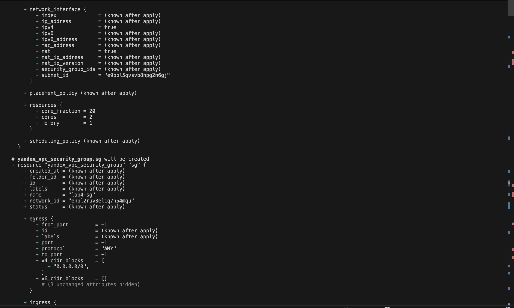
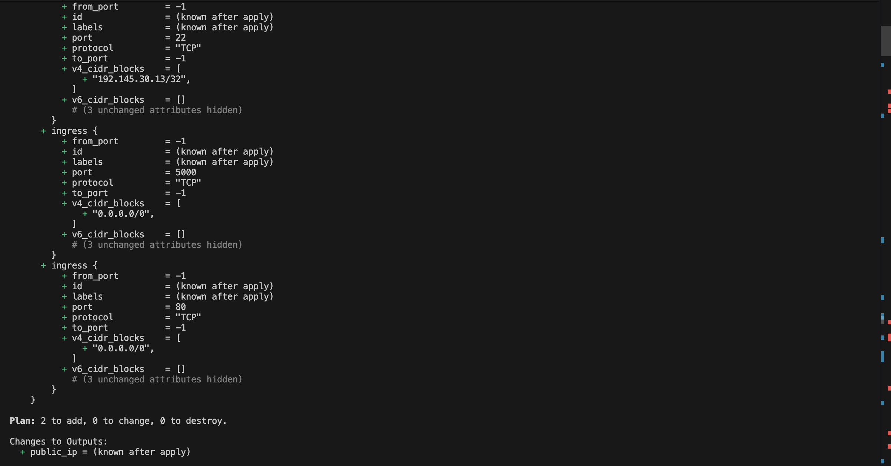
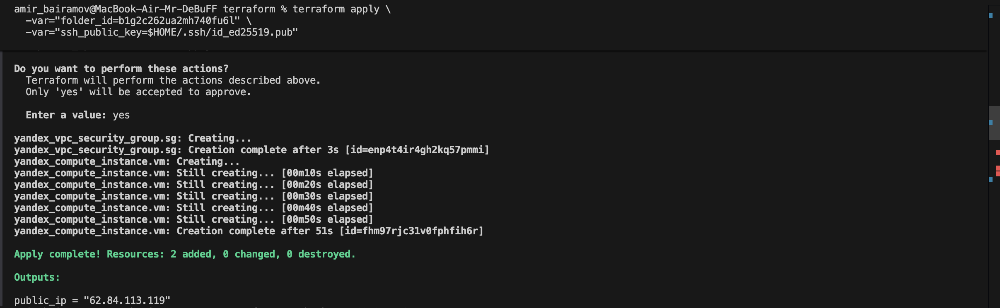
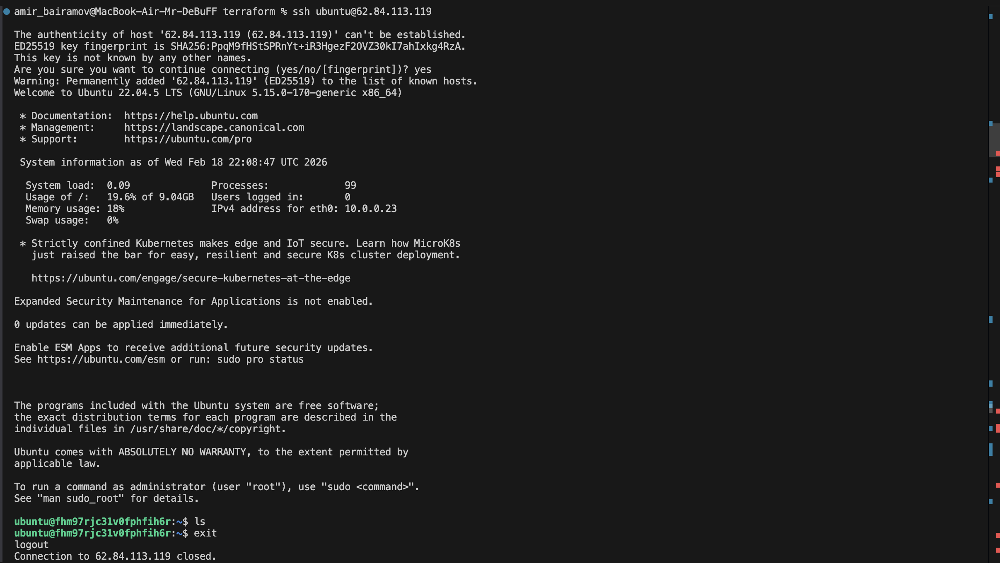
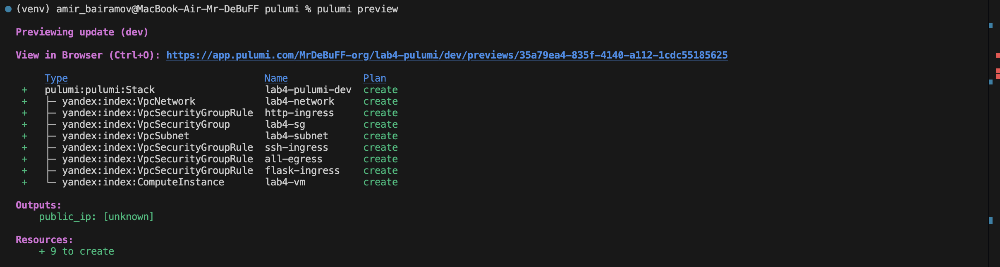
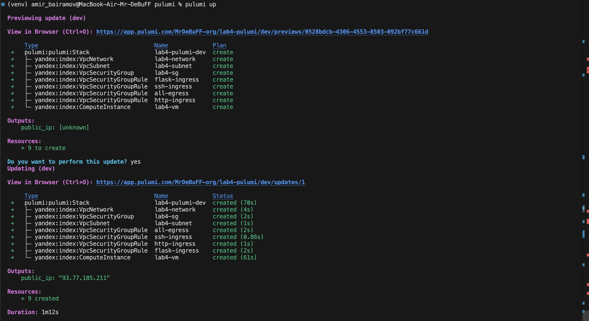
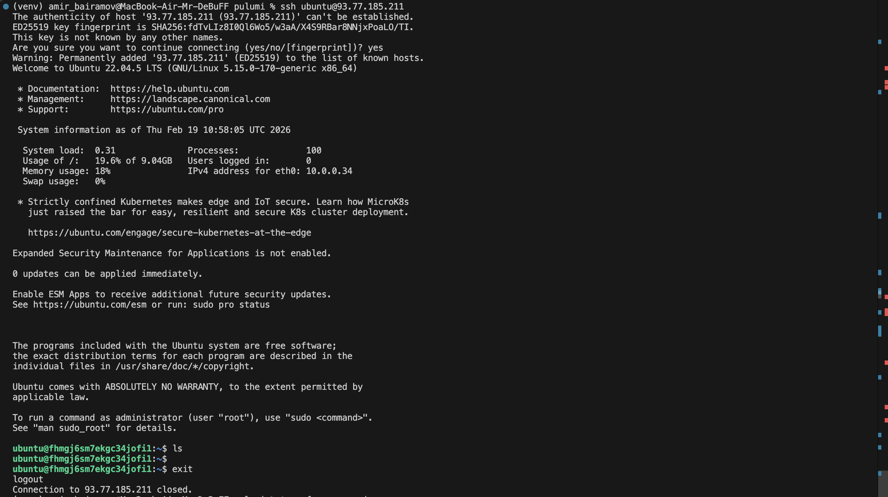
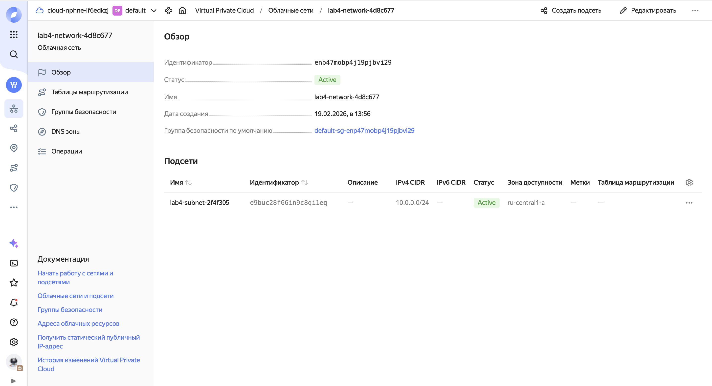

# LAB 04 — Infrastructure as Code (Terraform & Pulumi)

# 1. Cloud Provider & Infrastructure

## Cloud Provider Chosen

Yandex Cloud was selected as the cloud provider.

### Rationale

* Free tier suitable for educational purposes
* Simple IAM and service account integration
* Lightweight infrastructure sufficient for lab requirements
* Good compatibility with both Terraform and Pulumi


## Instance Type / Size

* 2 vCPU
* 1 GB RAM
* Core fraction: 20%
* Ubuntu 22.04 LTS image

### Why This Size?

This configuration is sufficient to:

* Run a basic Linux VM
* Install Docker
* Run a simple Flask application
* Stay within free tier limits

## Region / Zone

* Region: ru-central1
* Zone: ru-central1-a

### Why This Region?

* Default and most stable region
* Supported by free-tier eligible resources
* Minimal latency for testing purposes

## Total Cost

$0 — all resources were created within free tier limits.

## Resources Created

### Networking

* VPC Network
* Subnet
* Security Group
* Security Group Rules (SSH, HTTP, App Port, Egress)

### Compute

* Virtual Machine instance
* Boot disk (10 GB)
* Public IP via NAT

# 2. Terraform Implementation

## Terraform Version Used

Terraform v1.14.5 (latest stable at time of implementation)

## Project Structure

```
terraform/
├── main.tf
├── variables.tf
├── outputs.tf
├── provider.tf
└── .gitignore
```

Explanation:

* provider.tf — Cloud provider configuration
* variables.tf — Input variables (folder_id, cloud_id, ssh key path)
* main.tf — Network, Security Group, VM definitions
* outputs.tf — VM public IP output

## Key Configuration Decisions

* Used service account key file for authentication
* Separated networking and compute resources
* Opened only required ports (22, 80, 5000)
* Used Ubuntu 22.04 LTS image family
* Enabled NAT for public access

## Challenges Encountered

* Understanding how SSH public key injection works
* Configuring service account credentials properly
* Debugging Security Group rule syntax
* Handling environment variables for authentication

## Key Command Outputs

### terraform init

```
Terraform has been successfully initialized!
```

### terraform plan (sanitized)





### terraform apply



### SSH Connection



# 3. Pulumi Implementation

## Pulumi Version & Language

* Pulumi v3.221.0
* Language: Python

## How Code Differs from Terraform

* Uses general-purpose programming language (Python)
* Resources created via classes instead of HCL blocks
* Security Group rules required separate resource definitions
* Native programming logic available (loops, variables, functions)

## Advantages Discovered

* Full power of Python
* Easier reuse of logic
* Familiar syntax for developers
* Better integration with application code

## Challenges Encountered

* Version compatibility issues (Python 3.13)
* Missing Python dependencies (pkg_resources)
* Differences in Security Group rule implementation
* Less documentation/examples compared to Terraform

## Key Command Outputs

### pulumi preview



### pulumi up



### SSH Connection



# 4. Terraform vs Pulumi Comparison

## Ease of Learning

Terraform was easier initially because of simpler declarative syntax and better documentation. Pulumi required understanding provider-specific quirks and Python dependency management.

---

## Code Readability

Terraform is cleaner and more readable for pure infrastructure definitions. Pulumi is more flexible but slightly more verbose.

---

## Debugging

Terraform was easier to debug due to clearer error messages and larger community support. Pulumi debugging required analyzing Python stack traces.

---

## Documentation

Terraform has better documentation and more real-world examples. Pulumi documentation for Yandex Cloud is more limited.

---

## Use Case

Terraform is ideal for pure infrastructure management and team environments.
Pulumi is preferable when infrastructure must tightly integrate with application logic.

---

# 5. Lab 5 Preparation & Cleanup

## VM for Lab 5

Yes — VM will be kept for Lab 5.

Selected VM: Pulumi-created VM.

Reason: Cleaner final implementation and better understanding of configuration.

---

## Cleanup Status

VM is still running and accessible via SSH.

Verification:
```
ssh ubuntu@93.77.185.211
```


