# Lab 13 — GitOps with ArgoCD

---

## 1. ArgoCD Setup

### Installation Verification

ArgoCD was installed using a Helm chart:

```bash
helm repo add argo https://argoproj.github.io/argo-helm
helm repo update

kubectl create namespace argocd

helm install argocd argo/argo-cd --namespace argocd
```

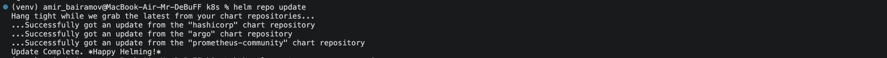

Verification:

```bash
kubectl get pods -n argocd
```

All core components (`argocd-server`, `repo-server`, `application-controller`) are in `Running` state.

---

### UI Access Method

Port-forwarding was used to access the UI:

```bash
kubectl port-forward svc/argocd-server -n argocd 8080:443
```

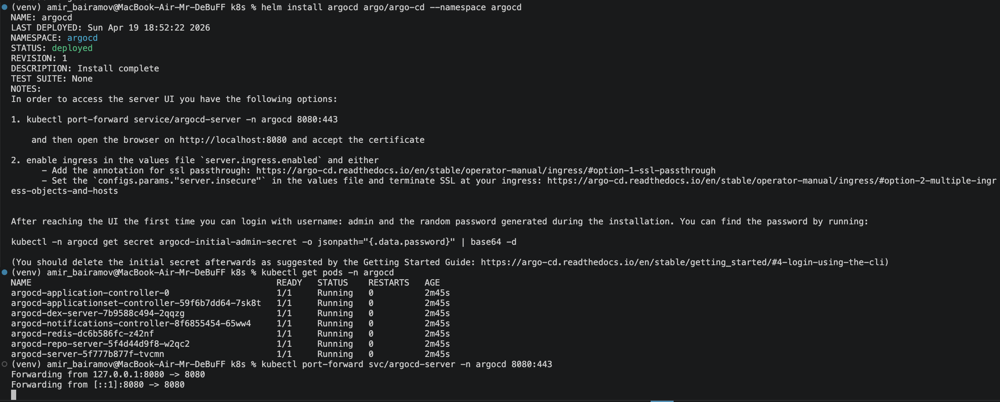

Access URL:

```
https://localhost:8080
```

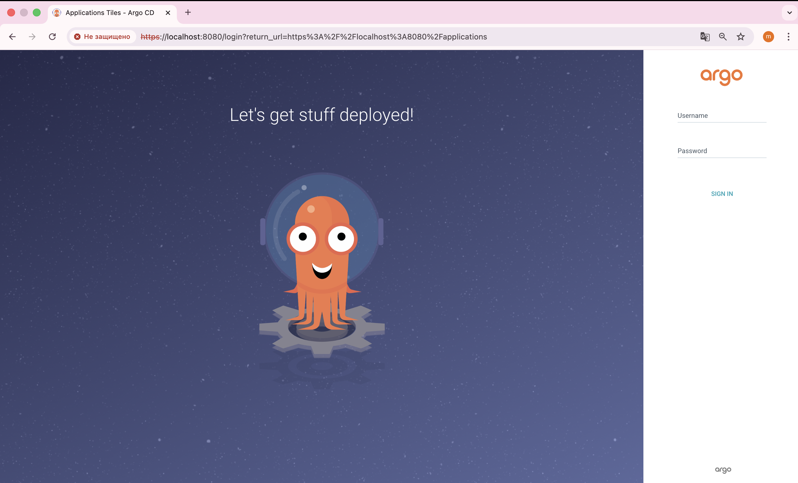

Credentials:

* Username: `admin`
* Password retrieved via:

```bash
kubectl -n argocd get secret argocd-initial-admin-secret \
-o jsonpath="{.data.password}" | base64 -d
```

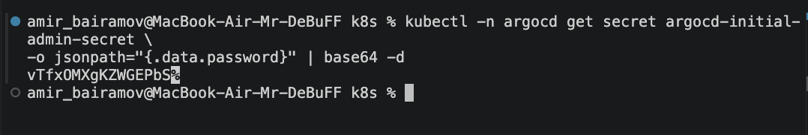

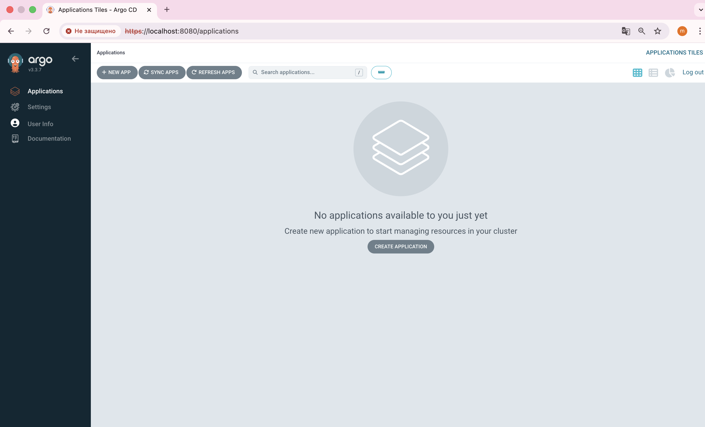

---

### CLI Configuration

CLI installed via Homebrew:

```bash
brew install argocd
```

Login:

```bash
argocd login localhost:8080 --insecure
```

Verification:

```bash
argocd app list
```

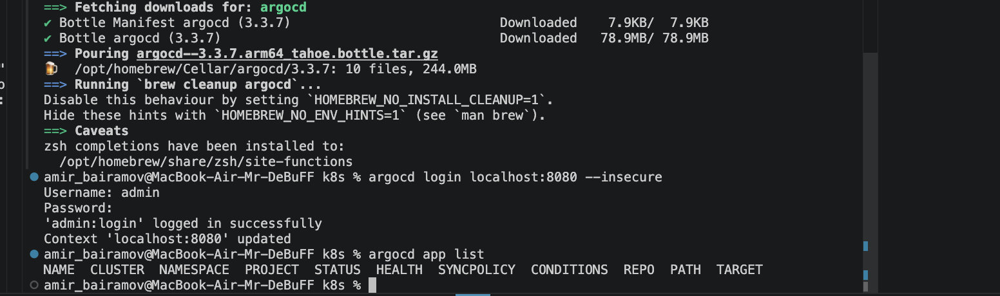

---

## 2. Application Configuration

### Application Manifests

The following manifests were created:

```
k8s/argocd/
├── application.yaml
├── application-dev.yaml
└── application-prod.yaml
```

---

### Source Configuration

```yaml
source:
  repoURL: https://github.com/<username>/<repo>.git
  targetRevision: main
  path: k8s/devops-info-chart
```

* `repoURL` — Git repository (source of truth)
* `targetRevision` — branch (main)
* `path` — path to Helm chart

---

### Destination Configuration

```yaml
destination:
  server: https://kubernetes.default.svc
  namespace: <environment>
```

* dev → `dev` namespace
* prod → `prod` namespace

---

### Values File Selection

Different Helm values are used per environment:

* dev:

  ```yaml
  valueFiles:
    - values-dev.yaml
  ```

* prod:

  ```yaml
  valueFiles:
    - values-prod.yaml
  ```

### Verification

1. Apply:

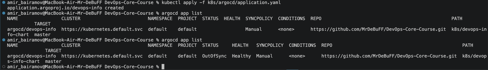

2. Sync:

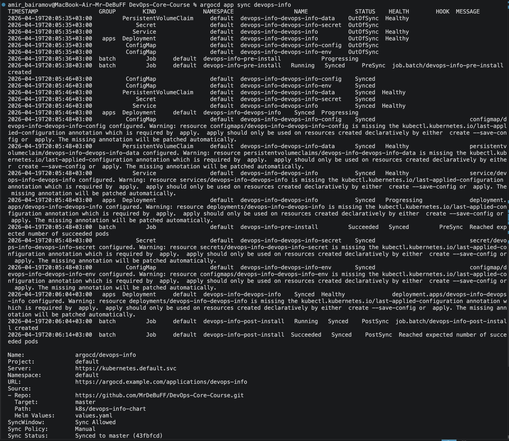

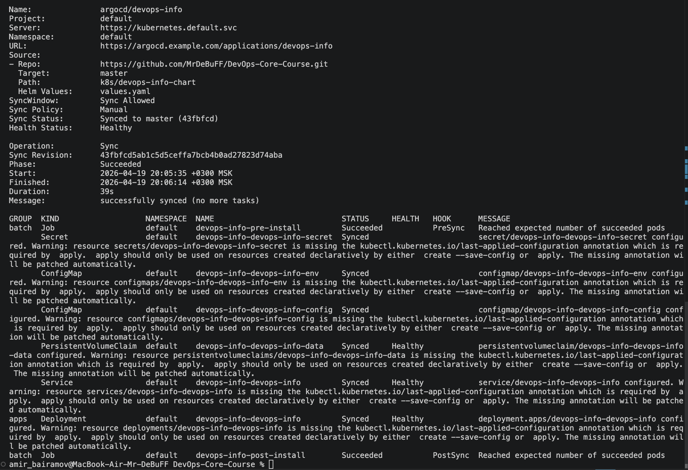

3. Get pods:

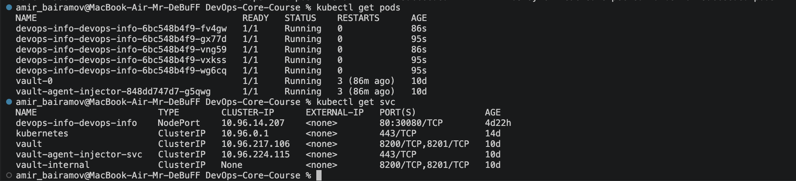

4. App list:

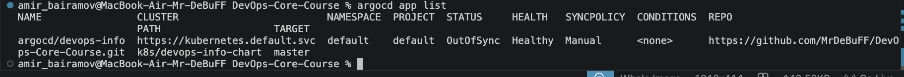

5. UI:

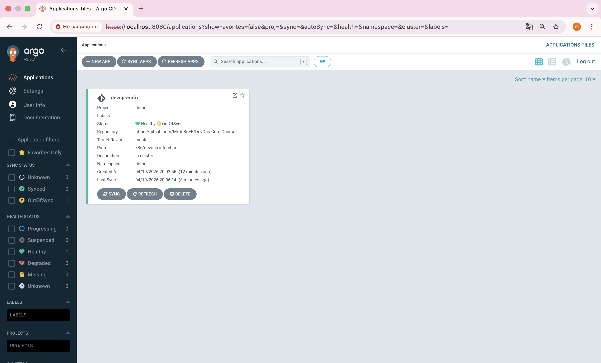

---

## 3. Multi-Environment

### Namespace Separation

Namespaces created:

```bash
kubectl create namespace dev
kubectl create namespace prod
```

---

## Dev vs Prod Differences

| Parameter    | Dev       | Prod       |
| ------------ | --------- | ---------- |
| replicaCount | 1         | 5          |
| resources    | minimal   | higher     |
| sync         | automatic | manual     |
| purpose      | testing   | production |

---

### Sync Policy Differences

#### Dev (Auto-Sync)

```yaml
syncPolicy:
  automated:
    prune: true
    selfHeal: true
```

* automatic deployment
* automatic drift correction
* removal of obsolete resources

---

#### Prod (Manual)

```yaml
syncPolicy:
  syncOptions:
    - CreateNamespace=true
```

* manual synchronization only

---

### Rationale

Production remains manual because:

* controlled release process
* prevents unintended changes
* allows code review before deployment
* supports planned rollout and rollback

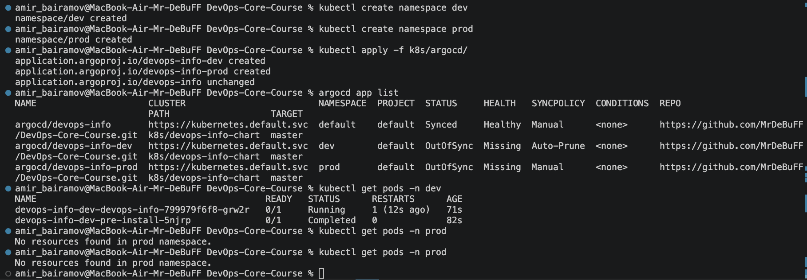

---

## 4. Self-Healing Evidence

### 4.1 Manual Scale Test

Before change:

```bash
kubectl get pods -n dev
```

→ 1 pod

---

Manual scaling:

```bash
kubectl scale deployment devops-info-dev-devops-info -n dev --replicas=5
```

→ 5 pods

---

After self-healing:

→ ArgoCD automatically restored desired state to 1 pod

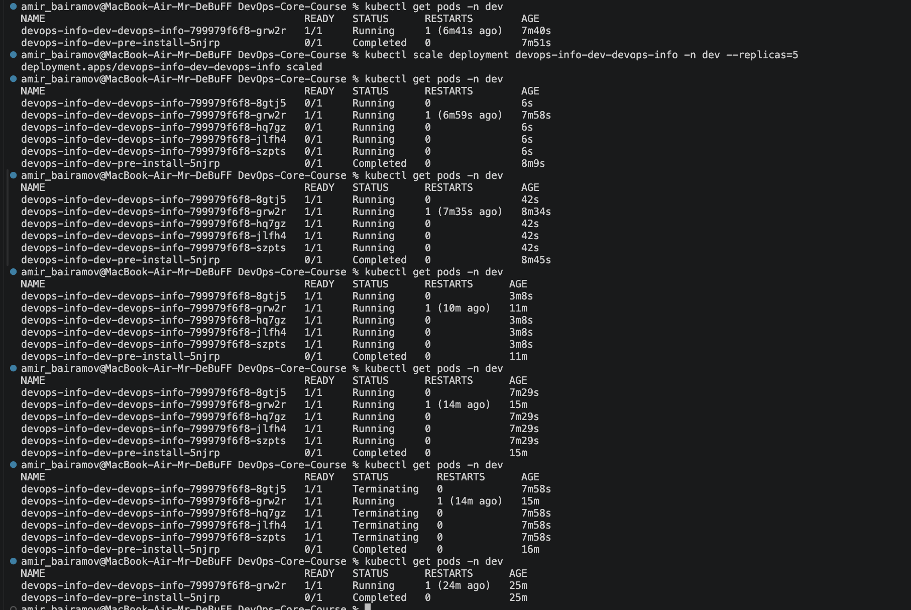

---

### 4.2 Pod Deletion Test

```bash
kubectl delete pod -n dev <pod-name>
```

Result:

* Pod was immediately recreated

This is Kubernetes behavior (ReplicaSet), not ArgoCD

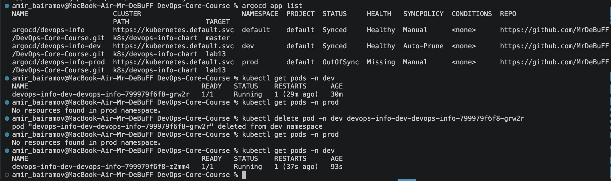

---

### 4.3 Configuration Drift Test

Manual modification:

```bash
kubectl edit deployment devops-info-dev-devops-info -n dev
```

Added label:

```yaml
metadata:
  labels:
    drift: test
```

Result:

* ArgoCD detected drift
* Changes were automatically reverted

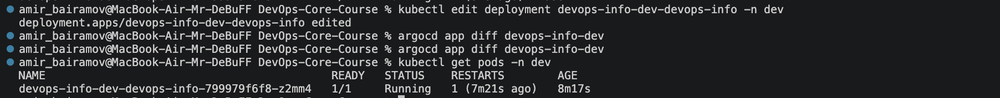

---

### 4.4 Observed Behavior

| Scenario       | Result                  |
| -------------- | ----------------------- |
| replica change | reverted by ArgoCD      |
| pod deletion   | recovered by Kubernetes |
| config change  | reverted by ArgoCD      |

---

## 5. Sync Behavior

### When ArgoCD Syncs

ArgoCD performs synchronization when:

* changes are pushed to Git
* drift is detected (with selfHeal enabled)
* manual sync is triggered
* periodic polling occurs

---

### What Triggers Sync

* `git push`
* manual sync (UI or CLI)
* drift detection
* webhook (if configured)

---

### Sync Interval

Default polling interval:

```
~ every 3 minutes
```

ArgoCD checks the Git repository periodically for changes.

---

### ArgoCD vs Kubernetes Behavior

| System     | Responsibility                        |
| ---------- | ------------------------------------- |
| Kubernetes | maintains desired pod count           |
| ArgoCD     | maintains desired configuration state |

---

## 6. Screenshots (Required)

The screenshots in this document included:

1. ArgoCD UI showing both applications (dev and prod)
2. Sync status (Synced / OutOfSync)
3. Application details view

To see more info look in upper part of the document, or in folder `screenshots_l13`.
