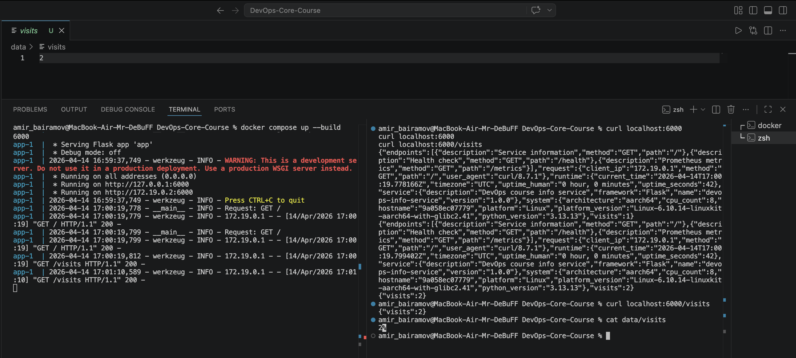
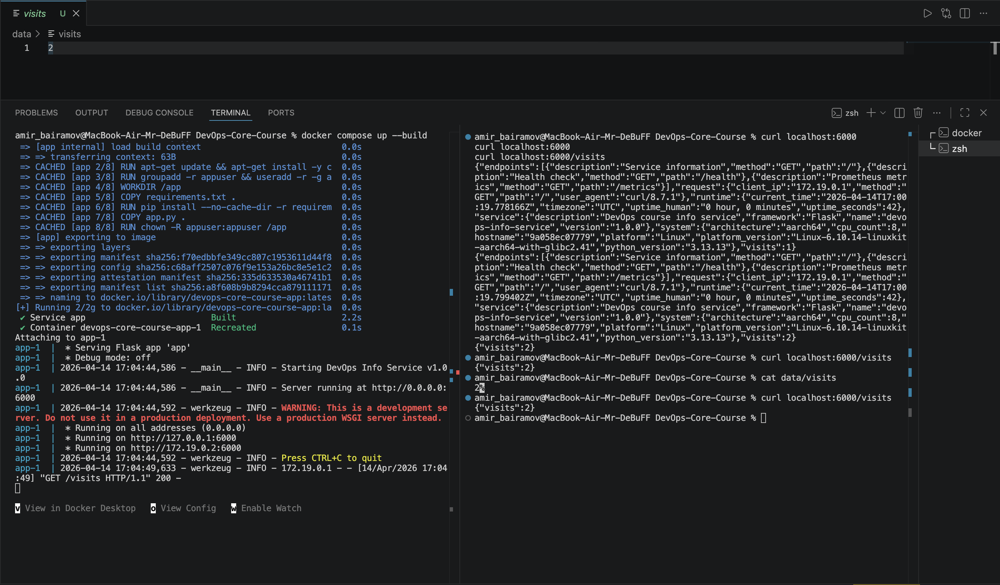
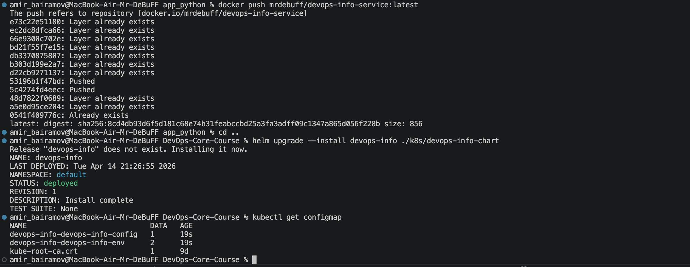
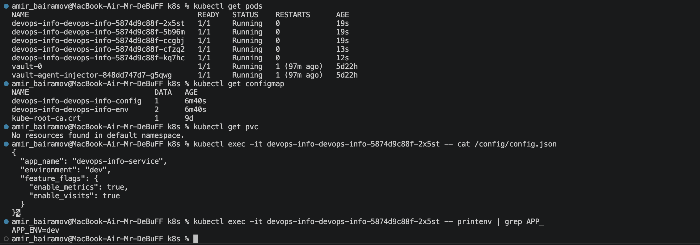
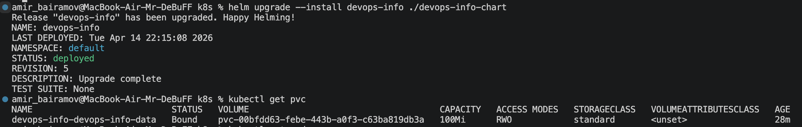
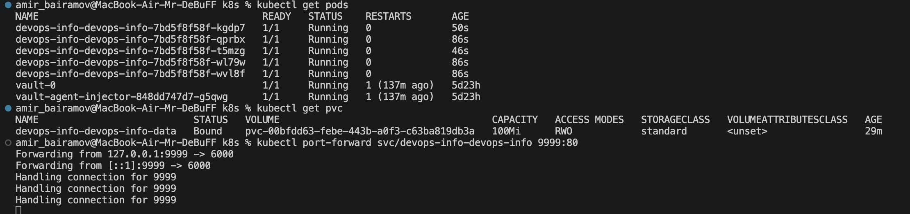
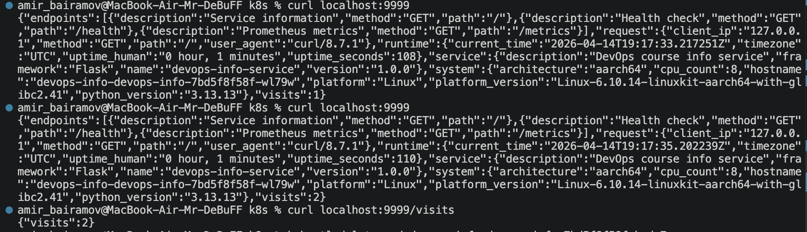
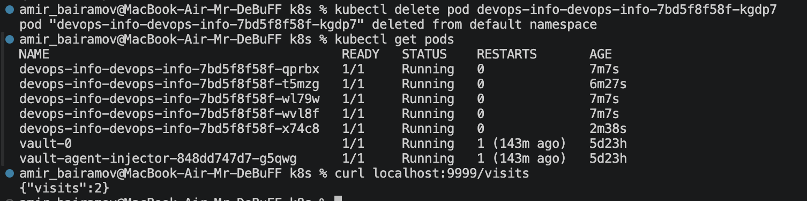

# Lab 12 — ConfigMaps & Persistent Volumes

## 1. Application Changes

### Visits Counter Implementation

The application was enhanced with a visit counter that persists data to a file.

* A file `/data/visits` is used to store the number of visits
* On each request to `/`, the counter:

  1. Reads the current value from file
  2. Increments it
  3. Writes it back to the file
* If the file does not exist, the counter defaults to `0`

A simple thread lock is used to prevent race conditions during concurrent access.

---

### New Endpoint

A new endpoint `/visits` was added:

```bash
GET /visits
```

**Response example:**

```json
{
  "visits": 2
}
```

---

### Local Testing with Docker

A Docker Compose setup was used to verify persistence locally.

**docker-compose.yml:**

```yaml
services:
  app:
    build: ./app_python
    ports:
      - "6000:6000"
    volumes:
      - ./data:/data
```

**Test steps:**

1. Start container:

   ```bash
   docker compose up --build
   ```
2. Call endpoints multiple times:

   ```bash
   curl localhost:6000
   curl localhost:6000
   ```
3. Check visits:

   ```bash
   curl localhost:6000/visits
   ```



4. Restart container and verify persistence:

   ```bash
   docker compose down
   docker compose up

   curl localhost:6000/visits
   ```



The counter value remained consistent after restart.


---

## 2. ConfigMap Implementation

### Config File

A configuration file was created:

```
k8s/devops-info-chart/files/config.json
```

**Content:**

```json
{
  "app_name": "devops-info-service",
  "environment": "dev",
  "feature_flags": {
    "enable_metrics": true,
    "enable_visits": true
  }
}
```

---

### ConfigMap (File-based)

A ConfigMap was created using Helm:

```yaml
apiVersion: v1
kind: ConfigMap
metadata:
  name: {{ include "devops-info-chart.fullname" . }}-config
data:
  config.json: |-
{{ .Files.Get "files/config.json" | indent 4 }}
```

This loads the file directly into Kubernetes.

---

### Mounting ConfigMap as File

The ConfigMap is mounted into the container:

```yaml
volumes:
  - name: config-volume
    configMap:
      name: {{ include "devops-info-chart.fullname" . }}-config

volumeMounts:
  - name: config-volume
    mountPath: /config
```

Inside the pod, the file is available at:

```
/config/config.json
```

---

### ConfigMap for Environment Variables

A second ConfigMap provides environment variables:

```yaml
apiVersion: v1
kind: ConfigMap
metadata:
  name: {{ include "devops-info-chart.fullname" . }}-env
data:
  APP_ENV: "dev"
  LOG_LEVEL: "INFO"
```

Injected using:

```yaml
envFrom:
  - configMapRef:
      name: {{ include "devops-info-chart.fullname" . }}-env
```

---

### Verification

**List ConfigMaps:**

```bash
kubectl get configmap
```



---

**Check file inside pod:**

```bash
kubectl exec -it <pod> -- cat /config/config.json
```

**Check environment variables:**

```bash
kubectl exec -it <pod> -- printenv | grep APP_
```



---

## 3. Persistent Volume

### PVC Configuration

A PersistentVolumeClaim was created:

```yaml
apiVersion: v1
kind: PersistentVolumeClaim
metadata:
  name: {{ include "devops-info-chart.fullname" . }}-data
spec:
  accessModes:
    - ReadWriteOnce
  resources:
    requests:
      storage: 100Mi
```

---

### Access Mode & Storage Class

* **ReadWriteOnce (RWO):**

  * Volume can be mounted by a single node
  * Suitable for this application

* **StorageClass:**

  * Default storage class is used (Minikube auto-provisions storage)

---

### Mounting PVC

The volume is mounted into the container:

```yaml
volumes:
  - name: data-volume
    persistentVolumeClaim:
      claimName: {{ include "devops-info-chart.fullname" . }}-data

volumeMounts:
  - name: data-volume
    mountPath: /data
```

The application writes the visits file to:

```
/data/visits
```

---

### Persistence Verification

**Step 1 — Check visits count:**

```bash
curl localhost:9999/visits
```

Example:

```json
{ "visits": 2 }
```







---

**Step 2 — Delete pod:**

```bash
kubectl delete pod devops-info-devops-info-7bd5f8f58f-kgdp7
```

**Step 3 — Wait for new pod and check again:**

```bash
curl localhost:9999/visits
```

Example:

```json
{ "visits": 2 }
```



The value remained unchanged, confirming persistence.

---

## 4. ConfigMap vs Secret

### ConfigMap

Used for:

* Non-sensitive configuration
* Application settings
* Feature flags

Examples:

* `config.json`
* `APP_ENV`
* `LOG_LEVEL`

---

### Secret

Used for:

* Sensitive data
* Credentials
* API keys

Examples:

* Database passwords
* Tokens
* Private keys

---

### Key Differences

| Feature   | ConfigMap            | Secret                  |
| --------- | -------------------- | ----------------------- |
| Data type | Plain text           | Base64 encoded          |
| Use case  | Non-sensitive config | Sensitive data          |
| Security  | Low                  | Higher                  |
| Storage   | etcd                 | etcd (encrypted option) |
