# Lab 10 - Helm Package Manager

## 1. Chart Overview

### Chart Structure

The Helm chart is located in the `k8s/devops-info-chart` directory and follows standard Helm structure:

```
devops-info-chart/
├── Chart.yaml          # Chart metadata
├── values.yaml         # Default configuration values
├── values-dev.yaml     # Development environment values
├── values-prod.yaml    # Production environment values
└── templates/
    ├── deployment.yaml # Deployment template
    ├── service.yaml    # Service template
    ├── _helpers.tpl    # Helper templates
    └── hooks/
        ├── pre-install-job.yaml
        └── post-install-job.yaml
```

---

### Key Template Files

* **deployment.yaml**

  * Defines Kubernetes Deployment
  * Uses templating for replicas, image, resources, probes

* **service.yaml**

  * Exposes application via Kubernetes Service
  * Fully configurable (type, ports)

* **_helpers.tpl**

  * Contains reusable template functions
  * Used for naming and labels

* **hooks/**

  * Contains lifecycle hook jobs
  * Executes logic before and after installation

---

### Values Organization Strategy

Configuration is centralized in `values.yaml` using a structured approach:

* `replicaCount` → number of pods
* `image` → repository, tag, pull policy
* `service` → networking configuration
* `resources` → CPU/memory limits
* `env` → environment variables
* `livenessProbe` / `readinessProbe` → health checks

This makes the chart reusable and environment-independent.

---

## 2. Configuration Guide

### Important Values

| Parameter        | Description             |
| ---------------- | ----------------------- |
| replicaCount     | Number of pod replicas  |
| image.repository | Docker image repository |
| image.tag        | Image version           |
| service.type     | NodePort / LoadBalancer |
| resources        | CPU & memory limits     |
| livenessProbe    | Health check config     |
| readinessProbe   | Readiness check         |

---

### Environment Customization

Two environment-specific configuration files are used:

#### Development (`values-dev.yaml`)

* 1 replica
* Lower resource usage
* NodePort service
* Latest image tag

#### Production (`values-prod.yaml`)

* 5 replicas
* Higher resource limits
* LoadBalancer service
* Fixed image version

---

### Example Installations

#### Development:

```bash
helm install devops-info-chart . -f values-dev.yaml
```

#### Production:

```bash
helm upgrade devops-info-chart . -f values-prod.yaml
```

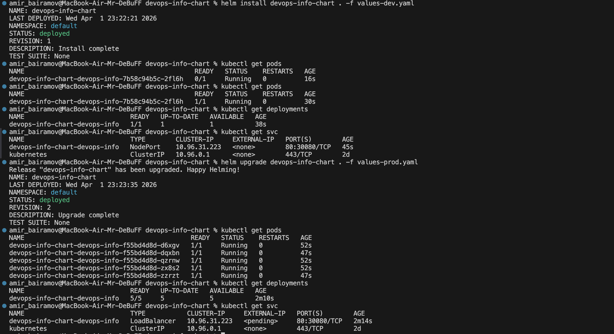

---

## 3. Hook Implementation

### Implemented Hooks

Two Helm hooks are implemented:

#### 1. Pre-install Hook

* Runs before chart installation
* Purpose: simulate pre-deployment validation

#### 2. Post-install Hook

* Runs after deployment
* Purpose: simulate smoke testing

---

### Hook Execution Order

| Hook         | Weight | Execution          |
| ------------ | ------ | ------------------ |
| Pre-install  | -5     | Runs first         |
| Post-install | +5     | Runs after install |

Lower weight = earlier execution.

---

### Deletion Policies

Both hooks use:

```
helm.sh/hook-delete-policy: hook-succeeded
```

This ensures:

* Jobs are deleted after successful execution
* Cluster stays clean
* No leftover resources

### Example Hook Implementations

1. Helm lint:

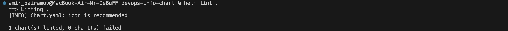

2. Helm install --dry-run --debug:

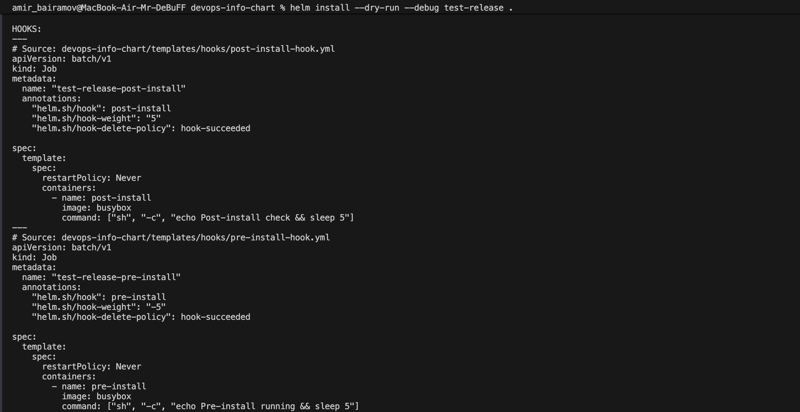

3. Helm install:

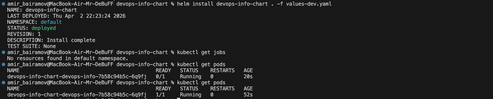

---

## 4. Installation Evidence

1. Install Helm:

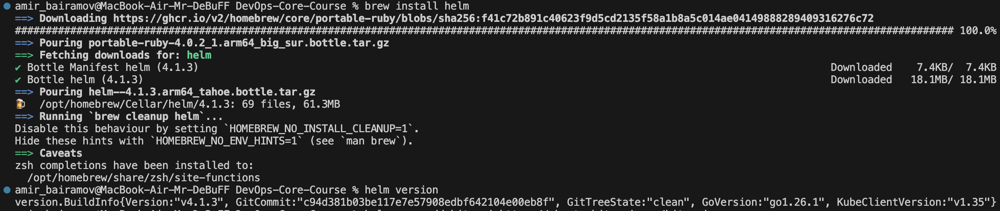

2. Helm add repo:

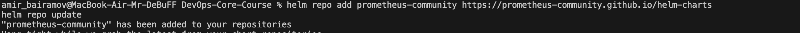

3. Helm repo update:

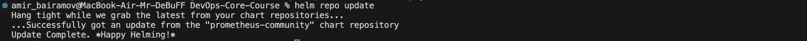

4. Helm search repo prometheus:

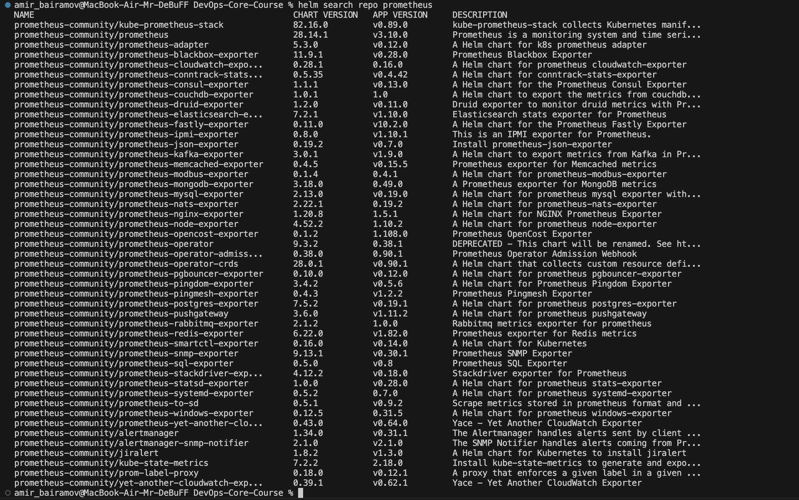

5. Helm show chart:

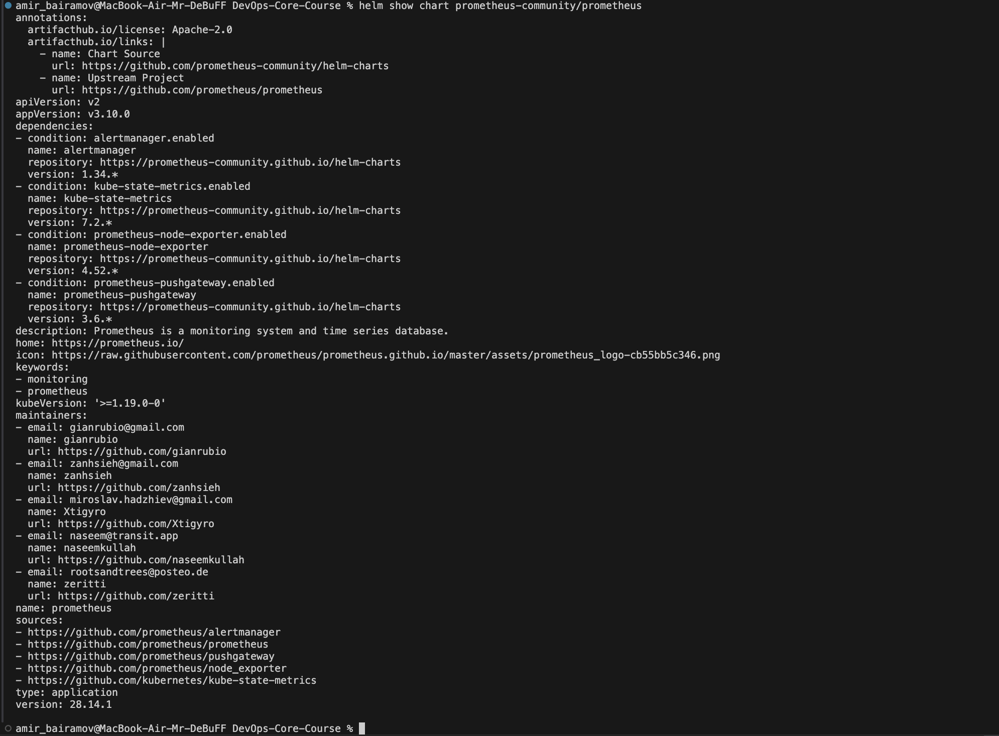

6. Helm lint:

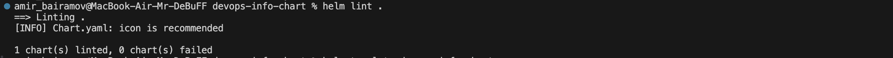

7. Helm template:

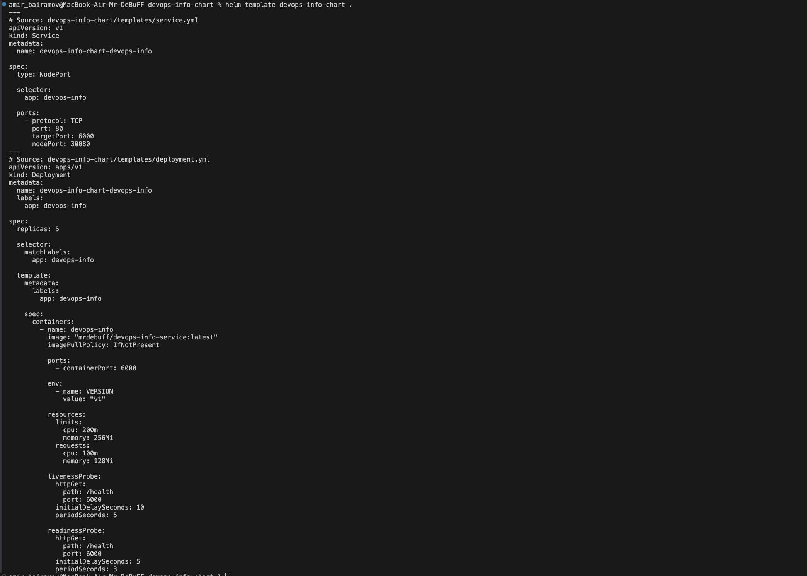

8. Helm install --dry-run --debug:

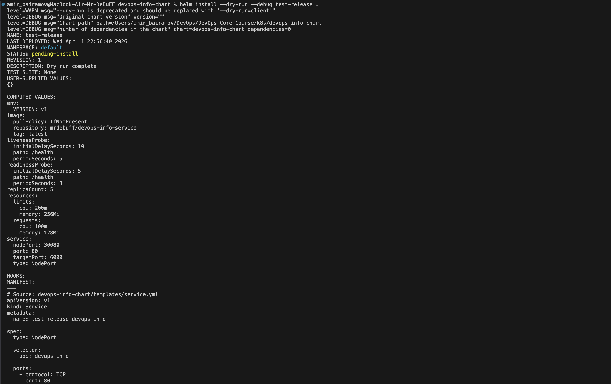

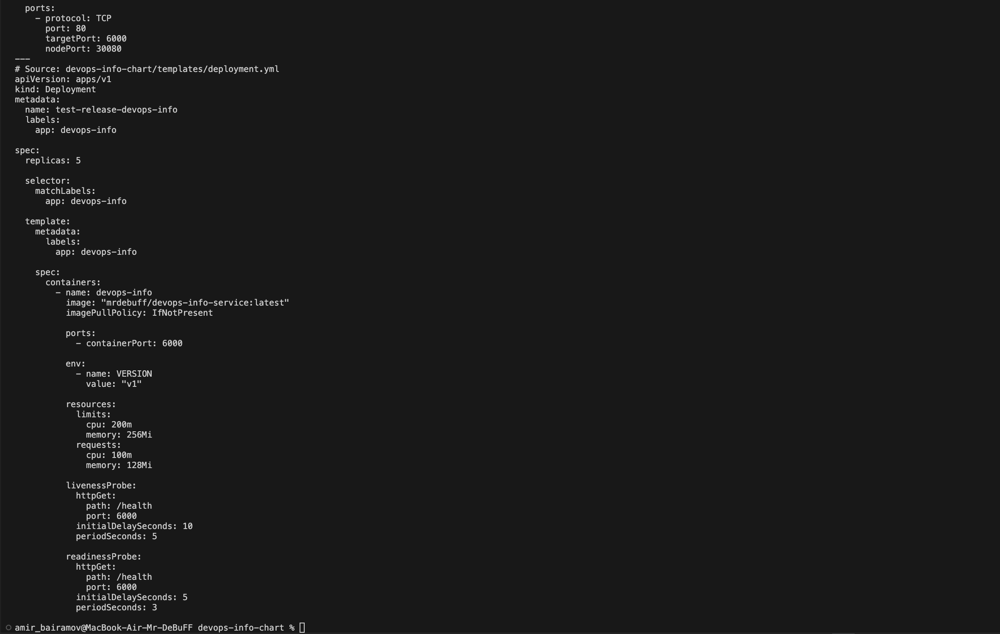

9. Helm install:

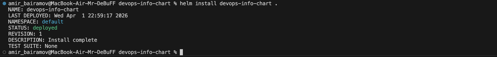

10. Verify installation:

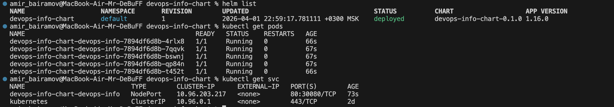

---

## 5. Operations

### Install

```bash
helm install devops-info-chart .
```

---

### Upgrade

```bash
helm upgrade devops-info-chart . -f values-prod.yaml
```

---

### Rollback

```bash
helm rollback devops-info-chart 1
```

---

### Uninstall

```bash
helm uninstall devops-info-chart
```


---

## 6. Testing & Validation

### Lint Check

```bash
helm lint .
```


Validates chart syntax and structure.

---

### Template Rendering

```bash
helm template test ./devops-info-chart
```


Renders Kubernetes manifests locally.

---

### Dry Run

```bash
helm install --dry-run --debug test-release .
```


Shows what will be installed without applying changes.

---

### Application Accessibility

Application is accessible via:

```bash
kubectl get svc
```

* NodePort → accessed via `<NodeIP>:30080`
* LoadBalancer → external IP (in cloud)

Health checks verified:

* `/health` endpoint
* Liveness & readiness probes working correctly


---

