# Lab 16 — Kubernetes Monitoring & Init Containers

## Overview

In this lab I implemented Kubernetes cluster monitoring using the Kube-Prometheus stack and explored init container patterns for application initialization.

The monitoring stack includes:
- Prometheus
- Grafana
- Alertmanager
- kube-state-metrics
- node-exporter
- Prometheus Operator

Additionally, I implemented:
- file download init container
- wait-for-service init container pattern

---

## Task 1 — Kube-Prometheus Stack

### Stack Components

### Prometheus Operator

Prometheus Operator simplifies the deployment and management of Prometheus components inside Kubernetes.

It watches custom resources such as:
- ServiceMonitor
- PodMonitor
- PrometheusRule

The operator automatically generates and updates Prometheus configuration.

---

### Prometheus

Prometheus is responsible for collecting and storing metrics from:
- Kubernetes cluster
- nodes
- pods
- services
- applications

It uses a pull-based model to scrape metrics endpoints.

---

### Alertmanager

Alertmanager processes alerts generated by Prometheus.

Its responsibilities:
- grouping alerts
- deduplication
- routing
- notifications

---

### Grafana

Grafana provides dashboards and visualization for metrics collected by Prometheus.

It allows:
- real-time monitoring
- dashboard creation
- resource analysis
- cluster observability

---

### kube-state-metrics

kube-state-metrics exposes Kubernetes object metrics.

It provides information about:
- pods
- deployments
- StatefulSets
- namespaces
- services
- nodes

---

### node-exporter

node-exporter collects hardware and operating system metrics from cluster nodes.

Examples:
- CPU usage
- memory usage
- filesystem usage
- network traffic

---

## Installation

### Add Helm Repository

```bash
helm repo add prometheus-community https://prometheus-community.github.io/helm-charts

helm repo update
```

### Install kube-prometheus-stack

```bash
helm install monitoring prometheus-community/kube-prometheus-stack \
  --namespace monitoring \
  --create-namespace
```

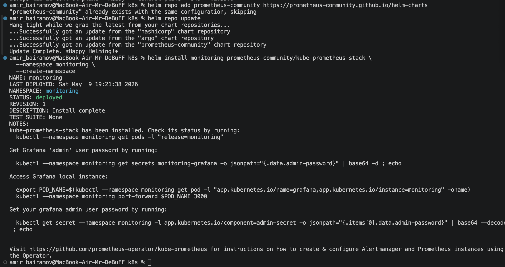

### Verify Installation

```bash
kubectl get po,svc -n monitoring
```

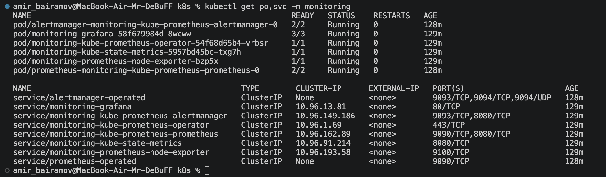

## Task 2 — Grafana Dashboard Exploration

### Access Grafana

```bash
kubectl port-forward svc/monitoring-grafana -n monitoring 3000:80
```

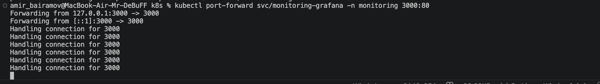

### Get Grafana Admin Password

```bash
kubectl get secret monitoring-grafana -n monitoring \
  -o jsonpath="{.data.admin-password}" | base64 -d
```

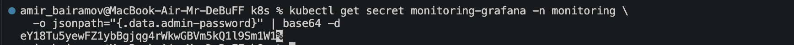

Grafana URL:

```
http://localhost:3000
```

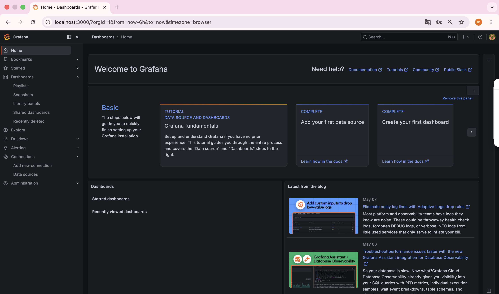

### Access Prometheus

```bash
kubectl port-forward svc/monitoring-prometheus -n monitoring 9090:9090
```

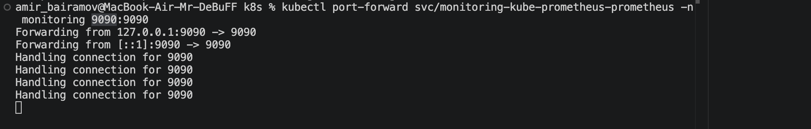

Prometheus URL:

```
http://localhost:9090
```

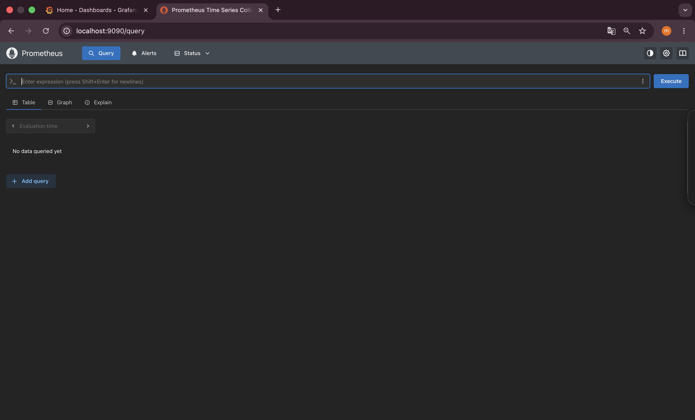

### Access Alertmanager

```bash
kubectl port-forward svc/monitoring-alertmanager -n monitoring 9093:9093
```

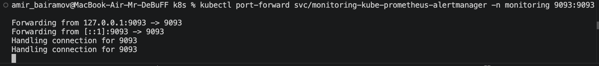

Prometheus URL:

```
http://localhost:9093
```

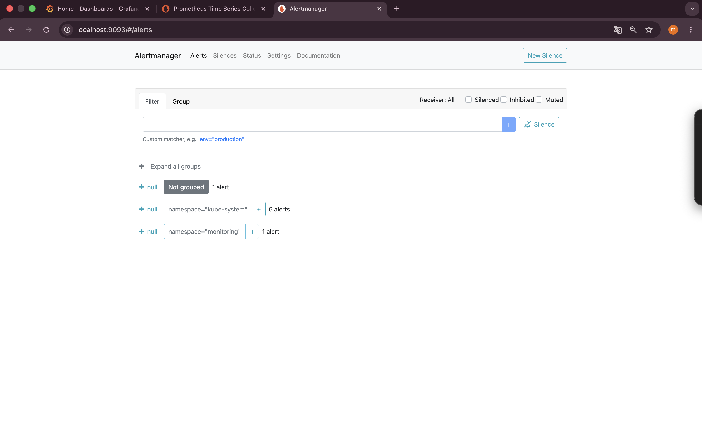


### Dashboard Answers

#### 1. Pod Resources

CPU Usage: around 0.0006

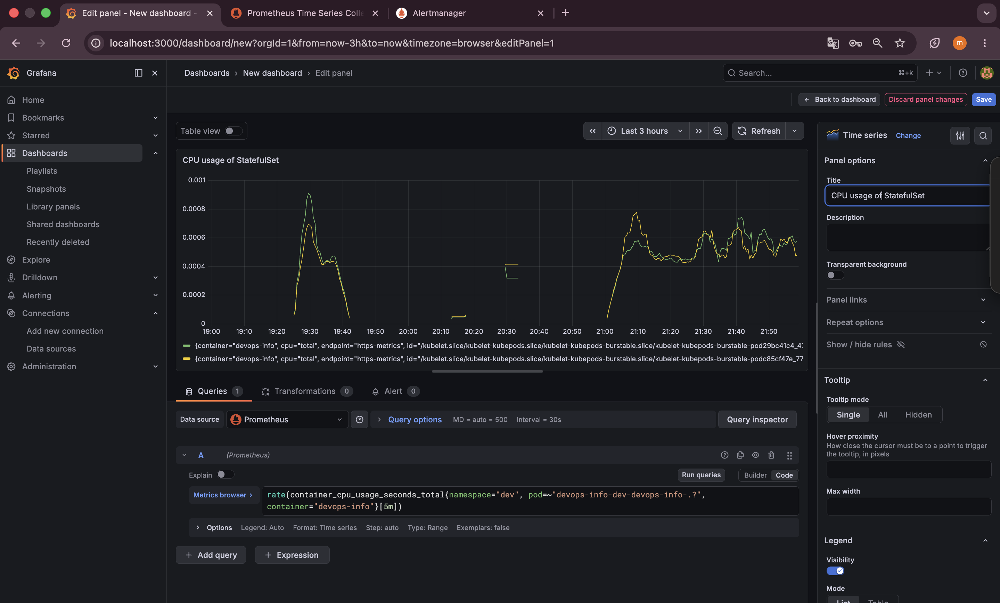

Memory Usage: around 500000 bytes

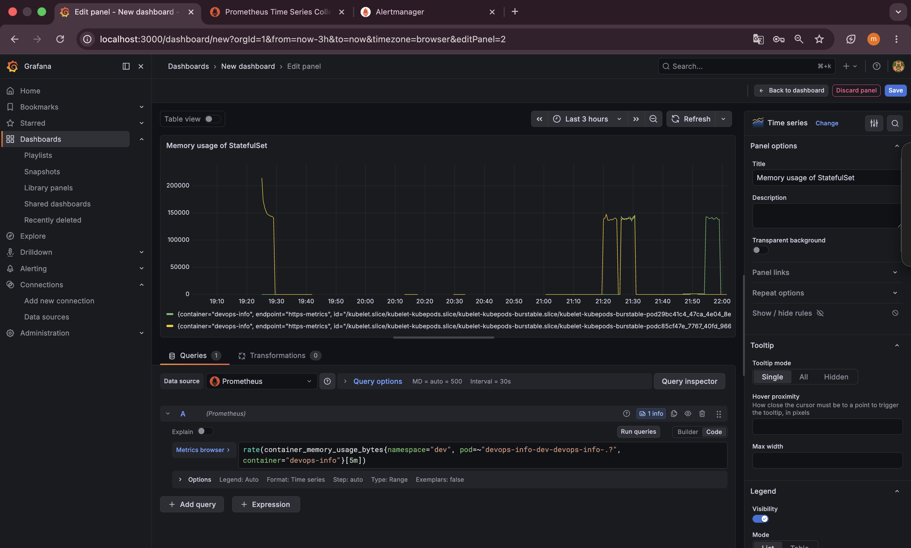

#### 2. Namespace Analysis

Pod Using Most CPU: `devops-info-dev-devops-info-1`

Pod Using Least CPU: `devops-info-dev-devops-info-0`

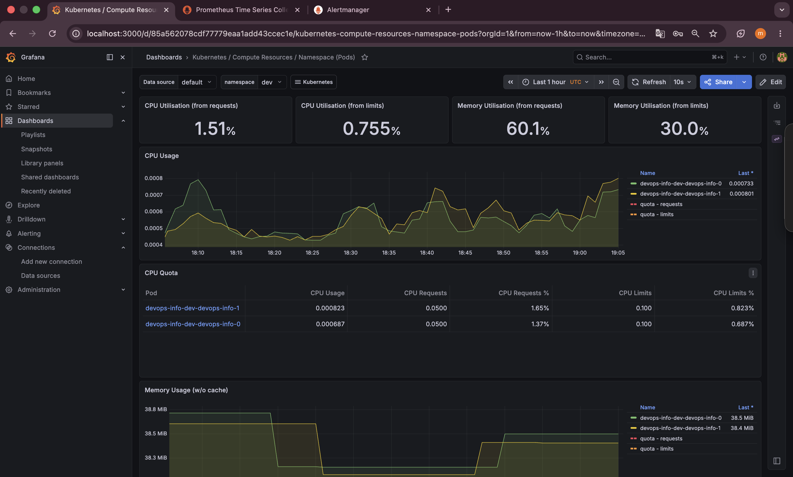

#### 3. Node Metrics

Memory Usage (%): 83,3%

Memory Usage (MB): around 4000 MB

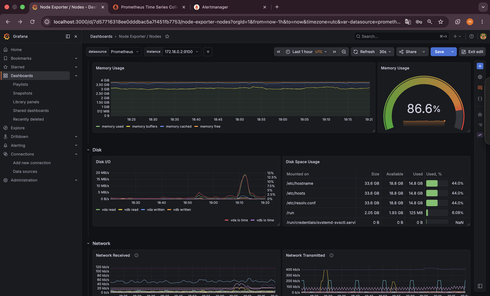

CPU Cores: 8

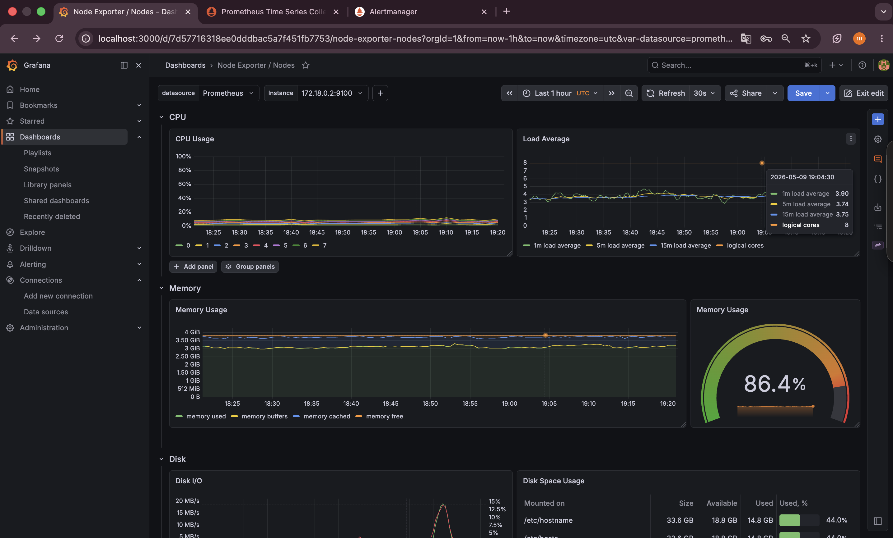

#### 4. Kubelet Metrics

Managed Pods: 28

Managed Containers: 59

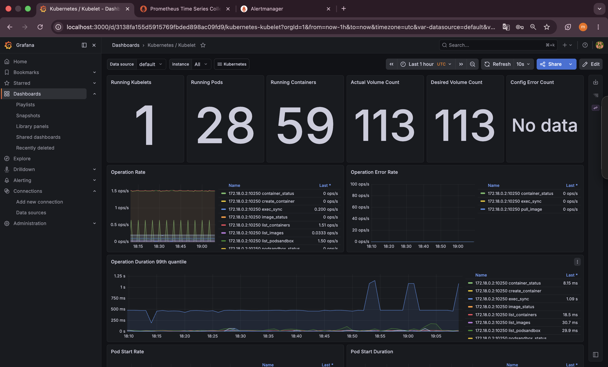

#### 5. Network Traffic

Traffic Information: around 40 kb/s (110 kb/s in maximum)

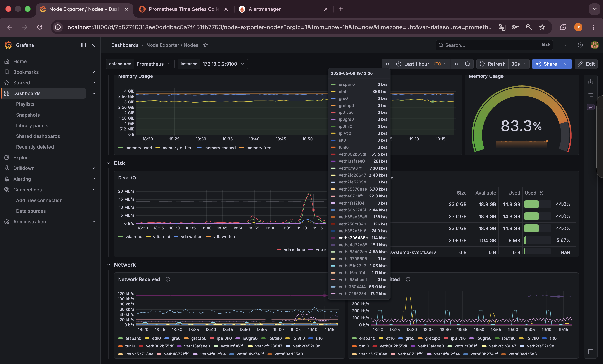

#### 6. Alerts

Active Alerts: 8

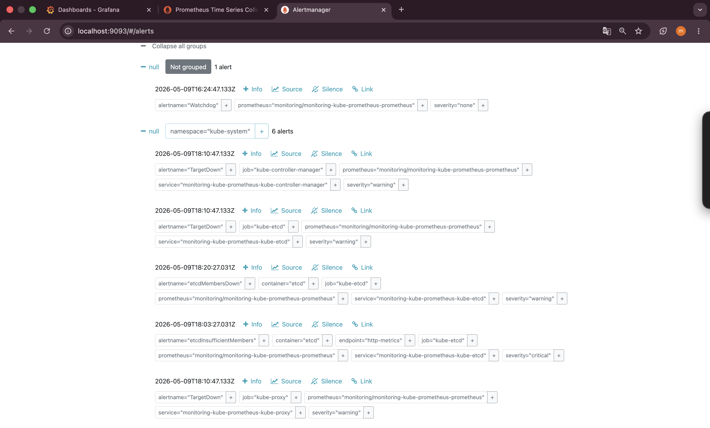

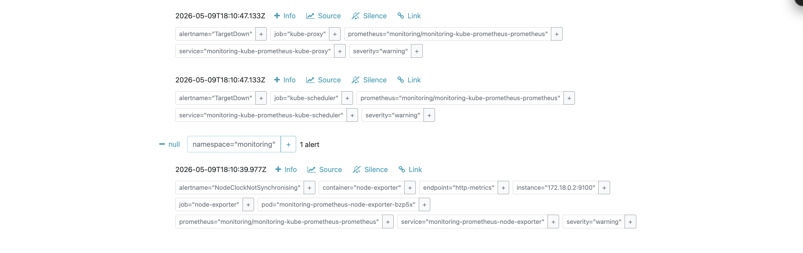

### Useful Grafana Dashboards

Used dashboards:
- Kubernetes / Compute Resources / Namespace (Pods)
- Kubernetes / Compute Resources / Pod
- Node Exporter / Nodes
- Kubernetes / Kubelet

## Task 3 — Init Containers

### Objective

The goal was to:
1. download a file before the application starts
2. wait until a dependency becomes available
3. share data between init containers and main container

### Init Container Implementation

StatefulSet Init Containers

Implemented two init containers:
- `init-download`
- `wait-for-kubernetes`

### Download Init Container

This init container downloads a file from the internet using wget and stores it in a shared volume.

**Implementation**

```yaml
- name: init-download
  image: busybox:1.36

  command:
    - sh
    - -c
    - |
      echo "Downloading file..."
      wget -O /work-dir/index.html https://example.com
      echo "Download completed"

  volumeMounts:
    - name: workdir
      mountPath: /work-dir
```

### Wait-for-Service Init Container

This init container waits until Kubernetes DNS service becomes available.

**Implementation**

```yaml
- name: wait-for-kubernetes
  image: busybox:1.36

  command:
    - sh
    - -c
    - |
      echo "Waiting for kubernetes.default.svc..."
      until nslookup kubernetes.default.svc.cluster.local; do
        echo "Service not ready yet..."
        sleep 2
      done
      echo "Service is ready"
```

### Shared Volume

An emptyDir volume was used for sharing files between init containers and the main application container.

**Volume Configuration**

```yaml
volumes:
  - name: workdir
    emptyDir: {}
```

### Verification

Watch Pod Initialization

```bash
kubectl get pods -n dev -w
```

Expected states:
- Init:0/2
- Init:1/2
- Running

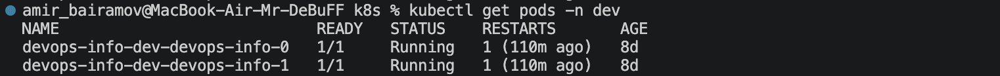

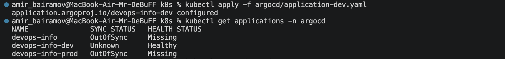

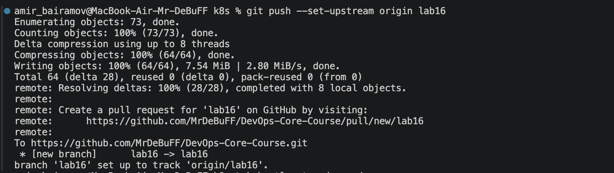

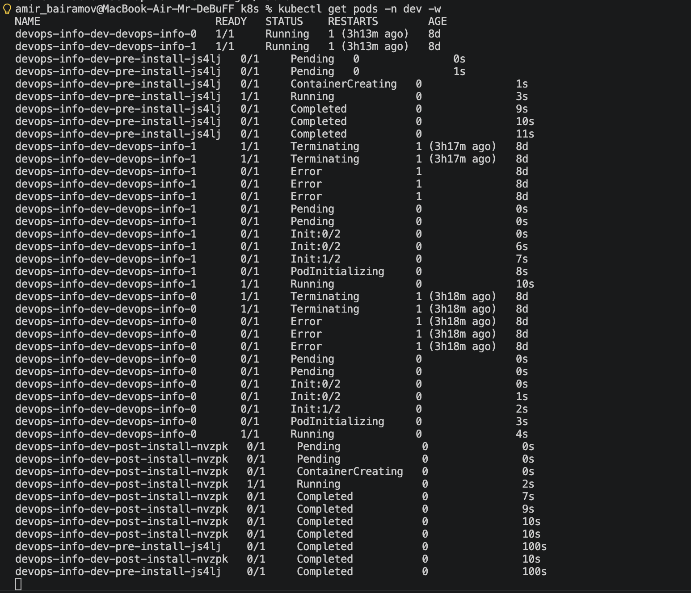

### Check Init Container Logs

Download Container Logs

```bash
kubectl logs -n dev devops-info-dev-devops-info-0 -c init-download
```

Wait Container Logs

```bash
kubectl logs -n dev devops-info-dev-devops-info-0 -c wait-for-kubernetes
```

Verify Shared File

```bash
kubectl exec -n dev -it devops-info-dev-devops-info-0 -- cat /init-data/index.html
```

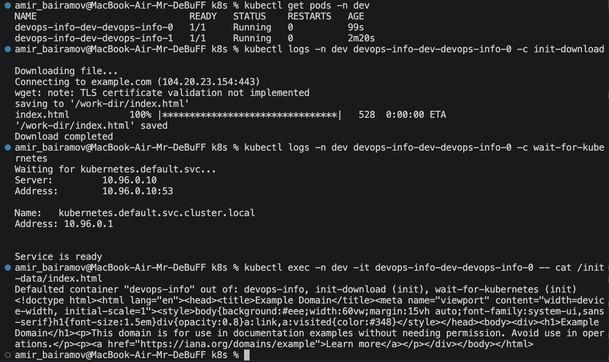
