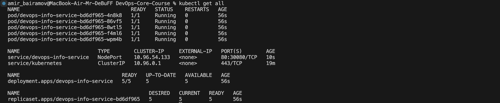
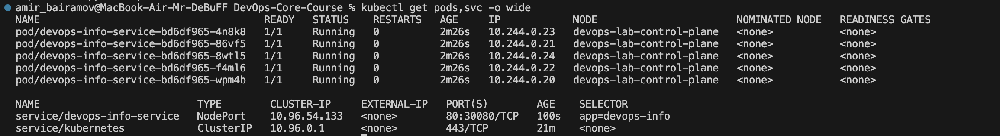
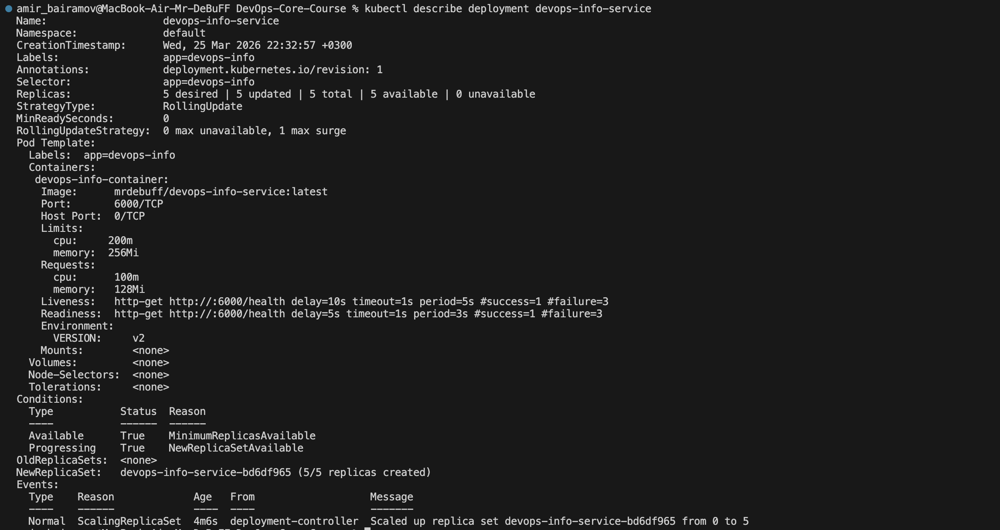
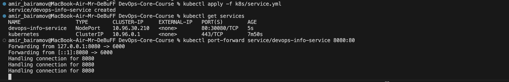
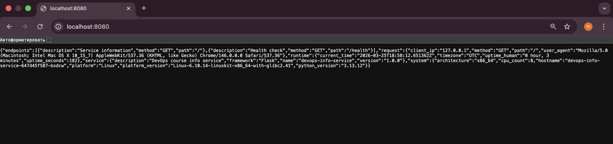
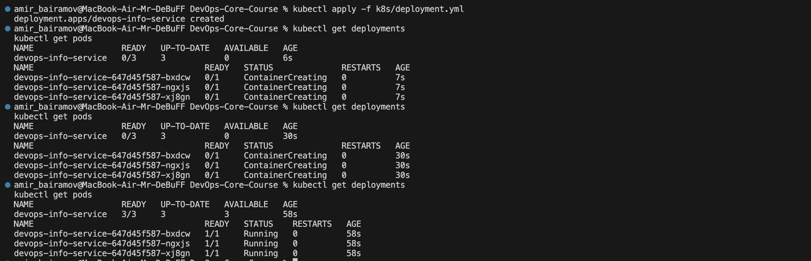
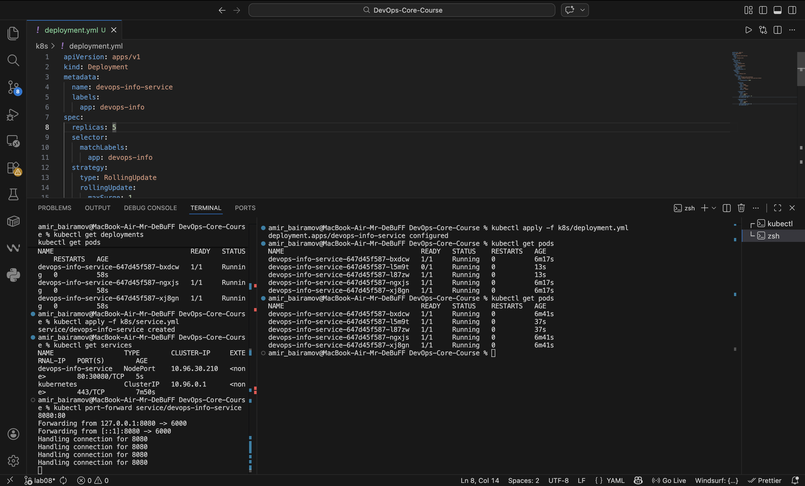
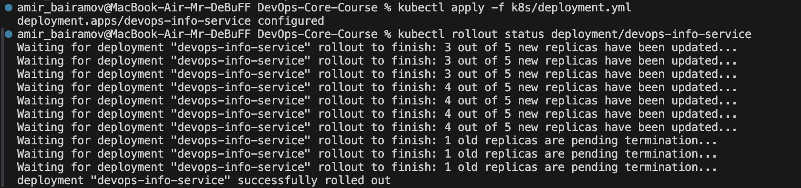
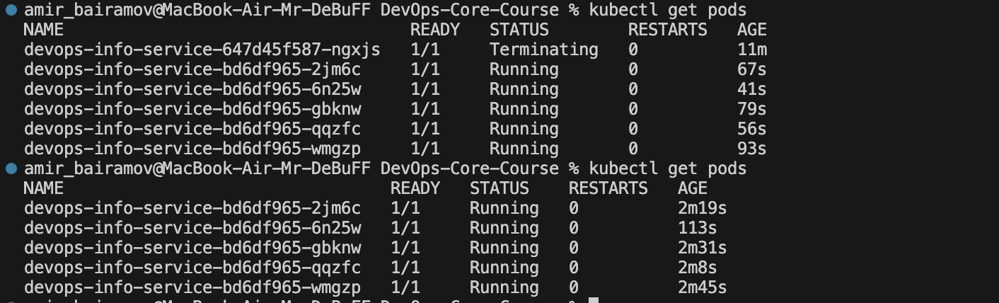
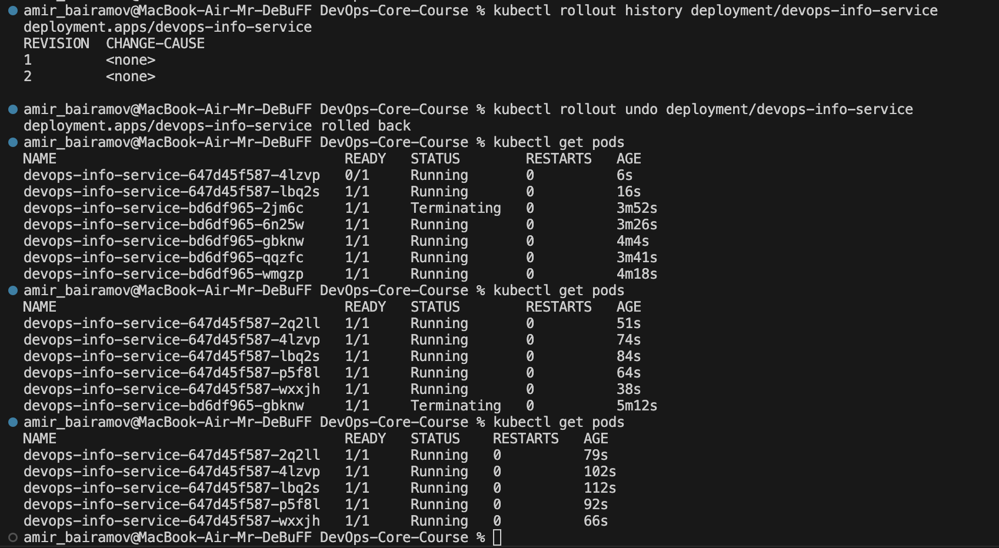

# Lab 9 — Kubernetes Fundamentals

## 1. Architecture Overview

### Deployment Architecture

The application is deployed to a local Kubernetes cluster using **kind**. The architecture consists of:

* **Deployment**: Manages application Pods
* **Pods**: 3–5 replicas of the Python application container
* **Service (NodePort)**: Exposes the application outside the cluster

### Components

* **Pods**:
  Each Pod runs a container based on the image:

  ```
  mrdebuff/devops-info-service:latest
  ```

  The container runs a Python application on port **6000**.

* **Deployment**:

  * Initially configured with **3 replicas**
  * Scaled to **5 replicas** during testing
  * Uses **RollingUpdate strategy** for zero-downtime deployments

* **Service**:

  * Type: `NodePort`
  * Exposes the app on port **30080**
  * Routes traffic to Pods on port **6000**

### Networking Flow

```
User → localhost:8080 (port-forward)
      ↓
Kubernetes Service (NodePort)
      ↓
Pods (via label selector)
      ↓
Container (Python app on port 6000)
```

### Resource Allocation Strategy

Each container has defined resource constraints:

* **Requests**:

  * CPU: 100m
  * Memory: 128Mi
* **Limits**:

  * CPU: 200m
  * Memory: 256Mi

This ensures:

* Proper scheduling by Kubernetes
* Prevention of resource starvation
* Cluster stability

---

## 2. Manifest Files

### deployment.yml

Defines the desired state of the application.

**Key configurations:**

* `replicas: 3` (scaled to 5 later)
* Rolling update strategy:

  ```yaml
  maxSurge: 1
  maxUnavailable: 0
  ```
* Container:

  * Image: `mrdebuff/devops-info-service:latest`
  * Port: `6000`

**Health Checks:**

* **Liveness Probe** (`/health`)
* **Readiness Probe** (`/health`)

**Why:**

* Ensures automatic restart if app crashes
* Prevents traffic routing to unready Pods

**Resources:**

* Requests and limits defined for production-like behavior

---

### service.yml

Exposes the application.

**Configuration:**

* Type: `NodePort`
* Port mapping:

  * Service port: `80`
  * Target port: `6000`
  * NodePort: `30080`

**Why NodePort:**

* Suitable for local development
* No cloud load balancer required

---

## 3. Deployment Evidence

### Cluster State

```bash
kubectl get all
```




---

### Pods and Services

```bash
kubectl get pods,svc -o wide
```



---

### Deployment Description

```bash
kubectl describe deployment devops-info-service
```

Shows:

* Replica count
* Rolling update strategy
* Resource configuration



---

### Application Access

```bash
kubectl port-forward service/devops-info-service 8080:80
```




```bash
curl http://localhost:8080
```



---

## 4. Operations Performed

### Deployment

```bash
kubectl apply -f k8s/deployment.yml
kubectl apply -f k8s/service.yml
```




---

### Scaling

Scaled deployment to 5 replicas:

```bash
kubectl scale deployment/devops-info-service --replicas=5
```



---

### Rolling Update

Updated deployment (e.g., environment variable change):

```bash
kubectl apply -f k8s/deployment.yml
```

Monitor rollout:

```bash
kubectl rollout status deployment/devops-info-service
kubectl get pods -w
```





Observed:

* New Pods created
* Old Pods terminated gradually
* No downtime

---

### Rollback

```bash
kubectl rollout history deployment/devops-info-service
kubectl rollout undo deployment/devops-info-service
```



---

### Service Access

```bash
kubectl port-forward service/devops-info-service 8080:80
```

Application доступна по:

```
http://localhost:8080
```


---

## 5. Production Considerations

### Health Checks

Implemented:

* **Liveness Probe** → detects crashes and restarts container
* **Readiness Probe** → ensures traffic goes only to ready Pods

Why:

* Improves reliability
* Prevents serving broken instances

---

### Resource Limits

Set to:

* Prevent one container from consuming all resources
* Enable Kubernetes scheduling decisions

---

### Improvements for Production

* Use **Ingress** instead of NodePort
* Add **Horizontal Pod Autoscaler (HPA)**
* Use **ConfigMaps and Secrets**
* Implement **CI/CD pipeline**
* Use **image versioning (not latest)**

---

### Monitoring & Observability

Recommended tools:

* Prometheus + Grafana (metrics)
* Loki / ELK stack (logs)
* Kubernetes events monitoring

---

## 6. Challenges & Solutions

### Issue 1: Wrong container port

**Problem:**
Initial mismatch between Dockerfile (6000) and Kubernetes config.

**Solution:**
Updated:

```yaml
containerPort: 6000
targetPort: 6000
```

---

### Debugging Tools Used

```bash
kubectl describe pod <pod>
kubectl logs <pod>
kubectl get events
```

---

### Key Learnings

* Kubernetes is **declarative** (desired state vs actual state)
* Deployments manage Pods automatically
* Services provide stable networking
* Health checks are critical for reliability
* Rolling updates ensure zero downtime
