# Lab 11 — Kubernetes Secrets & HashiCorp Vault

## 1. Kubernetes Secrets

### Creating Secret

Command used:

```bash
kubectl create secret generic app-credentials \
  --from-literal=username=admin \
  --from-literal=password=secret123
```
### Viewing Secret

```bash
kubectl get secret app-credentials -o yaml
```

### Decoding Base64 Values

```bash
echo "YWRtaW4=" | base64 -d
echo "c2VjcmV0MTIz" | base64 -d
```

### Result (screeenshot)

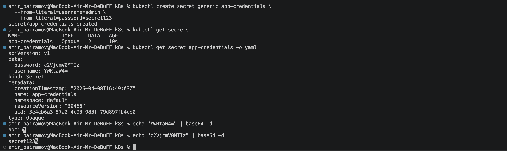

### Encoding vs Encryption

Base64 encoding:
- NOT secure
- Easily reversible
- Used only for data formatting

Encryption:
- Secure transformation using cryptography
- Requires a key to decrypt
- Protects data at rest

Kubernetes Secrets are base64-encoded, not encrypted by default

## 2. Helm Secret Integration

### Chart Structure

```
devops-info-chart/
├── templates/
│   ├── deployment.yaml
│   ├── service.yaml
│   ├── secrets.yaml   <-- added
│   └── hooks/...
...
```

### Secret Template

File: `templates/secrets.yaml`

```yaml
apiVersion: v1
kind: Secret
metadata:
  name: {{ include "devops-info-chart.fullname" . }}-secret

type: Opaque

stringData:
  username: {{ .Values.secret.username }}
  password: {{ .Values.secret.password }}
```

### Consuming Secrets in Deployment

```yaml
envFrom:
  - secretRef:
      name: {{ include "devops-info-chart.fullname" . }}-secret
```

### Verification

Access pod:

```bash
kubectl exec -it devops-info-devops-info-758668bff7-2xpx6 -- sh
```

Check environment variables:

```bash
env | grep username
env | grep password
```

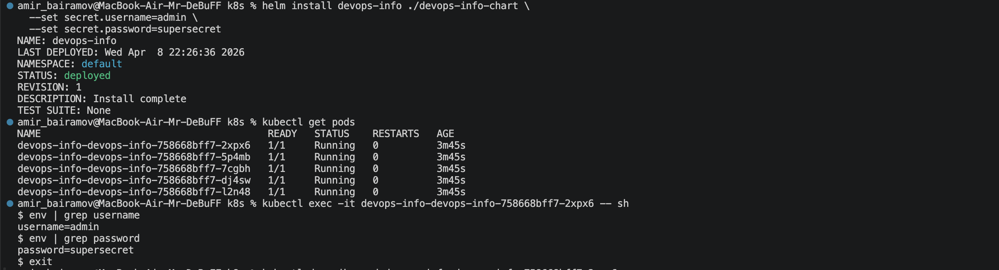

### Security Check

```bash
kubectl describe pod devops-info-devops-info-758668bff7-2xpx6
```

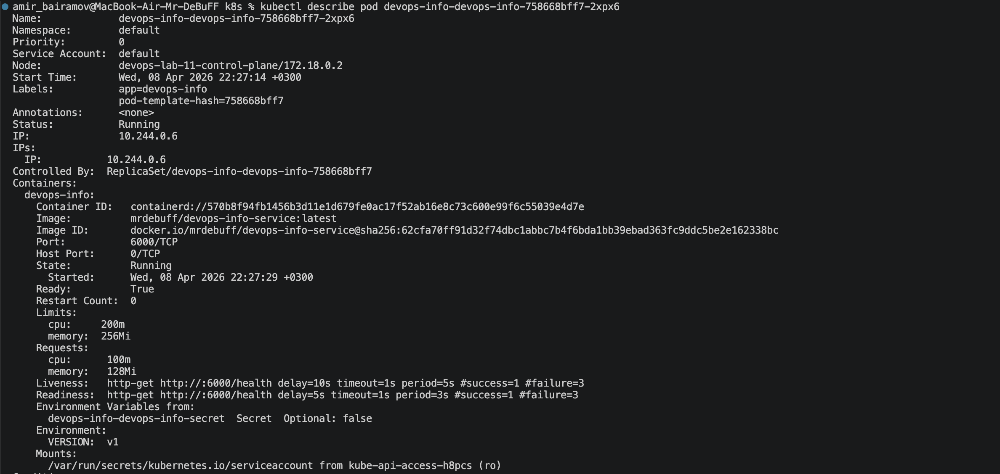
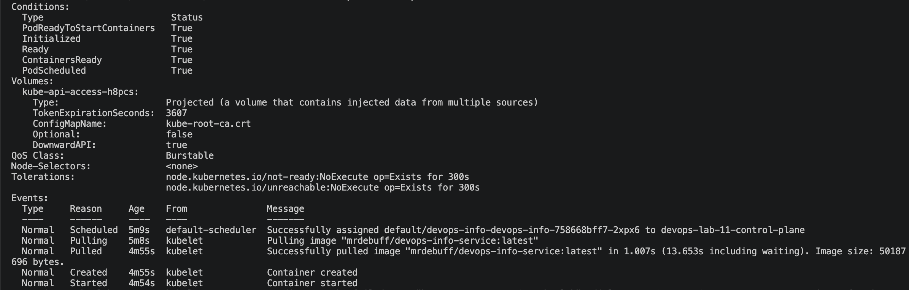

## 3. Resource Management

### Configuration

From `values.yaml`:

```yaml
resources:
  requests:
    cpu: "100m"
    memory: "128Mi"
  limits:
    cpu: "200m"
    memory: "256Mi"
```

### Requests vs Limits

Requests:
- Minimum guaranteed resources
- Used by scheduler

Limits:
- Maximum allowed usage
- Prevents resource abuse

### Best Practices
- Set requests ≈ normal usage
- Set limits slightly higher
- Avoid:
    - No limits → risk of node overload
    - Too strict limits → pod crashes

## 4. Vault Integration

### Installation

Vault installed via Helm:

```bash
helm install vault hashicorp/vault \
  --set "server.dev.enabled=true" \
  --set "injector.enabled=true"
```

### Verification

```bash
kubectl get pods
```


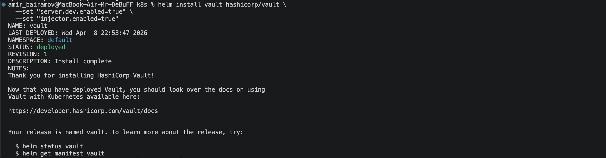

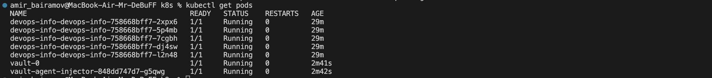

### Secret Creation in Vault

```bash
vault kv put secret/myapp/config \
  username="vault-user" \
  password="vault-pass"
```

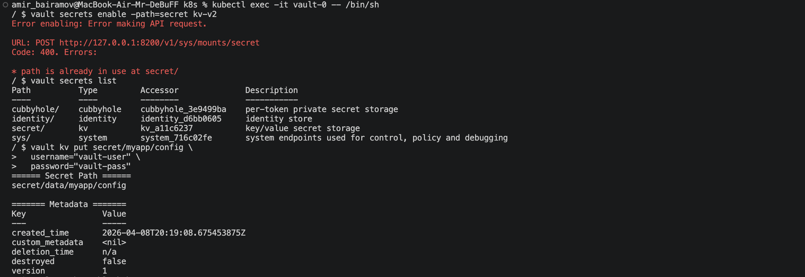

### Policy

```hcl
path "secret/data/myapp/config" {
  capabilities = ["read"]
}
```

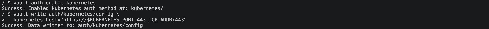

### Role

```bash
vault write auth/kubernetes/role/myapp-role \
  bound_service_account_names=default \
  bound_service_account_namespaces=default \
  policies=myapp-policy \
  ttl=24h
```

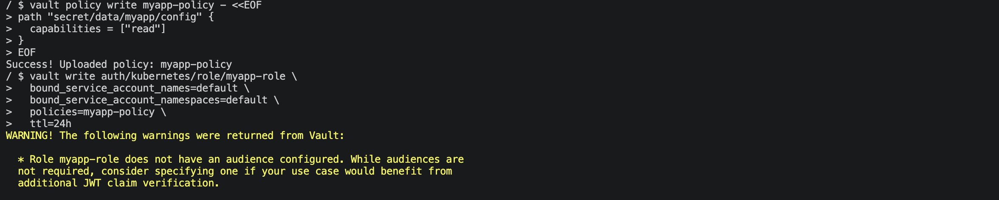

### Vault Injection

Deployment annotations:

```yaml
annotations:
  vault.hashicorp.com/agent-inject: "true"
  vault.hashicorp.com/role: "myapp-role"
  vault.hashicorp.com/agent-inject-secret-config: "secret/data/myapp/config"
```

### Verification

Inside pod:

```bash
ls /vault/secrets
cat /vault/secrets/config
```

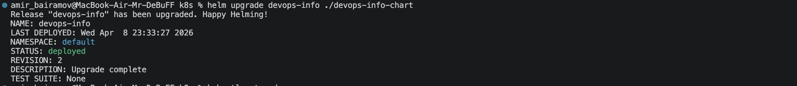

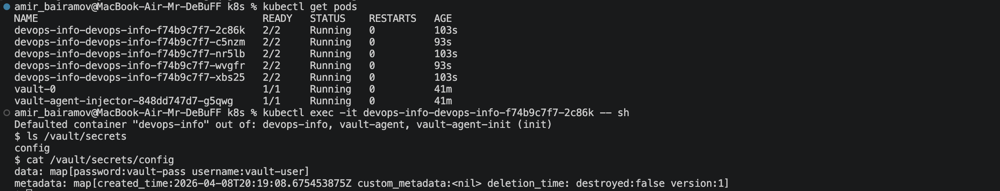

### Sidecar Injection Pattern

Vault uses a sidecar container that:
- Authenticates with Kubernetes
- Fetches secrets from Vault
- Writes them into shared volume (`/vault/secrets`)

Main container reads secrets from files.

Advantages:
- No secrets in environment variables
- Dynamic secret rotation
- Centralized secret management

## 5. Security Analysis

### K8s Secrets vs Vault

| Feature        | K8s Secrets | Vault                 |
| -------------- | ----------- | --------------------- |
| Storage        | etcd        | External              |
| Encryption     | Optional    | Built-in              |
| Access Control | RBAC        | Fine-grained policies |
| Rotation       | Manual      | Automatic             |
| Security Level | Medium      | High                  |

### When to Use

Kubernetes Secrets:
- Simple apps
- Non-critical data
- Development environments

Vault:
- Production systems
- Sensitive credentials
- Dynamic secrets
- Multi-service architectures

### Production Recommendations

- Enable etcd encryption
- Use RBAC
- Avoid storing secrets in Git
- Use HashiCorp Vault or similar tools
- Implement secret rotation
- Audit secret access
