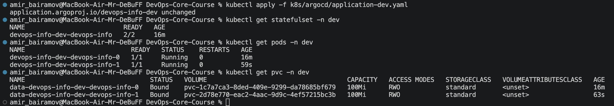
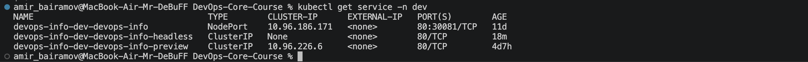
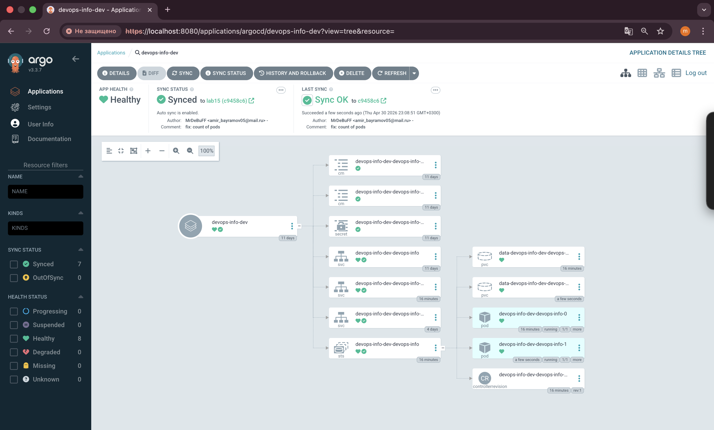
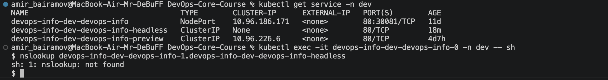
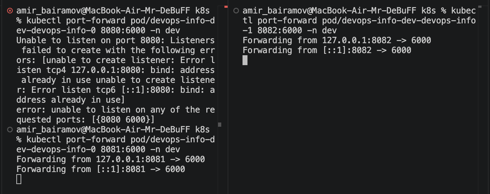
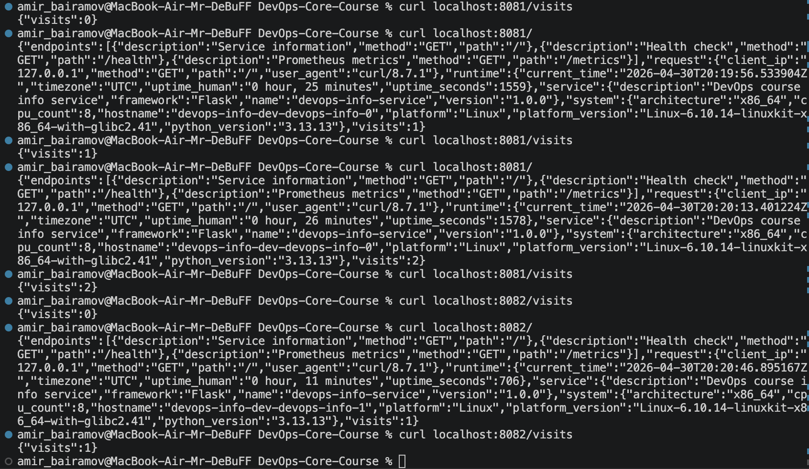
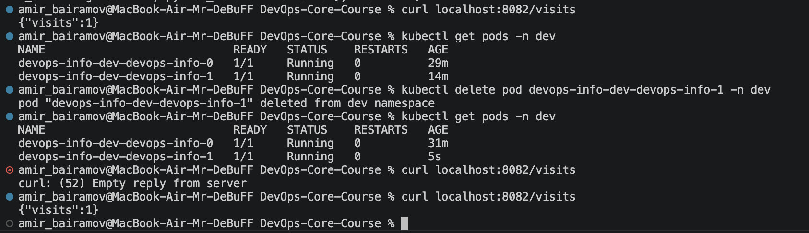

# Lab 15 — StatefulSets & Persistent Storage

## 1. StatefulSet Overview

### What is StatefulSet?

StatefulSet is a Kubernetes controller designed for managing **stateful applications**, where each pod requires:

- Stable network identity
- Persistent storage
- Ordered deployment and scaling

---

### Why StatefulSet?

Unlike stateless applications, some workloads need:

- Data persistence (e.g., databases)
- Unique identity per instance
- Stable DNS names

StatefulSet guarantees:

- Pod names are predictable:
  `app-0`, `app-1`, `app-2`
- Each pod gets its own storage (PVC)
- Pods are created and deleted **in order**

---

### StatefulSet vs Deployment

| Feature | Deployment | StatefulSet |
|--------|-----------|------------|
| Pod Names | Random (hash) | Ordered (app-0, app-1) |
| Storage | Shared or external | Per-pod PVC |
| Scaling | Parallel | Ordered |
| Network Identity | Dynamic | Stable DNS |
| Use Case | Stateless apps | Stateful apps |

---

### When to use StatefulSet?

Examples:

- Databases (PostgreSQL, MySQL)
- Message brokers (Kafka, RabbitMQ)
- Distributed systems (Elasticsearch, Cassandra)

---

## 2. Resource Verification

### Command:

```bash
kubectl get statefulset -n dev

kubectl get pods -n dev

kubectl get pvc -n dev
```

Output:



```bash
kubectl get service -n dev
```






### Explanation:

- Pods have stable names:
    - `devops-info-dev-devops-info-0`
    - `devops-info-dev-devops-info-1`
- StatefulSet manages replicas
- PVCs are created per pod:
    - `data-devops-info-dev-devops-info-0`
    - `data-devops-info-dev-devops-info-1`
- Services include:
    - Regular service (external access)
    - Headless service (internal DNS)

## 3. Network Identity (DNS)

### Headless Service

A headless service (`clusterIP: None`) allows direct DNS access to each pod.

### DNS Pattern

Each pod gets a DNS name:

```bash
<pod-name>.<headless-service>.<namespace>.svc.cluster.local
```

### Example:

```bash
devops-info-dev-devops-info-1.devops-info-dev-devops-info-headless.dev.svc.cluster.local
```

### Test Command

```bash
kubectl exec -it devops-info-dev-devops-info-0 -n dev -- sh
nslookup devops-info-dev-devops-info-1.devops-info-dev-devops-info-headless
```

Output:



## 4. Per-Pod Storage Evidence

Each pod has its own isolated storage mounted at `/data`.

### Test Setup

```bash
kubectl port-forward pod/devops-info-dev-devops-info-0 8081:6000 -n dev
kubectl port-forward pod/devops-info-dev-devops-info-1 8082:6000 -n dev
```



Test Requests:

```bash
curl localhost:8081/visits

curl localhost:8081/

curl localhost:8081/visits

curl localhost:8081/

curl localhost:8081/visits

curl localhost:8082/visits

curl localhost:8082/

curl localhost:8082/visits
```



### Explanation
- Each pod maintains its own visit counter
- Data is NOT shared
- Confirms per-pod storage isolation

## 5. Persistence Test

### Step 1 — Check current value

```bash
curl localhost:8082/visits
```

### Step 2 — Delete pod

```bash
kubectl delete pod devops-info-dev-devops-info-1 -n dev
```

### Step 3 — Wait for recreation

```bash
kubectl get pods -n dev
```

### Step 4 — Check value again

```bash
curl localhost:8082/visits
```



### Explanation

- Pod was deleted
- New pod created with same name (`-1`)
- PVC was reused
- Data persisted