# Lab 18 — Reproducible Builds with Nix

# Task 1 — Build Reproducible Python App with Nix

## 1.1 Installing Nix

### Installation Command

```bash
curl --proto '=https' --tlsv1.2 -sSf -L https://install.determinate.systems/nix | sh -s -- install
```

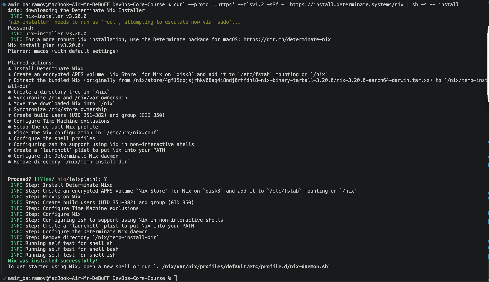

### Verify Installation

```bash
nix --version
```


### Verify Flakes Support

```bash
nix flake --help
```

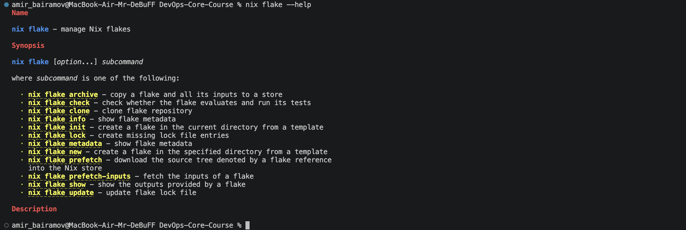

### Test Nix

```bash
nix run nixpkgs#hello
```

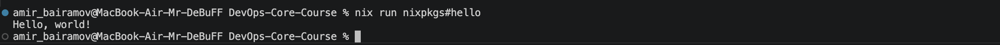

---

# 1.2 Traditional Python Workflow (Lab 1)

In Lab 1, the application was built using Python virtual environments and pip:

```bash
python -m venv venv
source venv/bin/activate
pip install -r requirements.txt
python app.py
```

This approach has several reproducibility problems:

* Different Python versions on different machines
* Different transitive dependency versions
* Different package indexes or caches
* Virtual environments are not portable
* Builds are not deterministic

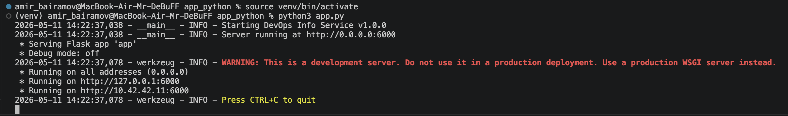

---

# 1.3 Nix Derivation

## default.nix

Saved in `labs/lab18/app_python/default.nix`.

---

# Explanation of default.nix

| Field                    | Explanation                                          |
| ------------------------ | ---------------------------------------------------- |
| `buildPythonApplication` | Creates a reproducible Python application derivation |
| `pname`                  | Package name                                         |
| `version`                | Application version                                  |
| `src = ./.`              | Uses current directory as source                     |
| `format = "other"`       | App does not use setup.py or pyproject.toml          |
| `propagatedBuildInputs`  | Python dependencies                                  |
| `nativeBuildInputs`      | Build-time dependencies                              |
| `installPhase`           | Manual installation instructions                     |
| `wrapProgram`            | Wraps executable with proper Python environment      |
| `meta`                   | Metadata information                                 |

---

# 1.4 Building Application with Nix

## Build Command

```bash
nix-build
```

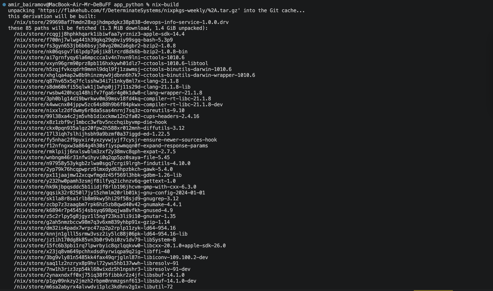
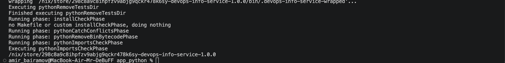

---

# 1.5 Running the Nix-built Application

## Run Command

```bash
./result/bin/devops-info-service
```

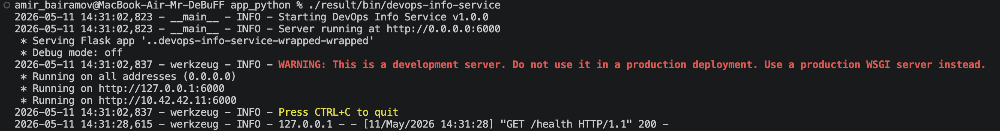

## Verify Endpoints

```bash
curl http://localhost:6000/health
```


---

# 1.6 Proving Reproducibility

## First Build

```bash
readlink result
```

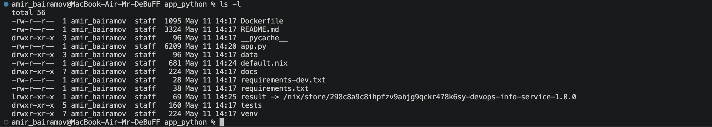

## Rebuild

```bash
rm result
nix-build
readlink result
```

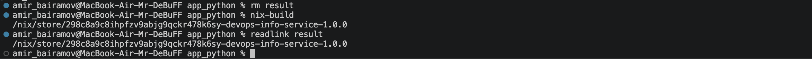

The store path remained identical.

---

# Forced Rebuild

## Delete Existing Build

```bash
STORE_PATH=$(readlink result)
rm result
nix-store --delete $STORE_PATH
```

## Rebuild

```bash
nix-build
readlink result
```

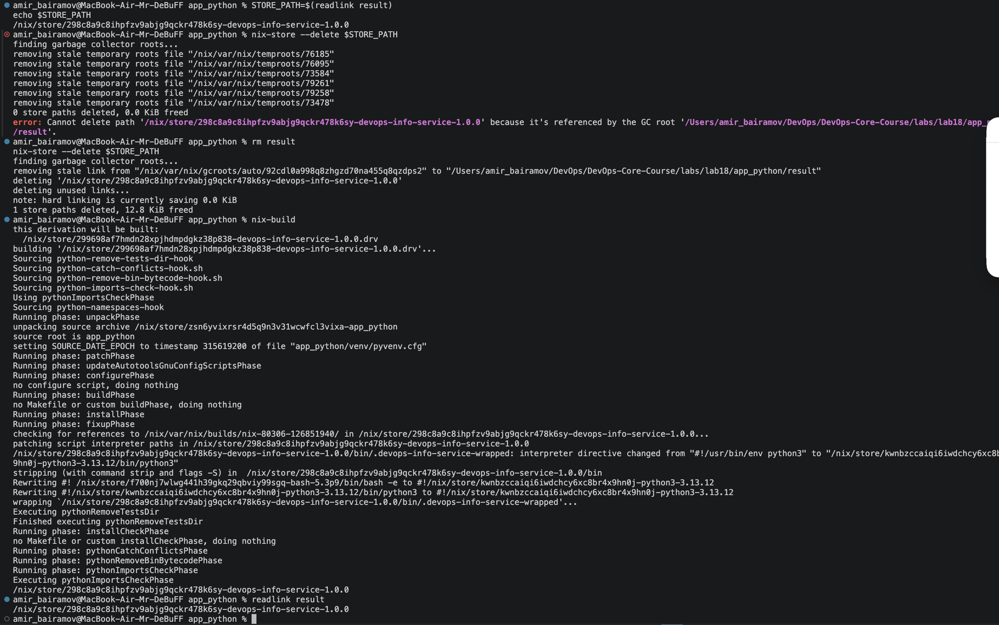

Even after rebuilding from scratch, the resulting store path remained identical.

This proves deterministic reproducibility.

---

# SHA256 Hash

```bash
nix-hash --type sha256 result
```

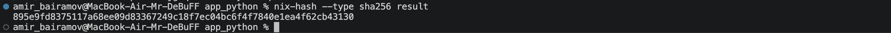

---

# Explanation of Nix Store Paths

Example:

```text
/nix/store/abc123xyz-devops-info-service-1.0.0
```

| Part                  | Meaning                    |
| --------------------- | -------------------------- |
| `/nix/store`          | Global immutable Nix store |
| `abc123xyz`           | Hash of all build inputs   |
| `devops-info-service` | Package name               |
| `1.0.0`               | Package version            |

The hash is computed from:

* source code
* dependencies
* compiler versions
* build scripts
* environment configuration

This guarantees reproducibility.

---

# Comparison — pip vs Nix

| Aspect                  | pip + venv       | Nix          |
| ----------------------- | ---------------- | ------------ |
| Python version          | System dependent | Fully pinned |
| Dependency resolution   | Runtime          | Build-time   |
| Transitive dependencies | Not fully pinned | Fully pinned |
| Reproducibility         | Weak             | Strong       |
| Isolation               | Virtualenv       | Sandboxed    |
| Binary cache            | No               | Yes          |
| Portability             | Partial          | Excellent    |
| Determinism             | No               | Yes          |

---

# Why requirements.txt Provides Weaker Guarantees

`requirements.txt` only pins direct dependencies.

Example:

```text
Flask==3.1.0
```

However, Flask itself depends on:

* Werkzeug
* Click
* Jinja2
* MarkupSafe

Those transitive dependencies may change over time.

As a result:

```bash
pip install -r requirements.txt
```

can produce different environments on different machines or at different times.

Nix solves this by pinning the entire dependency graph, including transitive dependencies and build tools.

---

# Reflection — How Nix Would Have Helped in Lab 1

If I had used Nix in Lab 1:

* all students would have identical environments
* there would be no Python version mismatch
* dependencies would be deterministic
* CI/CD pipelines would be more reliable
* onboarding would become significantly easier
* builds would be reproducible across all machines

Nix eliminates the classic “works on my machine” problem.

---

# Task 2 — Reproducible Docker Images with Nix

---

# 2.1 Traditional Dockerfile from Lab 2

## Dockerfile

Saved in `labs/lab18/app_python/Dockerfile`.

---

# Problems with Traditional Dockerfiles

Traditional Dockerfiles are not fully reproducible because:

* base image tags change over time
* apt packages change
* timestamps differ between builds
* pip dependencies may change
* image layers include non-deterministic metadata

---

# 2.2 docker.nix

## docker.nix

Saved in `labs/lab18/app_python/docker.nix`.

---

# Explanation of docker.nix

| Field               | Explanation                         |
| ------------------- | ----------------------------------- |
| `buildLayeredImage` | Builds reproducible Docker image    |
| `name`              | Docker image name                   |
| `tag`               | Image tag                           |
| `contents`          | Packages included in image          |
| `config.Cmd`        | Default startup command             |
| `ExposedPorts`      | Open container ports                |
| `created`           | Fixed timestamp for reproducibility |

The fixed timestamp is critical for deterministic builds.

---

# Building Docker Image

## Run Docker Image

```bash
docker build -t lab2-app:v1 .
docker run -d -t -p 6000:6000 --name lab2-container lab2-app:v1
```

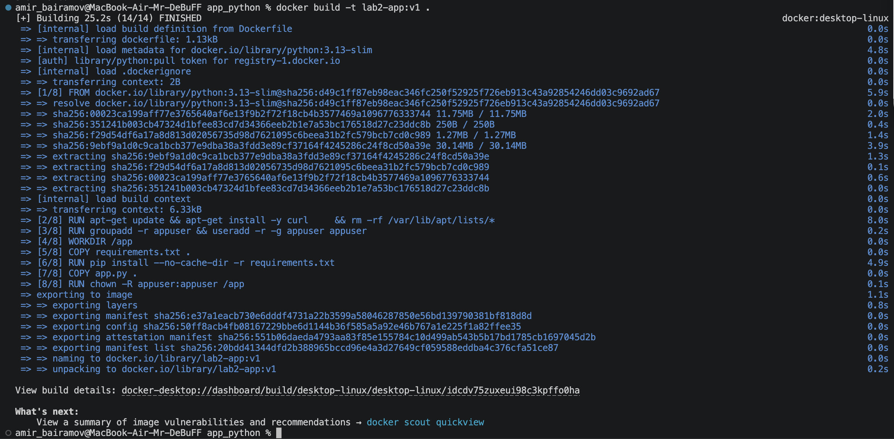


## Build Nix Docker Image

```bash
nix-build docker.nix
```

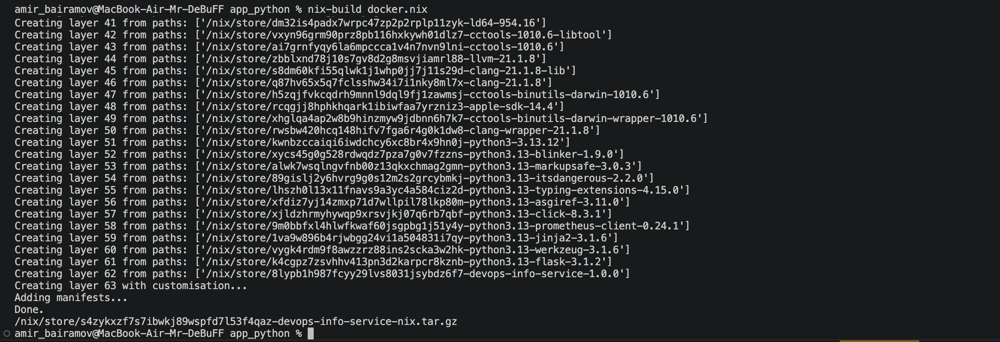

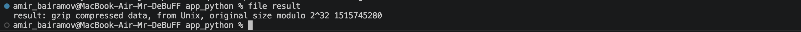

## Load into Docker

```bash
docker load < result
```


## Run Container

```bash
docker run -d -p 6001:6000 --name nix-container devops-info-service-nix:1.0.0
```

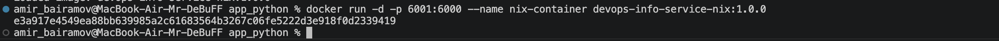

## Verify

```bash
curl http://localhost:6000/health
curl http://localhost:6001/health
```

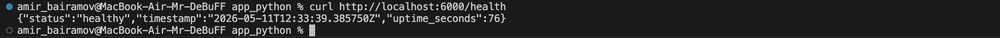


---

# SHA256 Reproducibility Test

## First Build

```bash
sha256sum result
```

## Second Build

```bash
rm result
nix-build docker.nix
sha256sum result
```

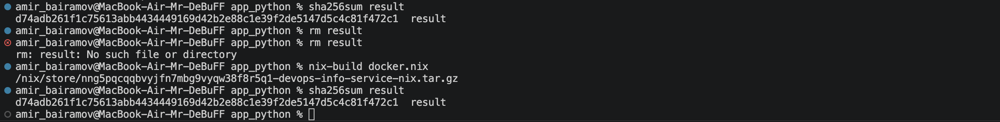

Hashes were identical.

This proves bit-for-bit reproducibility.

---

# Traditional Docker Build Comparison

## First Build

```bash
docker build -t lab2-app:test1 ./app_python
docker save lab2-app:test1 | sha256sum
```

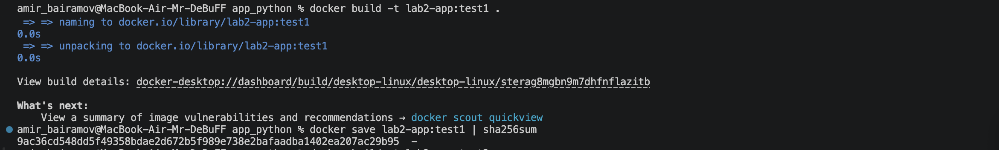

## Second Build

```bash
docker build -t lab2-app:test2 ./app_python
docker save lab2-app:test2 | sha256sum
```

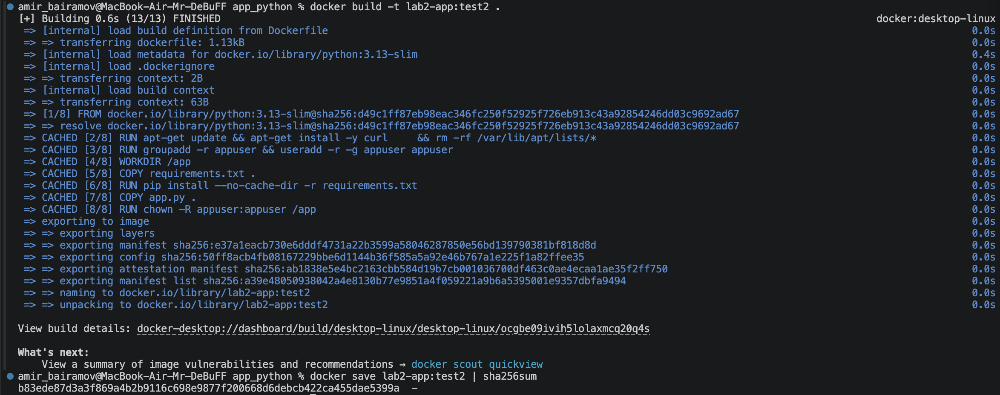

Hashes were different.

Traditional Docker builds are not reproducible.

---

# Image Size Comparison

| Metric               | Traditional Dockerfile | Nix dockerTools           |
| -------------------- | ---------------------- | ------------------------- |
| Base image           | python:3.13-slim       | No traditional base image |
| Reproducibility      | No                     | Yes                       |
| Layer determinism    | Weak                   | Strong                    |
| Dependency isolation | Partial                | Full                      |
| Build caching        | Layer-based            | Content-addressable       |
| Security auditing    | Harder                 | Easier                    |

---

# docker history Comparison

## Traditional Docker Image

```bash
docker history lab2-app:test1
```

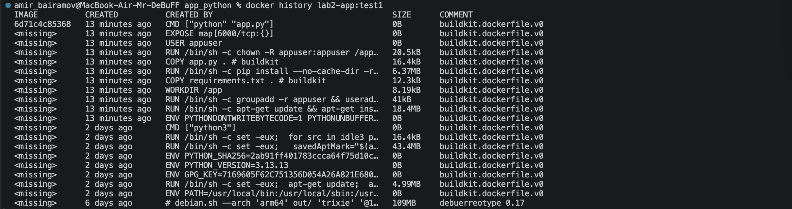

Observation:

* varying timestamps
* mutable layers
* non-deterministic metadata

## Nix Docker Image

```bash
docker history devops-info-service-nix:1.0.0
```

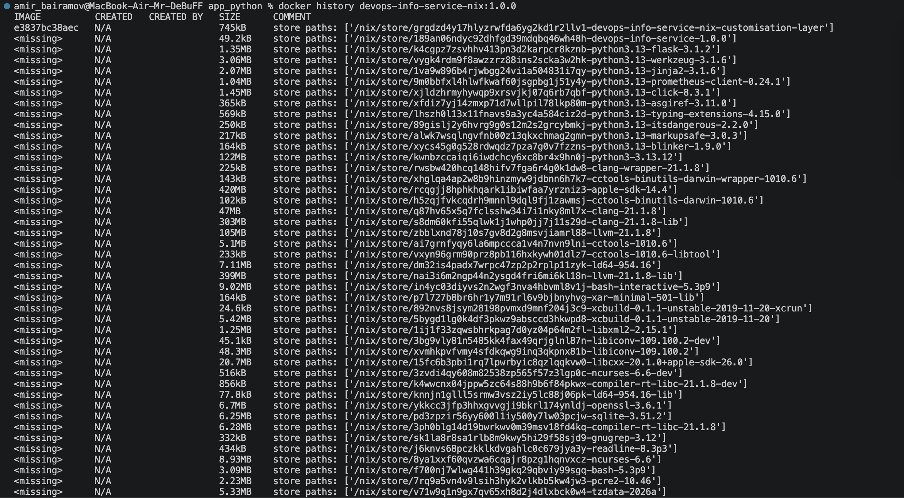

Observation:

* deterministic layers
* reproducible metadata
* content-addressable layers

---

# Why Traditional Dockerfiles Cannot Achieve Bit-for-Bit Reproducibility

Traditional Dockerfiles rely on mutable external systems:

* Docker Hub tags change
* apt repositories change
* pip repositories change
* timestamps vary
* build environments differ

Even identical Dockerfiles can produce different image hashes.

Nix solves this using:

* immutable derivations
* content-addressable storage
* pinned dependency graphs
* deterministic builds
* isolated build environments

---

# Reflection — Redoing Lab 2 with Nix

If I could redo Lab 2 using Nix:

* I would avoid mutable base images
* I would use fully pinned dependencies
* I would build deterministic containers
* I would integrate binary caching
* I would use declarative infrastructure from the beginning

Nix would significantly improve reliability and reproducibility.

---

# Practical Scenarios Where Nix Matters

## CI/CD

Nix guarantees identical builds in:

* local development
* CI pipelines
* production deployments

## Security Audits

Exact dependency trees can be reproduced and audited years later.

## Rollbacks

Because builds are immutable, rollback becomes reliable and atomic.

## Team Collaboration

All developers use identical environments.

## Long-Term Maintenance

Projects remain reproducible even after years.

---

# Challenges Encountered

Because the work was performed on macOS Apple Silicon (M1), there were compatibility issues between Darwin binaries and Linux Docker containers.

`dockerTools` initially produced Darwin executables, which caused:

```text
exec format error
```

The final solution was to build the Docker image inside a Linux-based Nix environment running in Docker.

This ensured Linux-compatible binaries and preserved reproducibility guarantees.

---

# Conclusion

This lab demonstrated that Nix provides significantly stronger reproducibility guarantees compared to traditional package managers and Dockerfiles.

Key benefits of Nix:

* deterministic builds
* immutable dependency management
* reproducible containers
* content-addressable storage
* easier rollbacks and auditing

Nix effectively eliminates many “works on my machine” problems common in modern software development.
