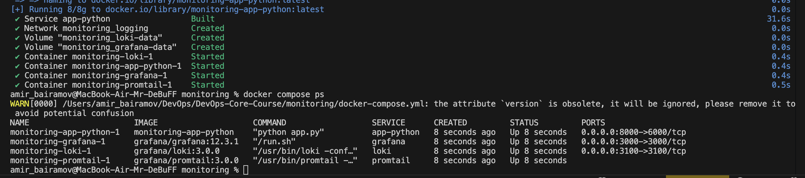
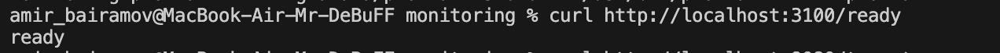
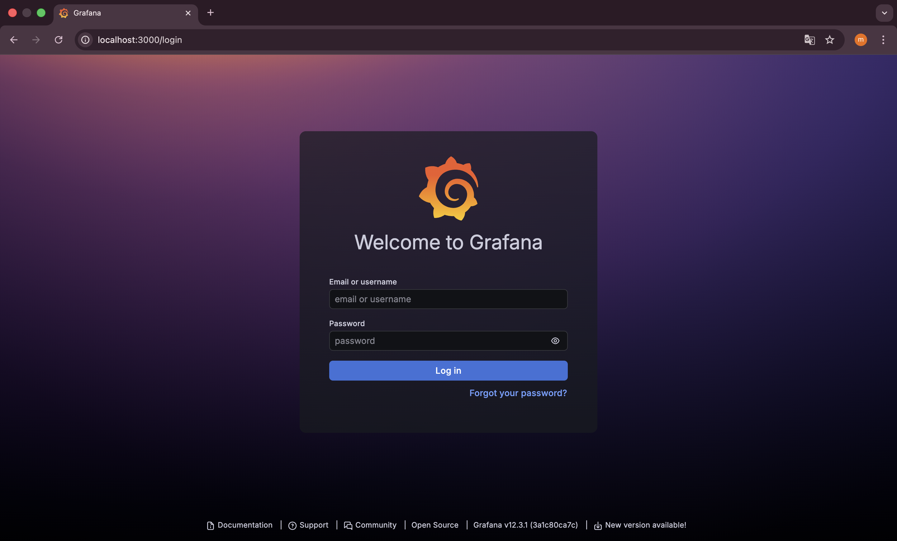
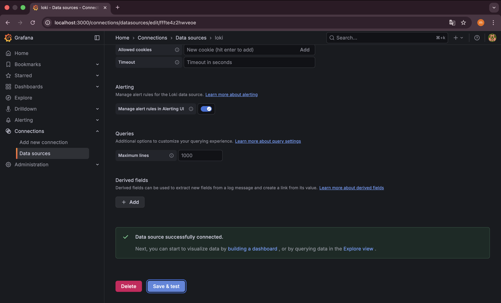
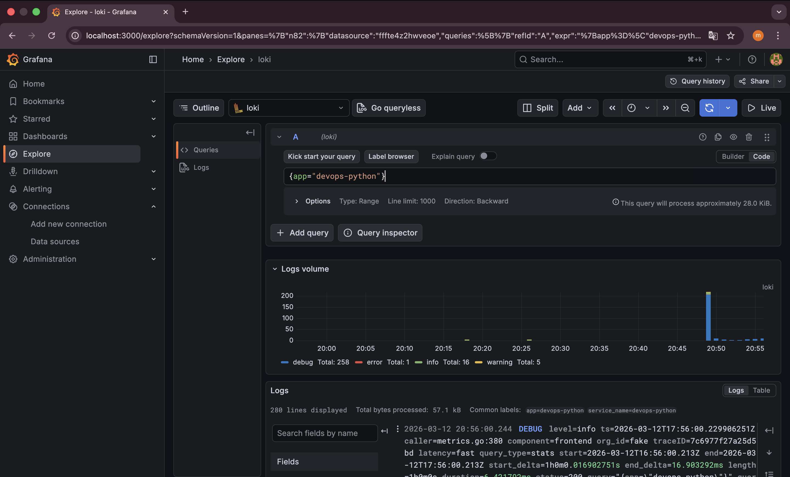
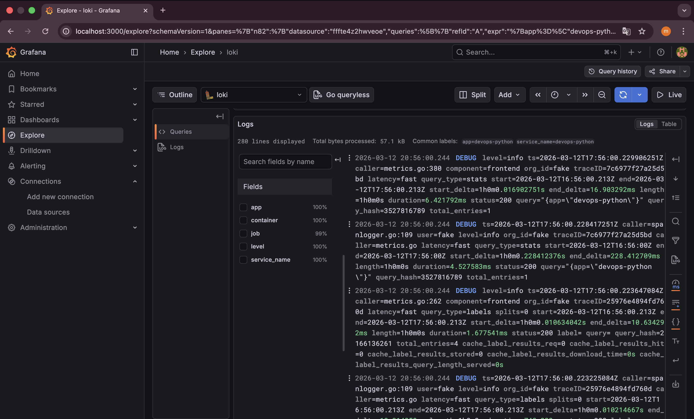
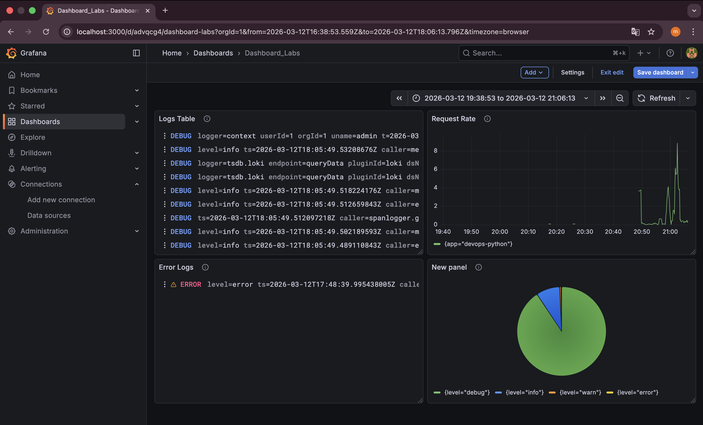
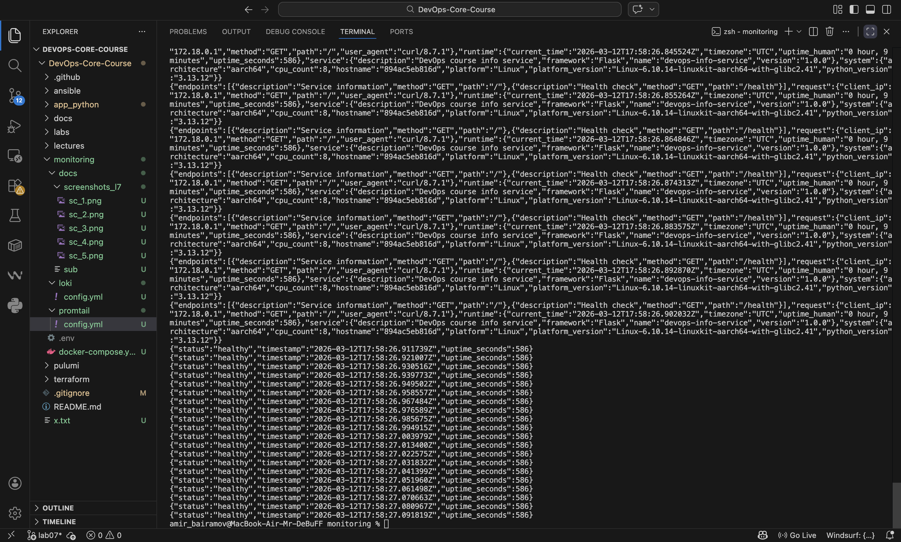
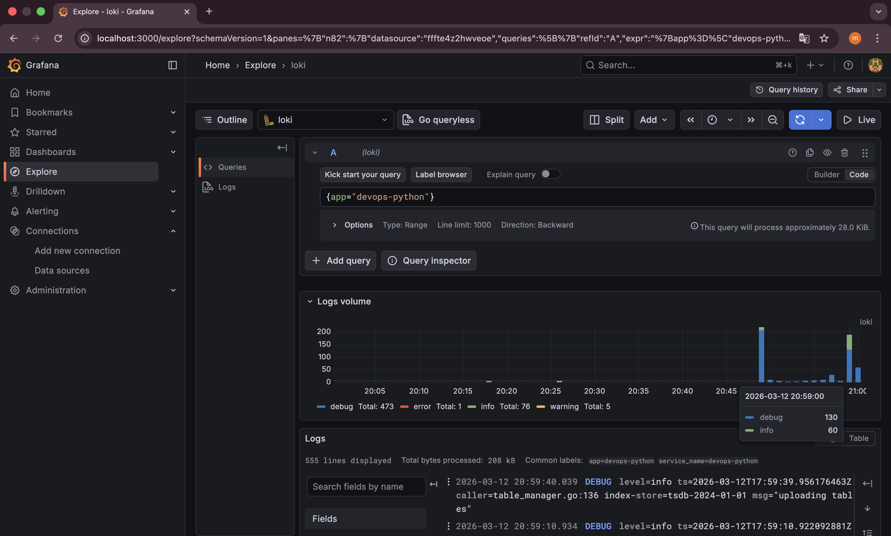
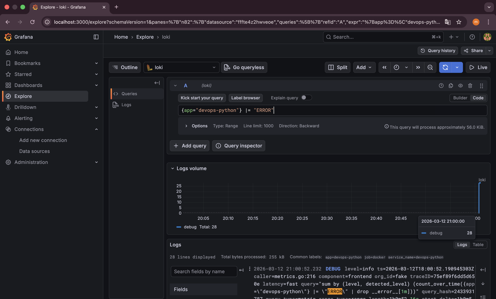

# Lab 7 — Observability & Logging with Loki Stack

## Architecture

The logging architecture consists of four main components:

* **Application (Flask)** — generates structured logs
* **Promtail** — collects logs from Docker containers
* **Loki** — stores logs and indexes metadata labels
* **Grafana** — visualizes logs and dashboards

```
+--------------------+
| Python Flask App   |
| (Docker container) |
+---------+----------+
          |
          | logs (stdout)
          v
+--------------------+
|     Promtail       |
| (Log collector)    |
+---------+----------+
          |
          | pushes logs
          v
+--------------------+
|       Loki         |
| (Log storage TSDB) |
+---------+----------+
          |
          | queries
          v
+--------------------+
|      Grafana       |
|  Dashboards & UI   |
+--------------------+
```

Promtail automatically discovers containers using the **Docker API** and attaches metadata labels such as container name and application label before sending logs to Loki.

---

## Setup Guide

### 1. Project Structure

```
project/
│
├── app_python/
│   ├── app.py
│   ├── Dockerfile
│   └── requirements.txt
│
└── monitoring/
    ├── docker-compose.yml
    ├── .env
    ├── loki/
    │   └── config.yml
    ├── promtail/
    │   └── config.yml
    └── docs/
        ├── screenshots_l7/
        └── LAB07.md
```

---

### 2. Build and start the stack

From the `monitoring` directory:

```bash
docker compose up -d --build
```

Verify containers:

```bash
docker compose ps
```



---

### 3. Verify Loki

```
curl http://localhost:3100/ready
```

Expected response:

```
ready
```



---

### 4. Verify Promtail

```
curl http://localhost:9080/targets
```

---

### 5. Access Grafana

```
http://localhost:3000
```

Login using credentials from the `.env` file.



Add **Loki data source**:

```
URL: http://loki:3100
```



Then open **Explore → Loki** to start querying logs.





---

## Configuration

### Loki Configuration

Loki is configured to use the **TSDB storage engine**, which improves query performance and reduces memory usage.

Example configuration snippet:

```yaml
auth_enabled: false

server:
  http_listen_port: 3100

schema_config:
  configs:
    - from: 2024-01-01
      store: tsdb
      object_store: filesystem
      schema: v13
```

Key points:

* **TSDB storage** improves query performance
* **Filesystem object store** used for a single-node setup
* **Schema v13** recommended for Loki 3.0+

Retention is configured to keep logs for **7 days**.

---

### Promtail Configuration

Promtail collects logs from Docker containers using **Docker service discovery**.

Example snippet:

```yaml
scrape_configs:
  - job_name: docker
  
    docker_sd_configs:
      - host: unix:///var/run/docker.sock
        refresh_interval: 5s
  
    relabel_configs:

      - source_labels: ['__meta_docker_container_name']
        regex: '/(.*)'
        target_label: 'container'
```

Promtail extracts metadata labels such as:

* container name
* application label
* job identifier

These labels allow Loki to efficiently index logs and enable powerful queries in Grafana.

---

## Application Logging

The Flask application was modified to use **structured JSON logging**.

The library **python-json-logger** was used to format logs.

Example logging configuration:

```python
logging.basicConfig(
    level=logging.INFO,
    format="%(asctime)s - %(name)s - %(levelname)s - %(message)s"
)
logger = logging.getLogger(__name__)
```

Example log output:

```json
{
 "asctime": "2026-03-12T20:10:01Z",
 "levelname": "INFO",
 "message": "request_received",
 "method": "GET",
 "path": "/"
}
```

Structured logs allow Loki to parse JSON fields and filter them using **LogQL queries**.

---

## Dashboard

A Grafana dashboard was created to visualize logs and log-derived metrics.

The dashboard includes four panels.



---

## 1. Logs Panel

Displays recent logs from all applications.

LogQL query:

```
{app=~"devops-.*"}
```

---

## 2. Request Rate

Displays the number of log entries per second by application.

LogQL query:

```
sum by (app) (rate({app=~"devops-.*"}[1m]))
```

Visualization: **Time Series**

---

## 3. Error Logs

Shows only error-level logs.

LogQL query:

```
{app=~"devops-.*"} | json | level="error"
```

---

## 4. Log Level Distribution

Shows the number of logs by level.

LogQL query:

```
sum by (level) (
  count_over_time({app=~"devops-.*"} | json [5m])
)
```

Visualization: **Pie Chart**

---

## Production Configuration

Several production best practices were implemented.

### Resource limits

To prevent containers from consuming excessive resources:

```yaml
deploy:
    resources:
    limits:
        cpus: '1.0'
        memory: 1G
    reservations:
        cpus: '0.5'
        memory: 512M
```

---

### Security

Grafana anonymous authentication was disabled.

Environment variables were stored in `.env` instead of the compose file.

Example:

```
GRAFANA_ADMIN_USER=admin
GRAFANA_ADMIN_PASSWORD=strongpassword
```

The `.env` file is excluded from version control using `.gitignore`.

---

### Health checks

Health checks ensure services are operational.

Example (Grafana):

```yaml
healthcheck:
      test: ["CMD-SHELL", "wget -q --spider http://127.0.0.1:3100/ready || exit 1"]
      interval: 10s
      timeout: 5s
      retries: 5
      start_period: 10s
```

---

## Testing

### Generate logs

```
for i in {1..20}; do curl http://localhost:8000/; done

for i in {1..20}; do curl http://localhost:8000/health; done
```






---

### Query logs in Grafana

Example LogQL queries:

All logs:

```
{job="docker"}
```

Logs from Python app:

```
{app="devops-python"}
```

Only errors:

```
{app="devops-python"} |= "ERROR"
```



Parse JSON logs:

```
{app="devops-python"} | json
```

---

## Challenges

### Promtail logs rejected by Loki

Error encountered:

```
error at least one label pair is required per stream
```

Cause:

Promtail was sending logs without labels.

Solution:

Added a static label in `promtail/config.yml`:

```yaml
- source_labels: ['__meta_docker_container_name']
    regex: '/(.*)'
    target_label: 'job'
    replacement: 'docker'
```

This ensured every log stream contained at least one label.

---

# Conclusion

The Loki logging stack successfully aggregated logs from containerized applications and visualized them in Grafana dashboards.

Key benefits of this approach include:

* centralized logging
* efficient label-based log indexing
* powerful LogQL querying
* integration with containerized environments

This setup demonstrates modern observability practices used in cloud-native infrastructure.
