# Lab 8 — Metrics & Monitoring with Prometheus

## 1. Architecture

The monitoring architecture consists of the following components:

- Python application exposing metrics
- Prometheus scraping metrics
- Grafana visualizing metrics
- Loki + Promtail collecting logs

### Architecture Diagram

```
Application → Prometheus → Grafana
Application → Promtail → Loki → Grafana
```

### Components

| Component | Purpose |
|--------|--------|
| Application | Exposes `/metrics` endpoint |
| Prometheus | Scrapes and stores metrics |
| Grafana | Dashboards and visualization |
| Loki | Log aggregation |
| Promtail | Log shipping agent |

### Data Flow

1. Application exposes metrics at `/metrics`
2. Prometheus scrapes metrics every 15 seconds
3. Metrics stored in Prometheus TSDB
4. Grafana queries Prometheus using PromQL
5. Dashboards visualize system health and performance

## 2. Application Instrumentation

The Python application was instrumented using the `prometheus-client` library.

### Added Metrics

| Metric | Type | Purpose |
|------|------|------|
| `http_requests_total` | Counter | Total number of HTTP requests |
| `http_request_duration_seconds` | Histogram | Request latency |
| `http_requests_in_progress` | Gauge | Active requests |
| `app_info` | Gauge | Application metadata |

### Example Metrics Endpoint

Application exposes metrics via:

```
/metrics
```

Example output:

```
#HELP http_requests_total Total HTTP requests
#TYPE http_requests_total counter
http_requests_total{method="GET",endpoint="/"} 15
```

### Screenshot

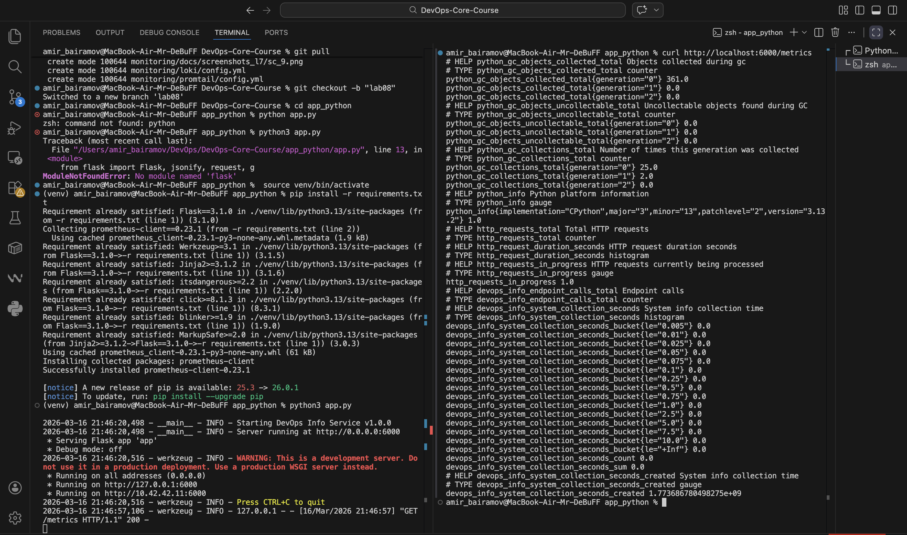

## 3. Prometheus Configuration

Prometheus is configured to scrape multiple services.

### Scrape Interval

```
scrape_interval: 15s
evaluation_interval: 15s
```

### Scrape Targets

| Target | Endpoint |
|------|------|
| Prometheus | localhost:9090 |
| Application | app-python:6000 |
| Grafana | grafana:3000 |
| Loki | loki:3100 |

Configuration example:

```
- job_name: 'app'
metrics_path: /metrics
static_configs:
    - targets: ['app-python:6000']
```

### Retention

Prometheus storage configured via command flags:

```
--storage.tsdb.retention.time=5d
--storage.tsdb.retention.size=5GB
```

### Targets Page

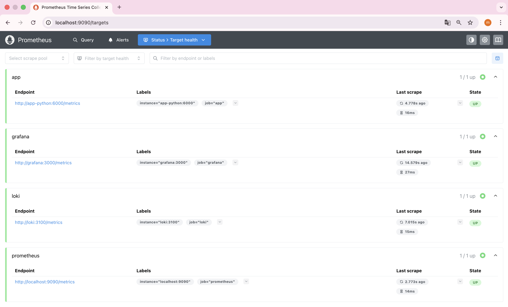

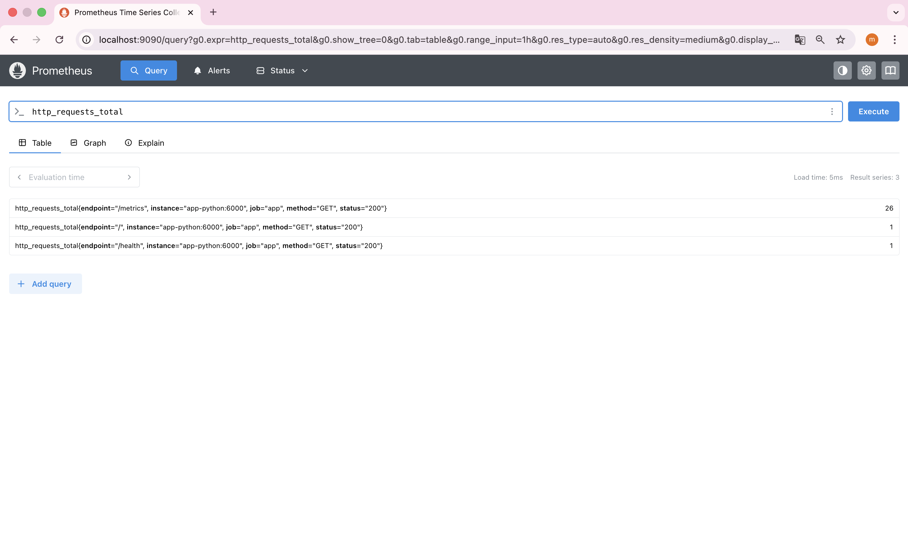

## 4. Dashboard Walkthrough

A custom Grafana dashboard was created with multiple panels.

### Panel Overview

1. **Request Rate** (Graph)
   - Query: `sum(rate(http_requests_total[5m])) by (endpoint)`
   - Shows requests/sec per endpoint

2. **Error Rate** (Graph)
   - Query: `sum(rate(http_requests_total{status=~"5.."}[5m]))`
   - Shows 5xx errors/sec

3. **Request Duration p95** (Graph)
   - Query: `histogram_quantile(0.95, rate(http_request_duration_seconds_bucket[5m]))`
   - Shows 95th percentile latency

4. **Request Duration Heatmap** (Heatmap)
   - Query: `rate(http_request_duration_seconds_bucket[5m])`
   - Visualizes latency distribution

5. **Active Requests** (Gauge/Graph)
   - Query: `http_requests_in_progress`
   - Shows concurrent requests

6. **Status Code Distribution** (Pie Chart)
   - Query: `sum by (status) (rate(http_requests_total[5m]))`
   - Shows 2xx vs 4xx vs 5xx

7. **Uptime** (Stat)
   - Query: `up{job="app"}`
   - Shows if service is up (1) or down (0)

### Dashboard Screenshots

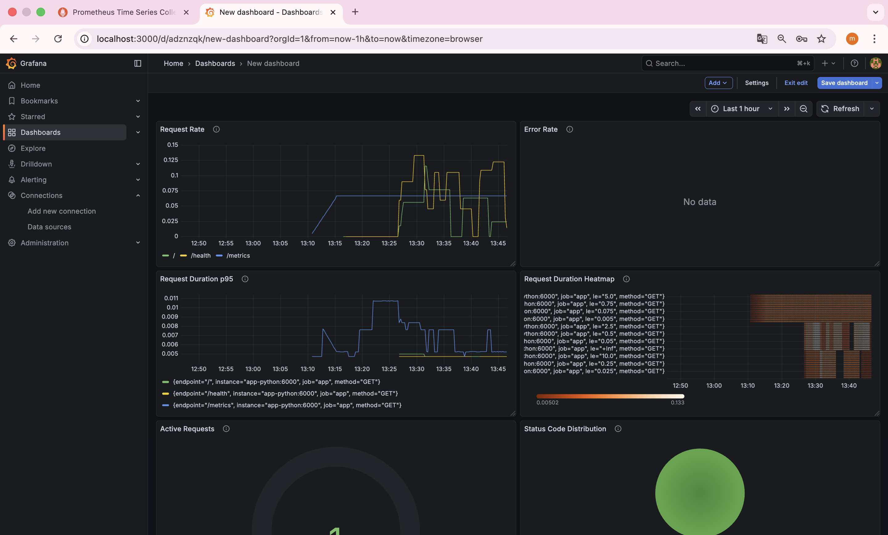

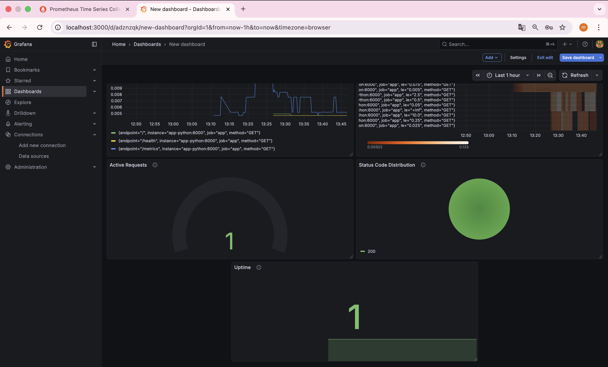

Also imported dashboard:

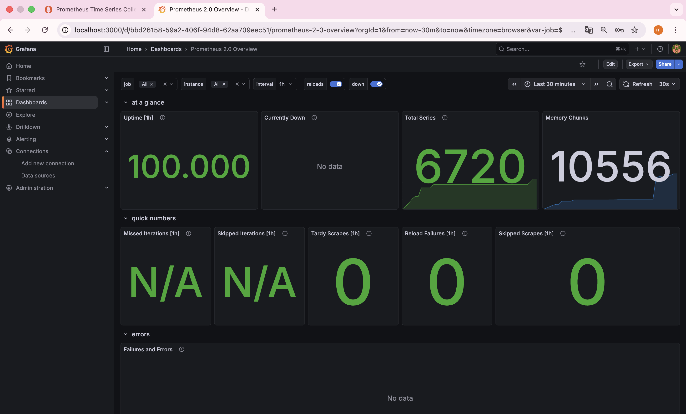


---

## 5. PromQL Examples

Below are example PromQL queries used during monitoring.

### (1) Requests Per Second

```
rate(http_requests_total[1m])
```

Shows request throughput.

---

### (2) Total Requests

```
http_requests_total
```

Total number of processed requests.

---

### (3) 95th Percentile Latency

```
histogram_quantile(0.95, rate(http_request_duration_seconds_bucket[5m]))
```

Shows high-percentile latency.

---

### (4) Error Rate

```
rate(http_requests_total{status=~"5.."}[1m])
```

Tracks server errors.

---

### (6) Active Requests

```
http_requests_in_progress
```

Shows currently processing requests.

---

### Example Query Result


## 6. Production Setup

Several production practices were implemented.

### Health Checks

Each service has a healthcheck configured.

Example:

```
healthcheck:
    test: ["CMD-SHELL", "curl -f http://localhost:6000/health || exit 1"]
    interval: 10s
    timeout: 5s
    retries: 5
```

### Resource Limits

Containers have CPU and memory limits:

```
deploy:
    resources:
    limits:
        cpus: '1.0'
        memory: 1G
```

### Persistence

Persistent volumes ensure data durability.

```
volumes:
    loki-data:
    grafana-data:
    prometheus-data:
```

- Check that dashboards exist in Grafana.

    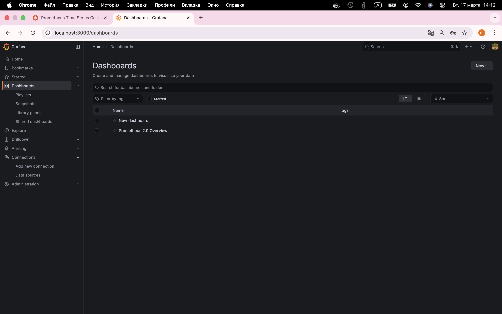

- Check `docker compose ps` and then `down` containers

    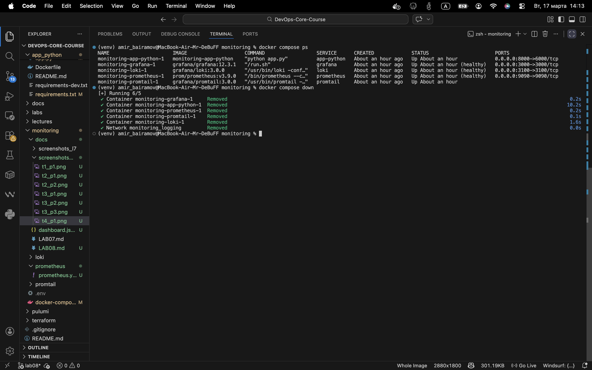

- `up` containers and check `docker compose ps`

    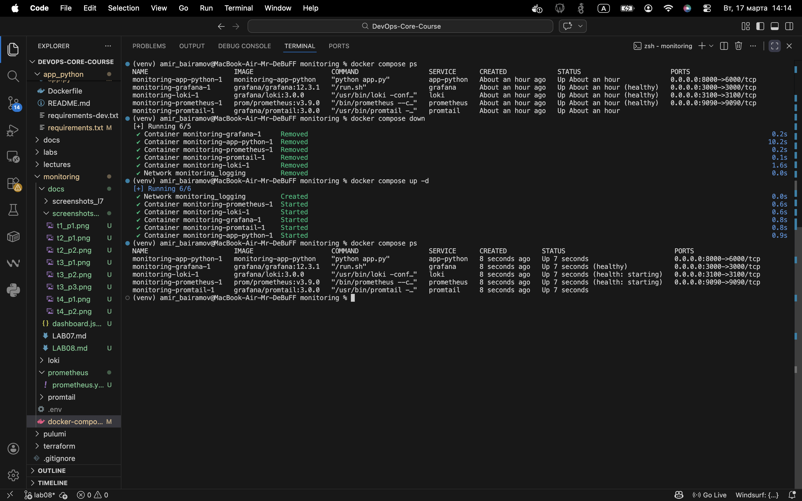

- Check that dashboards exist in Grafana (check time on all screenshots)

    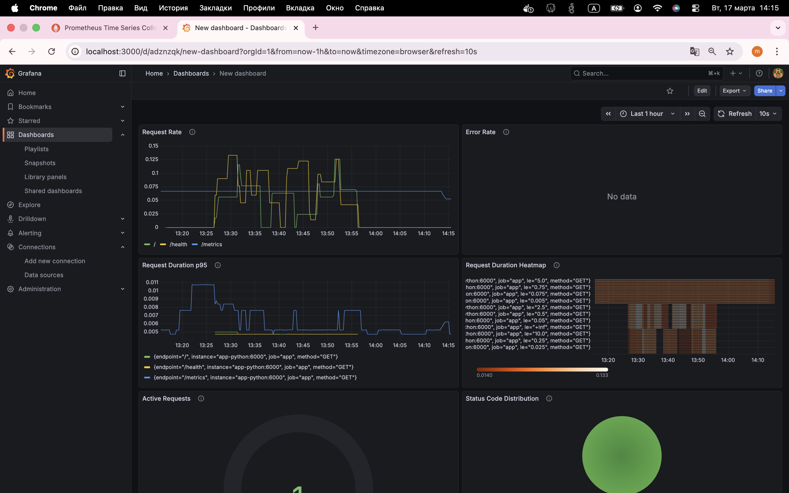

## 7. Testing Results

The monitoring system was validated with several checks.

### Services Status

```
docker compose ps
```

All services are healthy.

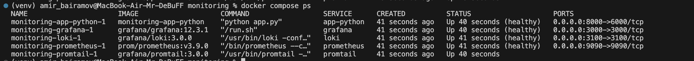

### Prometheus Targets

All scrape targets are operational.


---

## 8. Metrics vs Logs (Comparison with Lab 7)

| Feature | Metrics | Logs |
|------|------|------|
| Purpose | Aggregated monitoring | Detailed events |
| Storage | Time-series | Text |
| Query Language | PromQL | LogQL |
| Use Case | Alerts, dashboards | Debugging |

### When to Use Metrics

- performance monitoring
- error rate tracking
- system health dashboards

### When to Use Logs

- debugging application errors
- investigating incidents
- tracing user activity

## 9. Challenges & Solutions

### Issue 1 — Prometheus container failing

**Problem**

Prometheus failed to start due to invalid configuration.

**Cause**

Retention settings were placed inside `prometheus.yml`.

**Solution**

Moved retention settings to container command flags.

### Issue 2 — Application healthcheck unhealthy

**Problem**

Docker reported the application as unhealthy.

**Cause**

Healthcheck was using the wrong port (`8000` instead of container port `6000`).

**Solution**

Updated healthcheck endpoint:

```
curl http://localhost:6000/health
```

### Issue 3 — curl not available in container

**Problem**

Healthcheck command failed.

**Cause**

`curl` was not installed in the base image.

**Solution**

Installed curl in Dockerfile:

```
apt-get update && apt-get install -y curl
```
